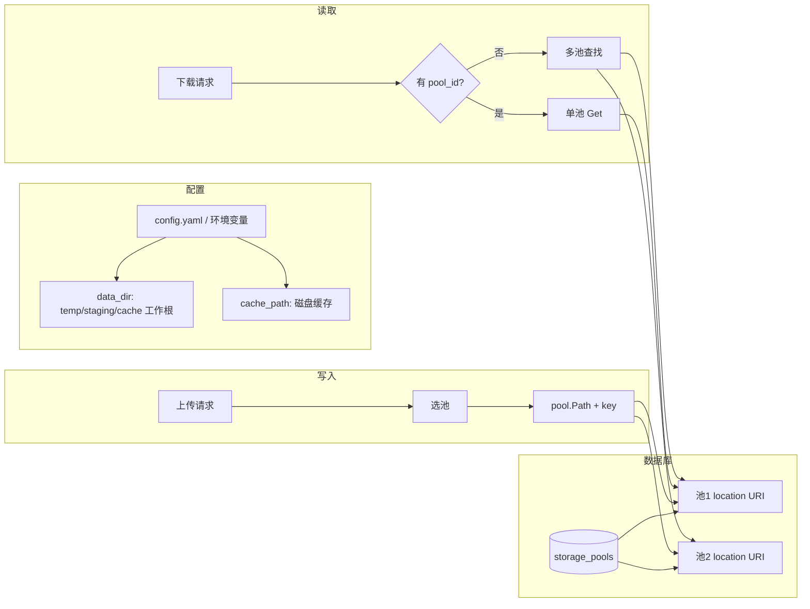
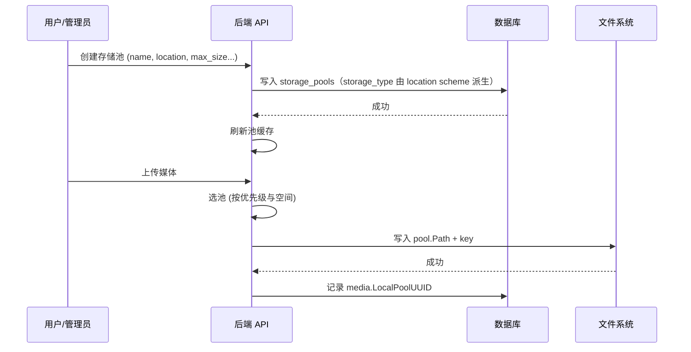

# 存储配置与使用指南

本文档说明如何配置和使用 PrismBox 后端的主存储（本地多池），便于快速上线与运维。

---

## 一、架构概览

主存储采用 **多存储池 + 按 Hash 分布**：媒体文件按内容 Hash 存到「池根 + 相对路径 key」，池的根目录由**数据库**管理，配置文件只提供**临时/缓存**等辅助目录。



**要点**：

- **池根**：来自表 `storage_pools` 的 **location** URI（如 `local:///absolute/path`），通过 API/CLI 创建或修改存储池时设置；解析后 path 为绝对路径。
- **配置文件中的 data_dir**：仅用于**临时文件**、**staging** 和（可选）**磁盘缓存**的工作根目录，**不**参与媒体文件路径；temp、cache 可默认为其下子目录。
- **Key 格式**：`files/{hash前2位}/{hash第3-4位}/{hash}[_变体].{扩展名}`，例如 `files/ab/cd/abcd1234_thumbnail.jpg`。

---

## 二、配置项说明

### 2.1 配置文件（config.yaml）

```yaml
storage:
  primary:
    type: local
    local:
      # 工作根目录，仅用于 temp、staging、cache；媒体文件路径由存储池的 location URI 决定
      data_dir: "./data"
      temp:
        base_path: ""   # 空时默认为 data_dir/temp
        max_age: "24h"
        max_size: "10GB"
        cleanup_interval: "1h"
      performance:
        cache_enabled: false
        cache_path: ""   # 空时默认为 data_dir/cache
        cache_size: "100MB"
        cache_ttl: "24h"
      pool_manager:
        flush_interval: "2s"
        cache_refresh_interval: "5m"
        reconcile_interval: "0"     # 0 表示不自动对账
```

| 配置路径 | 说明 | 默认 |
|----------|------|------|
| `storage.primary.local.data_dir` | 工作根目录（temp/staging/cache 默认在其下） | `./data` |
| `storage.primary.local.temp.base_path` | 临时文件目录（空时为 data_dir/temp） | 空 |
| `storage.primary.local.performance.cache_path` | 磁盘缓存根目录（空时为 data_dir/cache） | 空 |
| `storage.primary.local.performance.cache_enabled` | 是否启用磁盘缓存 | `false` |

### 2.2 环境变量（部署时常用）

| 变量名 | 说明 |
|--------|------|
| `ALBUM_STORAGE_PRIMARY_LOCAL_DATA_DIR` | 对应 `data_dir`（temp/staging/cache 工作根） |
| `ALBUM_STORAGE_PRIMARY_LOCAL_TEMP_BASE_PATH` | 临时文件目录（可选） |
| `ALBUM_STORAGE_PRIMARY_LOCAL_PERFORMANCE_CACHE_PATH` | 磁盘缓存目录（可选） |

环境变量会覆盖配置文件中的同键值。

---

## 三、存储池（必须配置）

媒体文件实际写在**存储池**的目录下。池的**根路径**在**数据库**中配置，不在 config 里写死。

### 3.1 流程示意



### 3.2 创建存储池（API）

- `POST /api/v1/storage/pools`  
- 请求体需包含：**`name`**、**`location`**（存储池位置 URI，**必填**，如 `local:///app/data/pool1`；**存储类型由 location 的 scheme 决定**，无需单独传 `storage_type`）、**`max_size`**（如 `1073741824` 表示 1GB）、`priority`、`enabled` 等。**本地池（local）校验**：location 的 path 须为**绝对路径**，否则创建/更新会报错（不校验路径是否已存在，目录可在池加载时创建）。

示例：`location` 填 `local:///app/data/pool1`（Docker 时需挂载该目录），`max_size` 约 1TB，`priority` 填 `0`。创建后新上传会写入该池根下，路径为 `files/{hash前2位}/{hash第3-4位}/{文件名}`。

### 3.3 命令行（CLI）配置存储池

CLI 通过**远程模式**连接已运行的后端服务，对存储池进行增删改查与运维。需先准备好管理员账号（邮箱与密码）。

#### 全局参数（所有 storage 子命令共用）

| 参数 | 说明 | 示例 |
|------|------|------|
| `--base-url` | 后端 API 地址（与 `--socket-path` 二选一） | `http://localhost:8080` |
| `--socket-path` | Unix Socket 路径（与 `--base-url` 二选一） | `/var/run/album.sock` |
| `--email` | 管理员邮箱 | 也可用环境变量 `ALBUM_CLI_EMAIL` |
| `--password` | 管理员密码 | 建议用环境变量 `ALBUM_CLI_PASSWORD` |
| `--timeout` | 请求超时 | 默认 `2m` |
| `--json` | 输出 JSON | 用于脚本处理 |

#### 命令一览

| 命令 | 说明 |
|------|------|
| `album storage pool list` | 列出存储池（可选 `--type`、`--status` 过滤） |
| `album storage pool info <pool-uuid>` | 查看指定池详情 |
| `album storage pool add` | 新增存储池（见下方参数） |
| `album storage pool update <pool-uuid>` | 更新存储池（仅修改提供的字段） |
| `album storage pool enable <pool-uuid>` | 启用存储池写入 |
| `album storage pool disable <pool-uuid>` | 禁用存储池写入（维护/退役） |
| `album storage pool refresh` | 触发所有实例刷新池缓存 |
| `album storage pool reconcile` | 对账：扫描磁盘并刷新 current_size |
| `album storage pool usage` | 查看各池容量（数据库记录 vs 实际） |

#### 新增存储池：`album storage pool add`

**必填参数：**

| 参数 | 说明 |
|------|------|
| `--name` | 存储池名称 |
| `--location` | 存储池位置 URI，**必填**（如 `local:///app/data/pool1`）；**存储类型由 URI 的 scheme 决定**；本地池须为**绝对路径** |
| `--max-size` | 最大容量，支持单位：`1TB`、`500GB`、`100MB` 等 |

**可选参数：**

| 参数 | 说明 | 默认 |
|------|------|------|
| `--priority` | 优先级，数值越小越优先被选用 | `0` |
| `--auto-disable-threshold` | 使用率超过该比例（0–1）时自动禁用 | `0.9` |
| `--enabled` | 是否启用 | `true` |
| `--description` | 描述信息 | - |
| `--cloud-config` | 云存储配置（JSON 字符串或 `@path/to/file.json`），仅非 local 类型使用 | - |

**示例：**

```bash
# 使用 HTTP 连接，新增一个本地存储池（类型由 location 的 scheme 决定，无需 --type）
album --base-url http://localhost:8080 \
  --email admin@example.com --password your-password \
  storage pool add \
  --name "主盘" \
  --location "local:///app/data/pool1" \
  --max-size 1TB \
  --priority 0

# 使用环境变量避免在命令行暴露密码
export ALBUM_CLI_EMAIL=admin@example.com
export ALBUM_CLI_PASSWORD=your-password
album --base-url http://localhost:8080 storage pool add \
  --name "主盘" --type local --location "local:///app/data/pool1" --max-size 1TB
```

#### 更新存储池：`album storage pool update <pool-uuid>`

仅修改提供的字段，未提供的保持不变。

| 参数 | 说明 |
|------|------|
| `--name` | 名称 |
| `--location` | 存储池位置 URI（如 local:///app/data/pool1） |
| `--max-size` | 最大容量（如 1TB、500GB） |
| `--priority` | 优先级 |
| `--auto-disable-threshold` | 自动禁用阈值（0–1） |
| `--enabled` | 是否启用 |
| `--description` | 描述 |
| `--cloud-config` | 云存储配置（JSON 或 `@file`） |

示例：

```bash
album --base-url http://localhost:8080 --email admin@example.com --password xxx \
  storage pool update <pool-uuid> --location "local:///app/data/pool2" --max-size 2TB --priority 1
```

#### 其他常用命令示例

```bash
# 列出所有存储池（表格）
album --base-url http://localhost:8080 --email admin@example.com --password xxx storage pool list

# 仅列 local 类型
album --base-url http://localhost:8080 --email admin@example.com --password xxx storage pool list --type local

# 查看指定池详情
album --base-url http://localhost:8080 --email admin@example.com --password xxx storage pool info <pool-uuid>

# 禁用某池（维护时）
album --base-url http://localhost:8080 --email admin@example.com --password xxx storage pool disable <pool-uuid>

# 对账：扫描磁盘并更新各池 current_size（可指定 --pool <uuid> 仅对单池）
album --base-url http://localhost:8080 --email admin@example.com --password xxx storage pool reconcile

# 查看容量对比（数据库 vs 实际）
album --base-url http://localhost:8080 --email admin@example.com --password xxx storage pool usage
```

新增或修改存储池后，若后端已在运行，可执行 `album storage pool refresh` 让实例立即加载新配置，无需重启服务。

### 3.4 多池时的行为

- **写入**：按策略选一个池（优先级 + 剩余空间），文件落在该池的 `local_path + key`。
- **读取**：若数据库中有该媒体的 `LocalPoolUUID`，则只在该池中查找；否则按池顺序查找直到命中。

---

## 四、部署检查清单

部署或升级时，建议按下列项检查，确保与新存储方案一致。

| 项目 | 说明 |
|------|------|
| **存储池** | 至少创建一个存储池，**location** 填本地 URI（如 `local:///app/data/pool1`）；类型由 scheme 决定，path 会规范化为绝对路径，容器内需可访问。 |
| **卷挂载** | 若用 Docker：将 location 中的路径对应目录挂载到容器内，与 compose 中 volume 一致。 |
| **data_dir / temp** | 配置或环境变量中的 `data_dir`、`temp.base_path` 仅影响临时文件与缓存，需有写权限。 |
| **cache_path** | 启用磁盘缓存时设置 `performance.cache_path` 或对应环境变量，未设置时默认为 data_dir/cache。 |
| **无旧 key 兼容** | 当前仅支持 key 格式 `files/xx/xx/filename`；存储池位置仅使用 **location** URI，不兼容旧 local_path 字段。 |

### 4.1 Docker Compose 示例

- 为存储池预留数据目录并挂载，例如：

```yaml
volumes:
  - album-data:/app/data

environment:
  - ALBUM_STORAGE_PRIMARY_LOCAL_DATA_DIR=/app/data
  - ALBUM_STORAGE_PRIMARY_LOCAL_TEMP_BASE_PATH=/app/data/temp
```

- 首次启动后，通过 API 或 CLI 创建存储池，**location** 填 `local:///app/data/pool1`（需与卷挂载一致；path 会规范化为绝对路径）。

---

## 五、常见问题

**Q：为什么配置里有 data_dir，但媒体文件不在下面？**  
A：`data_dir` 只用于临时文件、staging 和缓存。媒体文件路径 = **存储池 location 解析出的池根**（在数据库里）+ key，池根由创建存储池时传入的 **location** URI 决定。

**Q：如何增加一块新盘？**  
A：新盘挂载到某目录（如 `/mnt/disk2`），在 API 或 CLI 中创建新存储池，**location** 填 `local:///mnt/disk2`（容器内需能访问），并设置 `max_size`、`priority`。新上传会按策略写入新池。

**Q：key 的格式是什么？**  
A：固定为 `files/{hash[0:2]}/{hash[2:4]}/{hash}[_variant].{ext}`，例如原图 `files/ab/cd/abcd1234.jpg`，缩略图 `files/ab/cd/abcd1234_thumbnail.jpg`。应用内部自动生成，用户无需手写。

---

## 六、相关文档

- [环境变量列表](DEPLOYMENT/ENV_VARS.md) — 所有 `ALBUM_*` 环境变量说明  
- [部署文档](DEPLOYMENT/README.md) — 整体部署流程  
- [主存储设计](ARCHITECTURE/07-core-modules/07-storage-primary.md) — 开发视角的存储架构与实现
