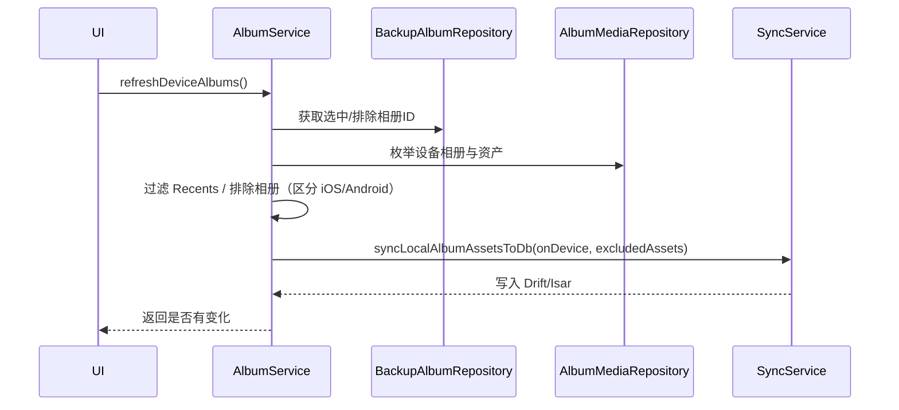
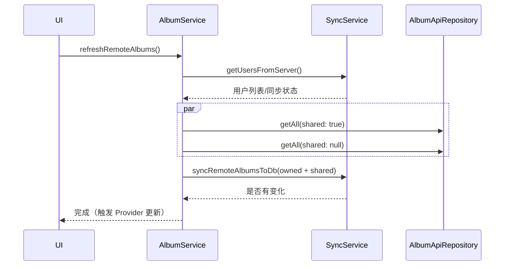
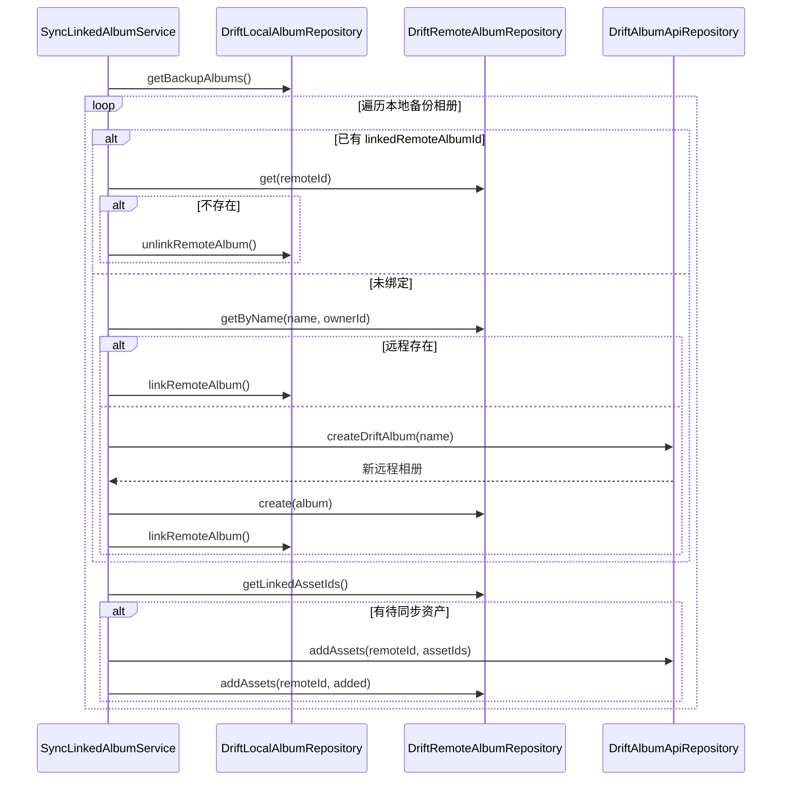

# Immich Mobile 相册管理模块详解

> 本文聚焦移动端“相册（Album）”体系：如何统一管理本地相册、远程相册与共享/备份场景，解析架构设计、核心流程与协作思路。

---

## 1. 模块定位与分层

| 层次               | 角色                                                                                                                                                        | 核心文件/组件                                                                                                 |
| ------------------ | ----------------------------------------------------------------------------------------------------------------------------------------------------------- | ------------------------------------------------------------------------------------------------------------- |
| **Domain**         | `LocalAlbumService`、`RemoteAlbumService` 提供统一的相册模型访问、排序、搜索、共享信息与 Linked Album 逻辑。                                                | `lib/domain/services/local_album.service.dart`、`remote_album.service.dart`、`sync_linked_album.service.dart` |
| **Infrastructure** | Drift 仓储（`local_album.repository.dart`、`remote_album.repository.dart`）与 Isar 仓储（`album.repository.dart`）维护表结构、链接关系、批处理与 Watch 流。 | 同上                                                                                                          |
| **Application**    | `AlbumService` 负责同步、创建/删除、共享、资产增删、备份联动；`SyncLinkedAlbumService` 管理本地-远程映射。                                                  | `lib/services/album.service.dart`、`lib/providers/album/*.dart`                                               |

UI 通过 Provider 获取状态，具体的数据库或 API 调用细节封装在 Service/Repository 内，便于扩展与测试。

---

## 2. 数据建模与统一视图

- **Album 实体（Isar）**：同时具备 `localId` 与 `remoteId`，可代表本地相册、远程相册或合并视图。关联 `assets`、`sharedUsers`，并保存 `startDate/endDate/lastModifiedAssetTimestamp` 等元数据。
- **仓储查询**：`AlbumRepository` 可按 remote/local/shared/owner 过滤并 watch；Drift 仓储负责在本地缓存远程相册、共享关系、相册资产，以 SQL 级别批量处理。
- **Domain 服务**：`LocalAlbumService`/`RemoteAlbumService` 提供轻量 API（获取、排序、搜索、watch、共享用户、包含资产列表）供上层调用；`SyncLinkedAlbumService` 负责本地备份相册与服务器相册的一对一映射。

---

## 3. 同步策略

### 3.1 本地相册同步（`AlbumService.refreshDeviceAlbums`）

1. 读取备份配置：`BackupAlbumRepository` 返回用户选择/排除的相册 ID。
2. `AlbumMediaRepository` 枚举设备相册及资产。iOS 与 Android 差异（iOS 资产可属于多个相册，Android 以文件夹为单位）由 `refreshDeviceAlbums` 内部处理：
   - iOS：如排除某相册需列出资产集以逐个过滤。
   - Android：排除相册仅需移除对应“文件夹”。
3. 若启用“Recents”，Android 会移除虚拟相册以避免重复；否则仅保留选中的本地相册。
4. 将所得本地相册及其资源传给 `SyncService.syncLocalAlbumAssetsToDb()` 写入 Drift/Isar。
5. 通过 `_localCompleter` 防止并发执行，确保同一时间只有一次本地同步。

### 3.2 远程相册同步（`refreshRemoteAlbums`）

1. 调整 `SyncService` 与 `UserService` 获取用户信息，保证 owner/共享用户数据已最新。
2. 并行请求“共享给我（shared: true）”与“我拥有的（shared: null）”两类相册。由于 API 行为差异需要分别调用。
3. 利用 `HashSet<Album>` 去重后，将结果交给 `SyncService.syncRemoteAlbumsToDb()` 写入本地数据库。
4. `_remoteCompleter` 控制并发；`AlbumRepository.watchRemoteAlbums()` 推送更新给 UI。

### 3.3 Linked Albums（`SyncLinkedAlbumService`）

1. 遍历本地备份相册：若已有 `linkedRemoteAlbumId`，验证远程存在与否；不存在则解绑。
2. 对于未绑定的相册，先按名称查找远程相册；若无，则调用 `DriftAlbumApiRepository.createDriftAlbum()` 创建新远程相册并写入 Drift，再与本地相册绑定。
3. `syncLinkedAlbums()` 会找出“已经上传但尚未加入远程相册”的资产列表（通过 `getLinkedAssetIds`），调用 API 批量添加，保持备份一致。

---

## 4. 业务操作能力（AlbumService）

### 4.1 创建/删除/共享

- `createAlbum`/`createAlbumWithGeneratedName`：调用 API 创建，并通过 `EntityService.fillAlbumWithDatabaseEntities` 填充 owner/资产链接后存入 Isar。
- `deleteAlbum`：根据 Album ownership 决定是否调用 API；处理共享场景时还会清理共享资产引用。
- `leaveAlbum`/`addUsers`/`removeUser`：统一调用 API，然后更新本地 Album 的共享用户列表，触发 watch 流刷新 UI。

### 4.2 资产增删与排序

- `addAssets`/`removeAsset`：先调用 API，返回成功/重复的信息，再通过 `_updateAssets()` 同步本地 Album 的资产集合和元数据（`recalculateMetadata`）。
- `updateSortOrder`、`RemoteAlbumService.sortAlbums`：本地支持多种排序（标题、创建时间、资产数、最新/最旧资产）；涉及最新/最旧需要异步查询各相册的最早/最晚资产时间戳。
- `searchAlbums`：文本搜索 + QuickFilter（我的/共享给我/全部），用于 UI 快速筛选。

### 4.3 状态与共享信息

- `setActivityStatus`、`changeTitle/Description`：遵循“先 API 后本地更新”模式，保证缓存一致。
- `getSharedUsers`、`getUserRole`、`albumsContainingAssetProvider` 为 UI 展示共享成员、资产所属相册提供数据。

### 4.4 备份/上传联动

- `syncUploadAlbums`：在备份完成后，把指定相册名称映射到远程相册，如果不存在则自动创建，再将上传的资产批量加入，实现“备份＋归类”一体化。

---

## 5. Provider 与 UI 协同

- `albumProvider` 与 `localAlbumsProvider`：StateNotifier 在构造时即加载一次数据，随后订阅 `AlbumService.watchRemoteAlbums()`/`watchLocalAlbums()`。UI 只需 `ref.watch` 即可获得实时列表。
- `isRefreshingRemoteAlbumProvider` 让 UI 知晓正在刷新，从而展示 Loading 状态或禁用按钮。
- `albumsContainingAssetProvider`、`remoteAlbumProvider` 等集合了常见查询，资产详情/分享页面可直接使用。
- `AlbumNotifier` 暴露 `create/refresh/delete/leave/search/addUsers/...` 等方法，UI 不需直接接触 `AlbumService`，同时在 `dispose` 时关闭 Stream 订阅避免内存泄漏。

---

## 6. 核心流程时序图

### 6.1 本地相册同步

### 6.2 远程相册同步

### 6.3 Linked Album 对齐

---

## 7. 设计亮点

1. **双向映射与 Linked Albums**：通过 `localId/remoteId` + 同步服务，将本地备份选项与远程相册保持一致，用户只需在一处配置。
2. **并发防护**：`_localCompleter` / `_remoteCompleter` 防止同一刷新操作被多次触发，降低服务器和数据库压力。
3. **响应式更新**：Drift/Isar watch + Riverpod Provider，确保任何创建、共享、资产变更都能实时推送到 UI。
4. **平台差异处理**：iOS/Android 相册结构不同，`refreshDeviceAlbums` 内专门处理 Recents、排除相册等差异，保证跨平台一致体验。
5. **跨模块协作**：与备份、资产、People、Memories、搜索模块通过 `SyncService`/Provider 协调，资源变动自动影响相关模块。

---

## 8. 可扩展方向

- **离线编辑**：凭借本地缓存，可进一步支持无网状态下修改相册名称/描述，待网络恢复后批量同步。
- **更丰富的角色/权限**：当前共享仅区分 owner/成员，可拓展只读/上传权限，需结合服务器 API 扩展。
- **智能建议/自动归类**：结合 `getDateRange`、`getPlaces` 等能力，未来可自动生成“旅行相册”或提供智能相册建议。
- **实时同步**：与 SyncStream 深度结合，实现相册活动即时推送（新增资产、评论等）。

---

通过上述分层和协同，相册模块把“本地图库 + 云端共享 + 备份联动”的复杂问题拆解成可维护的服务和仓储，使创建、共享、备份、搜索等上层功能都能在统一的相册视图上构建。继续扩展时，只需按层次扩充 Service/Repository 的能力，即可融入现有架构。***

