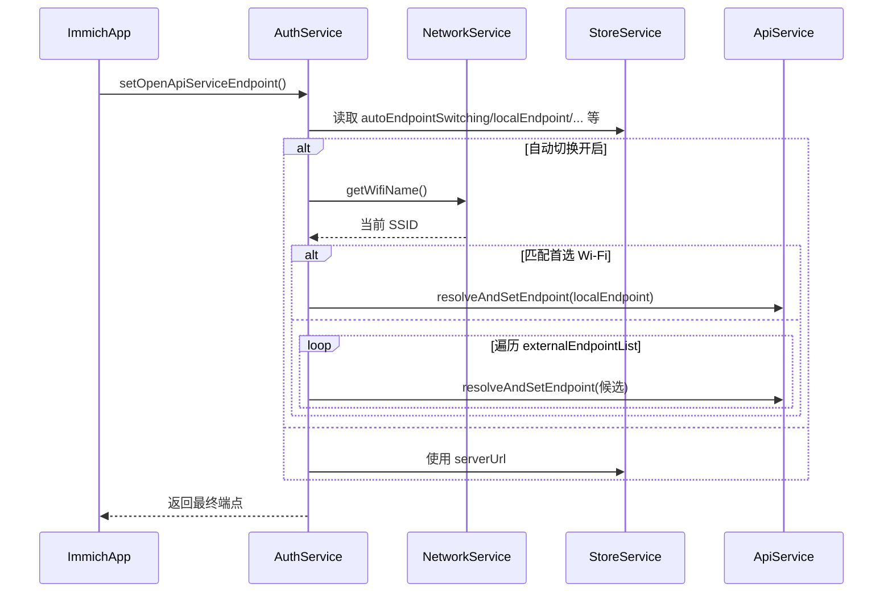
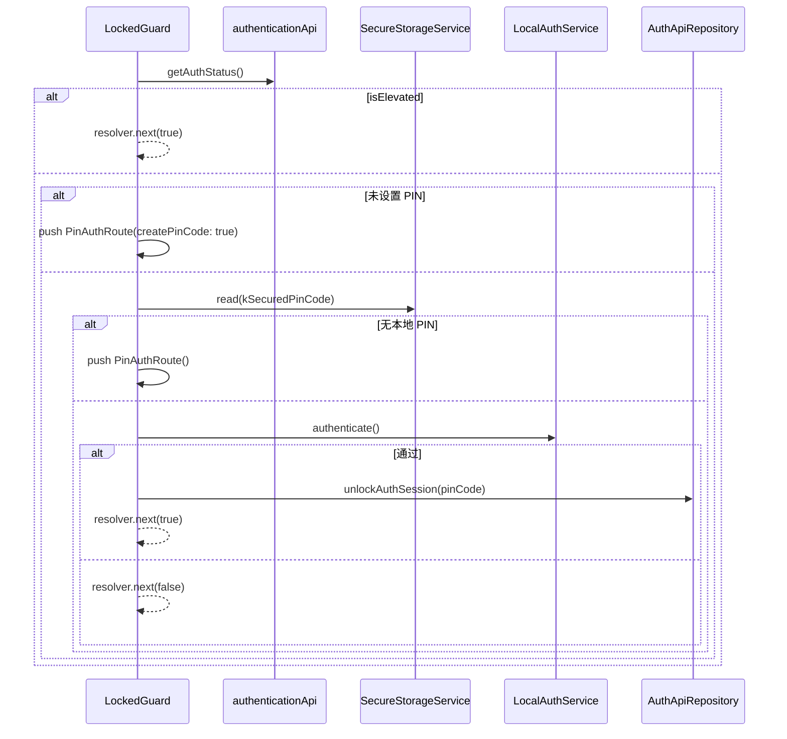
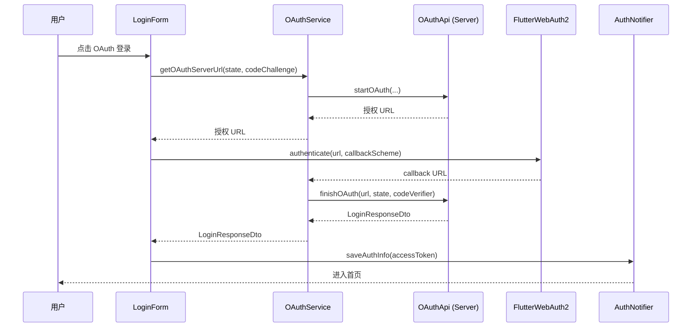

# Immich Mobile 认证与用户管理模块详解

> 本文聚焦移动端认证体系，详解组件职责、核心流程（自动端点切换、PIN + 生物识别、OAuth 登录），并给出配置项与时序图，便于后续扩展与审查。

---

## 1. 模块范围与职责

| 维度     | 说明                                                                                                                                                   |
| -------- | ------------------------------------------------------------------------------------------------------------------------------------------------------ |
| 目标     | 确认服务器来源、执行登录/OAuth 流程、缓存用户信息、维持会话、执行 PIN/生物识别解锁、负责登出清理。                                                     |
| 主要组件 | `AuthService`、`AuthNotifier`、`UserService`、`SecureStorageService`、`LocalAuthService`、`WidgetService`、`UploadService`、`ApiService`。             |
| 数据层   | `UserApiRepository`（OpenAPI 客户端封装）、`IsarUserRepository`（本地持久化）、`StoreService`（KV + 内存缓存）以及 `AuthRepository`（端点/配置管理）。 |
| 状态管理 | `authProvider`（StateNotifier）是 UI 与业务的唯一入口；`AuthState` 提供认证态、用户信息、设备 ID 等。                                                  |
| 安全策略 | Token/PIN 存储分层（Store vs Secure Storage），登出时并行清空；后台任务、Widget 凭据、上传服务等均受认证态驱动。                                       |

---

## 2. 组件关系图

```
UI/LoginForm → AuthNotifier (StateNotifier/AuthState)
              ↘ AuthService ↘ ApiService ↘ OpenAPI
               ↘ UserService ↘ StoreService + IsarUserRepository
               ↘ SecureStorageService (PIN/生物识别)
               ↘ UploadService / WidgetService / BackgroundSyncManager
```

- `AuthNotifier` 负责编排登录/登出流程、设备 ID 管理、状态更新。
- `AuthService` 聚合网络感知、端点解析、Auth API、PIN、后台同步控制。
- `UserService` 负责用户资料的缓存、刷新与广播。
- `SecureStorageService` + `LocalAuthService` 提供 PIN/生物识别支撑。

---

## 3. 核心流程剖析

### 3.1 登录 → 会话建立

1. **服务器 URL 验证**：`AuthService.validateServerUrl()` 解析用户输入，设置 Base URL 与设备信息头，并写入 `StoreKey.serverUrl`。
2. **凭证验证**：`AuthNotifier.login()` 调 `AuthService.login()` 获取 `LoginResponse`。
3. **Token 固化**：`saveAuthInfo()` 设置 `ApiService` Access Token、通知 WidgetService、生成/存储 `deviceId`。
4. **用户信息刷新**：`UserService.refreshMyUser()` 拉取服务器用户数据，写入 `StoreKey.currentUser` 与 Isar。
5. **状态更新**：`AuthState` 切为已认证，包含 `email/name/isAdmin/profileImagePath` 等，为路由守卫与 UI 提供源数据。

### 3.2 登出 → 清理

- `AuthService.logout()` 无论请求成功与否，最终都会执行 `clearLocalData()` + 关闭 `BackgroundSyncManager`。
- `AuthNotifier.logout()` 额外删除 PIN (`kSecuredPinCode`)、通知 `UploadService.cancelBackup()`、清空 `AuthState`。
- `AuthRepository.clearLocalData()` 重置 Isar/Drift 中的资产、相册、ETag、用户等缓存。

---

## 4. 自动端点切换（Auto Endpoint Switching）

### 4.1 架构设计

- **目标**：在“家中局域网 + 外网代理”场景下，根据用户所处网络自动选择最快、最可靠的服务器端点，减少手动切换。
- **关键思路**：
  - `AuthService` 集中 orchestration，不直接操作 UI 或权限。
  - `NetworkService` 负责跨平台 Wi‑Fi 读取及权限申请。
  - `StoreService`/`AuthRepository` 维护局域网/远端/辅助端点配置，使逻辑可配置、可回退。
  - `ApiService.resolveAndSetEndpoint()` 统一处理 URL 归一化、证书策略、OpenAPI 客户端重建，避免重复代码。
  - 整个流程自动化但保留开关，用户可在设置中关闭，确保隐私与可控性。

### 4.2 详细流程

1. `AuthNotifier` 在应用冷启动、登录成功、后台任务恢复等时机调用 `AuthService.setOpenApiServiceEndpoint()`。
2. `AuthService` 首先从 Store 读取自动切换开关、首选 Wi‑Fi、局域网地址、辅助端点列表。
3. 若开关关闭，则直接使用当前 `serverUrl` 并返回；否则请求 `NetworkService.getWifiName()`。
4. 若当前 SSID 与首选 Wi‑Fi 匹配，则优先尝试本地端点；若失败或未匹配，则遍历外网端点列表，依次调用 `ApiService.resolveAndSetEndpoint()`。
5. 每次端点解析成功后都会更新 Store 中的 `serverUrl`，并触发 `AuthService.validateAuxilaryServerUrl()` 在设置页面做即时校验。
6. 如果所有端点都不可达，则保持旧配置并记录日志，提示用户手动介入。

### 4.3 时序图



### 4.4 配置项

| 键                               | 说明                   | 来源                                      |
| -------------------------------- | ---------------------- | ----------------------------------------- |
| `StoreKey.autoEndpointSwitching` | 是否开启自动切换       | 设置页                                    |
| `StoreKey.preferredWifiName`     | 家庭 Wi-Fi SSID        | 用户手动保存                              |
| `StoreKey.localEndpoint`         | 局域网地址             | 用户手动保存                              |
| `StoreKey.externalEndpointList`  | 外部/辅助端点列表      | JSON 数组                                 |
| 位置信息权限                     | 读取 SSID 需要定位权限 | `NetworkService` + `PermissionRepository` |

---

## 5. PIN + 生物识别

### 5.1 架构设计

- **目标**：在需要加强安全性的页面（如锁定相册、设置页）要求二次认证，既保证安全又保持体验。
- **核心组件**：
  - `LockedGuard`：AutoRoute 守卫，负责决策流程。
  - `ApiService.authenticationApi`：提供 `getAuthStatus()`、`unlockAuthSession()` 等服务端接口。
  - `SecureStorageService`：以 Keychain/Keystore 方式存储 PIN（在用户授权的前提下）。
  - `LocalAuthService`：封装 `local_auth` 插件，统一面容/指纹验证。
  - `AuthService`：提供 `setupPinCode/lockPinCode/unlockPinCode` 入口，配合 Pin UI。
- **设计理念**：“服务器主导安全，客户端辅助体验”。是否必须 PIN、会话是否有效由服务器控制；客户端负责缓存与生物识别桥接。

### 5.2 流程拆解

1. `LockedGuard` 在导航前调用 `getAuthStatus()`，若返回 `isElevated=true`，直接放行。
2. 若服务器尚未要求 PIN（如首次进入），则推送 `PinAuthRoute(createPinCode: true)` 引导用户设置。
3. 若已设置 PIN 且本地 `SecureStorageService` 无缓存，则跳转 `PinAuthRoute()` 让用户手动输入。
4. 若本地有缓存，则调用 `LocalAuthService.authenticate()` 触发生物识别。认证通过后，用缓存 PIN 调 `unlockAuthSession()` 提升服务器会话。
5. 生物识别失败或 API 返回 PIN 失效会阻止导航，并在必要时清除缓存，确保不会用过时 PIN 解锁。
6. `AuthNotifier.logout()` 会清空 Secure Storage，防止旧会话信息残留。

### 5.3 时序图



### 5.4 相关配置

| 项目                    | 描述                           |
| ----------------------- | ------------------------------ |
| `authStatus.pinCode`    | 服务端 PIN 要求                |
| `authStatus.isElevated` | 当前会话是否已提升             |
| `kSecuredPinCode`       | Secure Storage 中的 PIN 缓存键 |
| `PinAuthRoute`          | 设置/输入 PIN 的页面           |
| `LocalAuthService`      | 生物识别统一入口               |

---

## 6. OAuth 登录扩展

### 6.1 架构设计

- **适用场景**：企业 IdP、外部 OAuth 提供商、自建 SSO 等，需要在移动端完成第三方认证。
- **关键原则**：
  - 使用 PKCE（code verifier/challenge）减少授权码被窃取的风险。
  - 通过 Deep Link (`app.immich:///oauth-callback`) 将浏览器结果回传 App，流程全闭环。
  - 成功后完全复用普通登录的 `saveAuthInfo()`，保证 Token 写入、用户拉取、Widget/后台任务同步一致。
  - `OAuthService` 只负责调用服务器端 `startOAuth/finishOAuth`，服务器可以根据配置返回自定义按钮文案、IdP URL 等。

### 6.2 流程概览

1. 登录页点击 OAuth → 生成 `state`、`codeVerifier`、`codeChallenge`（遵循 PKCE）。
2. `OAuthService.getOAuthServerUrl()` 调 `OAuthApi.startOAuth()` 获取授权 URL 并解析服务器 endpoint。
3. `FlutterWebAuth2.authenticate()` 打开外部浏览器/IdP App，完成认证后以 `app.immich:///oauth-callback` 回调客户端。
4. `OAuthService.oAuthLogin()` 将回调 URL、state、codeVerifier 传给 `finishOAuth()`，换取 `LoginResponseDto`。
5. `AuthNotifier.saveAuthInfo()` 复用普通登录逻辑：设置 Token、刷新用户信息、更新状态、同步 Widget 与后台任务。

### 6.3 时序图



### 6.4 配置/约束

| 项目        | 说明                                                                    |
| ----------- | ----------------------------------------------------------------------- |
| 回调 Scheme | 固定 `app.immich:///oauth-callback`，需在 iOS/Android Manifest 中注册。 |
| PKCE        | codeVerifier/codeChallenge 按 RFC 7636 生成，存活在内存中，防止重放。   |
| OAuth API   | 服务器决定按钮文案、IdP URL、额外参数；客户端对返回值无感知。           |
| 错误处理    | 任一步失败都会停止加载、吐司提示，并保持现有会话不变。                  |

---

## 7. 关键配置索引

| 分类         | 配置项                                                                  | 作用                       |
| ------------ | ----------------------------------------------------------------------- | -------------------------- |
| 端点         | `StoreKey.serverUrl`                                                    | 当前 API 地址              |
|              | `StoreKey.autoEndpointSwitching`                                        | 自动切换开关               |
|              | `StoreKey.preferredWifiName` / `localEndpoint` / `externalEndpointList` | 切换所需参数               |
| PIN/生物识别 | `kSecuredPinCode` (Secure Storage)                                      | 缓存 PIN 供生物识别复用    |
|              | `LocalAuthService`                                                      | 统一生物识别状态与验证接口 |
| OAuth        | Deep Link Scheme                                                        | `app.immich`               |
|              | PKCE 参数                                                               | 运行时生成                 |
| 用户/会话    | `StoreKey.currentUser` / `accessToken` / `deviceId`                     | 会话与用户信息             |

---

## 8. 设计亮点与扩展方向

- **解耦**：UI 通过 `AuthNotifier` 访问认证逻辑；`AuthService` 仅负责编排，不直接感知 UI。
- **安全性**：Token/PIN 分层存储；登出清理覆盖 Store、Isar、Secure Storage、后台任务；OAuth PKCE + Deep Link 防止截获。
- **可扩展**：自动端点、OAuth、PIN 均以服务/Provider 封装，未来可接入更多 IdP、二次验证手段或网络策略。
- **可观测性**：关键路径均使用 `Logger`，易于搜集日志；toast/Snackbar 提供用户反馈。

如需在本章基础上进一步添加示意图或测试策略，可在仓库 `docs/docs/developer/` 下继续扩展。

