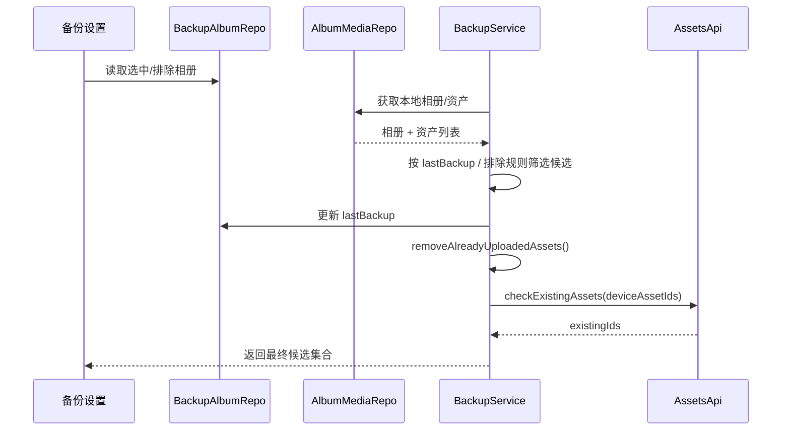
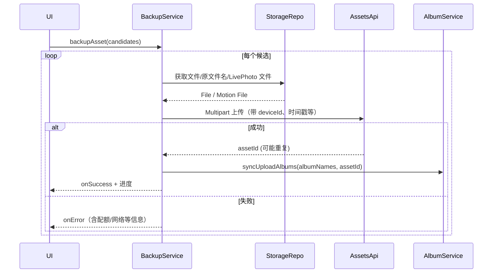
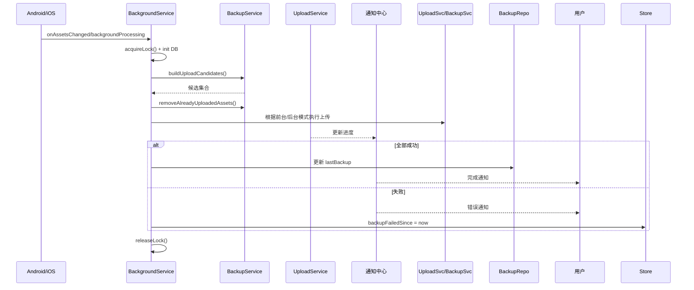

# Immich Mobile 备份与上传模块详解

> 本文剖析移动端「备份 & 上传」体系——如何从相册筛选候选资产、组织上传队列、在前后台稳定执行，并向 UI/通知层反馈进度。

---

## 1. 模块定位与分层

| 层次               | 角色                                                                                                                                                       | 核心组件                                                                                                                                   |
| ------------------ | ---------------------------------------------------------------------------------------------------------------------------------------------------------- | ------------------------------------------------------------------------------------------------------------------------------------------ |
| **Domain**         | 备份相关模型（`BackupAlbum`、`BackupCandidate`、`SuccessUploadAsset` 等），定义备份配置、候选资产的结构。                                                  | `lib/domain/models/backup/*`                                                                                                               |
| **Infrastructure** | Drift/Isar 仓储，维护备份配置、候选列表、上传队列、存储访问、文件读写。                                                                                    | `backup.repository.dart`、`upload.repository.dart`、`storage.repository.dart`、`file_media.repository.dart`、`asset_media.repository.dart` |
| **Application**    | `BackupService`（候选筛选、去重、HTTP 上传）、`UploadService`（任务队列 + BackgroundDownloader）、`BackgroundService`（原生后台调度），以及对应 Provider。 | `lib/services/backup.service.dart`、`upload.service.dart`、`background.service.dart`、`lib/providers/backup/*`                             |

UI 通过 Provider 订阅状态（进度、失败、候选数等），具体上传策略和原生交互隐藏在 Service 层。

---

## 2. 数据流与核心职责

1. **备份配置**：`BackupAlbumRepository` 记录被选/排除的设备相册及 `lastBackup` 时间；`AlbumMediaRepository`/`FileMediaRepository` 提供设备端相册与资产信息。
2. **候选筛选**：`BackupService.buildUploadCandidates()` 根据 `lastBackup` 和排除规则生成新增资产集合 `BackupCandidate`，并附带所在相册名，为上传后同步相册做准备。
3. **去重过滤**：本地 `DuplicatedAsset` 表 + 服务器 `checkExistingAssets` API +（必要时）全量设备资产列表，避免重复上传。
4. **上传执行**：前台 `backupAsset()` 直接用 HTTP Multipart，后台由 `UploadService` 将任务封装为 `UploadTask`，交给 BackgroundDownloader/自定义 HTTP 客户端。
5. **后台调度**：`BackgroundService` 通过 MethodChannel 调用原生 WorkManager/BGProcessing，负责锁、通知、错误处理等。
6. **状态反馈**：Provider 将进度、错误、剩余数量等同步至 UI；后台任务则通过系统通知显示。

---

## 3. 候选与去重流程

### 3.1 候选生成

- **输入**：用户选择的备份相册（selected）与排除相册（excluded）。
- **增量策略**：若 `useTimeFilter=true`，仅取 `lastBackup` 之后的资产；否则全量。
- **合并相册名**：若资产属于多个被选相册，会合并其 `albumNames`，以便上传完成后同步到对应远程相册。
- **更新 lastBackup**：候选生成后立即更新 `BackupAlbum.lastBackup`，即便最终上传失败，也能避免重复扫描（失败会通过 Store 标记时间，供 UI 提示）。

### 3.2 去重流程

1. 查询本地 `DuplicatedAsset` 表，移除已标记的 `localId`。
2. 调 `assetsApi.checkExistingAssets()`，一次性传递候选的 `deviceAssetId` 判断服务器是否已有。
3. 若旧服务器或请求过大导致失败，则回退到 `getDeviceBackupAsset()`（拉取该设备所有已备份资产）做差集。

### 3.3 顺序排序

- 背景任务会使用 `_sortPhotosFirst()` 让照片先行、视频后行，同时按创建时间排序，确保快速完成大量轻量文件，提升用户感知。

---

## 4. 上传执行策略

### 4.1 前台上传（`BackupService.backupAsset`)

- 直接构建 `MultipartRequest`，写入 `deviceAssetId`、`deviceId`、创建/修改时间、收藏状态、时长等字段。
- 支持 Live Photo：先上传视频，获取 `livePhotoVideoId` 再上传照片；若仅获取到一部分会记录警告。
- iCloud 资产：若用户允许，会通过 `PhotoManager` 先从 iCloud 下载原图（`PMProgressHandler` 显示进度），否则跳过。
- 成功后回调 `onSuccess`，执行相册同步（`AlbumService.syncUploadAlbums`）；失败则通过 `onError` 记录错误并在必要时中断（如配额不足）。

### 4.2 后台上传（`UploadService`）

- **任务构建**：`getUploadTask()` 根据 `LocalAsset` 获取文件、决定 Wi-Fi 需求、Live Photo 元信息，生成 `UploadTask`，按组（`kBackupGroup`、`kBackupLivePhotoGroup`、`kManualUploadGroup`）加入队列。
- **BackgroundDownloader**：`UploadRepository` 负责与插件交互，队列化上传任务，回调 `onUploadStatus`、`onTaskProgress`。
- **Live Photo 特殊处理**：视频与照片分任务，照片任务优先级更高，且取消操作不会影响已上传的视频。
- **手动备份**：`manualBackup()` 清理缓存后，为用户指定的资产生成 `UploadTask`，加入 `kManualUploadGroup`。
- **HTTP 客户端模式**：`startBackupWithHttpClient()` 在特定场景下自定义上传逻辑，例如更精细的 Wi-Fi 控制。

### 4.3 任务控制

- `cancelBackup()`：清理缓存、重置队列、删除 DB 记录，返回剩余任务数。
- `resumeBackup()`：恢复后台上传服务。
- `taskStatusStream`/`taskProgressStream`：供 UI 订阅实时任务状态。

---

## 5. 后台调度（BackgroundService）

- **原生交互**：MethodChannel `foregroundChannel`/`backgroundChannel` 与 Android/iOS 插件通信；`enableService`/`disableService`/`configureService` 控制任务。
- **独占锁**：为避免多个后台任务并发，使用 `IsolateNameServer` + 心跳机制保证只有一个 isolate 执行备份。
- **回调入口**：`_callHandler` 接收 `backgroundProcessing`、`onAssetsChanged` 事件 → 初始化 DB/Store → `BackupService.buildUploadCandidates` → `_runBackup()`。
- **通知策略**：根据设置显示总进度或单文件进度；若连续失败会显示错误通知，并设置冷却期 `_errorGracePeriodExceeded`。
- **Android 特性**：备份完成后调用 `hasContentChanged` 检查是否有新的媒体变更，若有则循环执行，确保在一次唤醒内尽可能多备份。

---

## 6. 时序图

### 6.1 候选生成 + 去重

### 6.2 前台上传流程

### 6.3 后台任务执行

---

## 7. 设计亮点

1. **增量 + 去重**：结合本地重复表、服务器 `checkExistingAssets` 与备份时间，确保每次只处理增量资产。
2. **双上传策略**：前台直接 HTTP，后台依赖 BackgroundDownloader + 原生服务，适配平台限制。
3. **Live Photo 支持**：区分视频/照片任务，优先级与元数据精细控制，成功后自动排队补充任务。
4. **iCloud 兼容**：可选择跳过 iCloud 资产或自动下载原件，最大化兼容 Apple 生态。
5. **通知与状态同步**：MethodChannel + Provider 双通道，让后台通知与前台 UI 同步进度与错误。
6. **锁与容错**：独占锁、错误冷却期、防止并发、多次检查权限，确保后台任务可靠执行。

---

## 8. 可扩展方向

- **更精细的差量检测**：结合服务器 ETag 或增量流（SyncStream），减少 `checkExistingAssets` 依赖。
- **故障分类与重试策略**：针对网络、配额、权限等错误定制不同重试间隔与提示。
- **跨设备协同**：利用设备 ID + Store，让多个设备共享上传状态或互相避让。
- **调度策略自定义**：开放更多后台触发条件（仅充电、夜间、按 Wi-Fi 类型）以及失败后的延迟策略。

---

通过上述设计，备份与上传模块实现了“配置 → 候选 → 队列 → 上传 → 同步 → 反馈”的清晰闭环，在性能、稳定性与用户体验之间找到平衡，也为未来扩展（智能筛选、实时同步、跨设备协同）留下了空间。***

