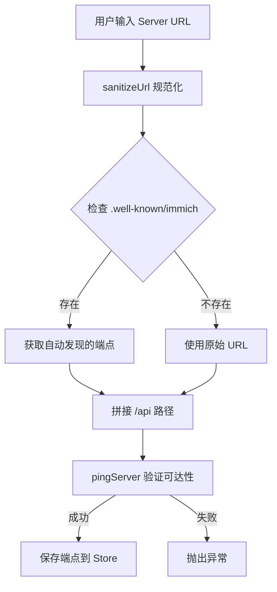
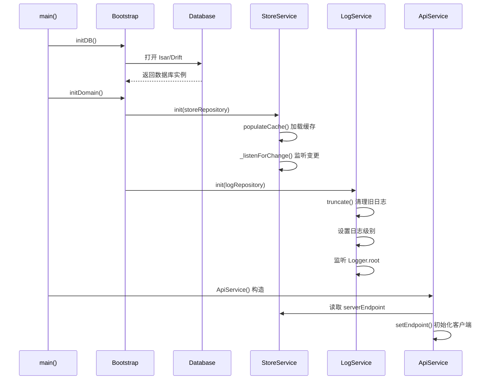
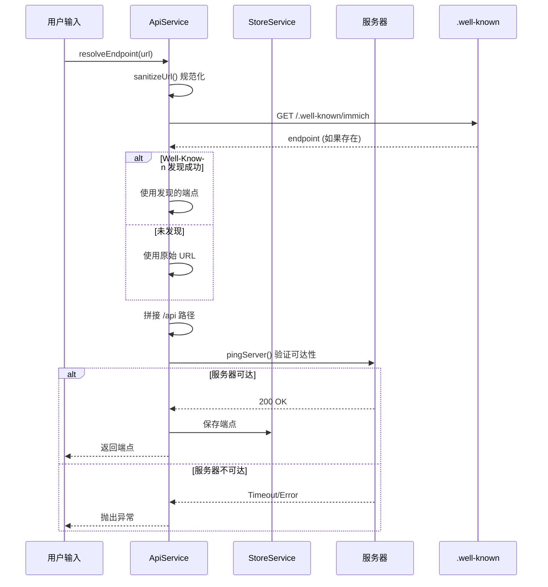
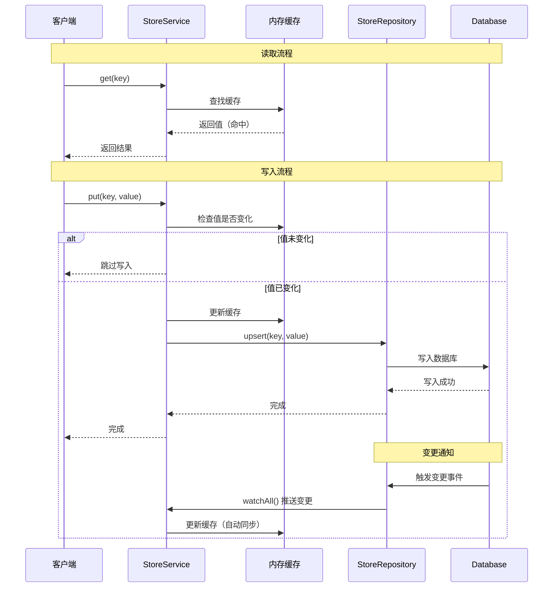
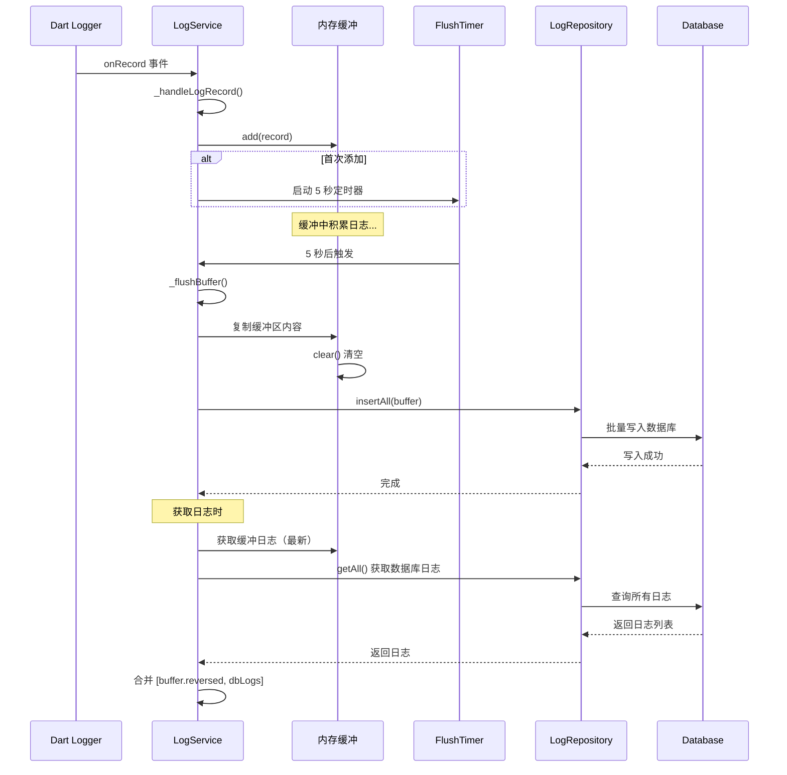
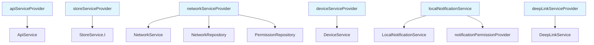

# Immich Mobile 基础服务模块 - 深度架构分析

> 本文档深入分析 Immich Mobile 应用中基础服务模块的架构设计、实现思路和核心机制。

## 1. 架构设计理念

### 1.1 核心设计原则

基础服务模块是应用的**基础设施层**，遵循以下核心设计原则：

1. **单一职责**：每个服务专注单一功能域（API、存储、日志等）
2. **依赖注入**：通过 Riverpod Provider 实现依赖注入，便于测试和替换
3. **缓存优先**：StoreService 采用内存缓存 + 持久化存储的双层架构
4. **异步非阻塞**：日志等操作采用缓冲和批量写入，避免阻塞主线程
5. **平台抽象**：通过 Repository 模式抽象平台差异，统一接口

### 1.2 模块分层架构

```
┌─────────────────────────────────────────────────────────────┐
│                    应用层 / UI 层                              │
│  (通过 Provider 获取服务实例)                                  │
└──────────────────────┬──────────────────────────────────────┘
                       │ Provider 依赖注入
┌──────────────────────▼──────────────────────────────────────┐
│                   Service 层                                 │
│  ┌──────────────┐  ┌──────────────┐  ┌──────────────┐     │
│  │ ApiService   │  │ StoreService │  │ LogService   │     │
│  │ NetworkSvc   │  │ DeviceSvc    │  │ NotifySvc    │     │
│  │ DeepLinkSvc  │  │ HashService  │  │              │     │
│  └──────────────┘  └──────────────┘  └──────────────┘     │
└──────────────────────┬──────────────────────────────────────┘
                       │ 使用 Repository 接口
┌──────────────────────▼──────────────────────────────────────┐
│                  Repository 层                               │
│  ┌──────────────┐  ┌──────────────┐  ┌──────────────┐     │
│  │StoreRepo     │  │LogRepository │  │NetworkRepo   │     │
│  │(Isar/Drift)  │  │(DriftLogger) │  │(Platform)    │     │
│  └──────────────┘  └──────────────┘  └──────────────┘     │
└──────────────────────┬──────────────────────────────────────┘
                       │
┌──────────────────────▼──────────────────────────────────────┐
│                  数据持久化层                                 │
│  ┌──────────────┐  ┌──────────────┐  ┌──────────────┐     │
│  │ Isar DB      │  │ Drift DB     │  │ Platform API │     │
│  │ (键值存储)    │  │ (日志存储)    │  │ (权限/网络)  │     │
│  └──────────────┘  └──────────────┘  └──────────────┘     │
└─────────────────────────────────────────────────────────────┘
```

## 2. API Service - HTTP 客户端管理

### 2.1 职责范围

`ApiService` 是应用的 HTTP 客户端统一入口，负责：

- **管理 OpenAPI 生成的 API 客户端**：统一管理 18+ 个 API 客户端实例
- **端点解析与验证**：智能解析服务器 URL，支持 Well-Known 发现
- **认证 Token 管理**：存储和注入访问令牌
- **请求头注入**：自动添加 User-Agent、设备信息等头部

### 2.2 架构设计要点

#### 2.2.1 多 API 客户端管理

系统统一管理所有 OpenAPI 生成的客户端实例，包括：
- UsersApi、AuthenticationApi、AlbumsApi、AssetsApi
- SearchApi、ServerApi、MapApi、PartnersApi
- PeopleApi、SharedLinksApi、SyncApi 等 18+ 个客户端

**初始化流程**：
1. 构造时先初始化空端点，避免 late 初始化错误
2. 从 Store 读取已保存的端点（如果有）
3. 每次调用 `setEndpoint()` 时重新创建所有客户端实例

#### 2.2.2 端点解析机制

端点解析采用多步骤智能策略：



**关键步骤**：

1. **URL 规范化**：补充协议、端口等缺失部分
2. **Well-Known 发现**：尝试访问 `/.well-known/immich` 获取自动配置的端点
3. **可达性验证**：调用 `pingServer()` 接口验证服务器可达性（5 秒超时）
4. **持久化**：解析成功后保存到 Store，下次启动自动使用

#### 2.2.3 认证机制

**Token 管理**：
- 通过 `setAccessToken()` 方法存储访问令牌
- Token 同时保存在内存和 Store 中
- 实现 `Authentication` 接口，在每次请求时自动注入

**请求头注入**：
- 实现 `applyToParams()` 方法，在请求参数中注入认证头
- 支持自定义头部：从 Store 读取 `customHeaders` 配置
- 统一的头部格式：`x-immich-user-token`

#### 2.2.4 设备信息头

`setDeviceInfoHeader()` 动态设置设备信息：
- **iOS**：使用 `utsname.machine` 作为设备型号
- **Android**：使用 `model` 作为设备型号
- 统一添加 `deviceType` 和 `deviceModel` 头部

## 3. Store Service - 键值存储服务

### 3.1 职责范围

`StoreService` 是应用级的键值存储服务，负责：

- **应用设置的持久化**：服务器端点、用户信息、应用偏好等
- **内存缓存加速访问**：提供零延迟的读取性能
- **变更监听与响应式更新**：支持 Stream 监听，实现响应式 UI

### 3.2 架构设计要点

#### 3.2.1 双层存储架构

```
┌─────────────────────────────────────┐
│       内存缓存 (_cache)              │
│  Map<int, Object?>                   │
│  - 快速访问                           │
│  - Key = StoreKey.id                 │
└──────────────┬──────────────────────┘
               │ 同步更新
┌──────────────▼──────────────────────┐
│     持久化存储 (Repository)          │
│  - IsarStoreRepository (旧)          │
│  - DriftStoreRepository (新)         │
│  - 数据库持久化                       │
└─────────────────────────────────────┘
```

**设计优势**：
- **读写性能**：内存缓存提供零延迟访问
- **数据持久化**：数据库保证数据不丢失
- **自动同步**：监听数据库变更，自动更新缓存

#### 3.2.2 Repository 选择策略

系统支持两种 Repository 实现，根据配置动态选择：

- **新版本（Beta Timeline）**：使用 `DriftStoreRepository`
- **旧版本**：使用 `IsarStoreRepository`

选择逻辑在 Bootstrap 初始化时根据 `StoreKey.betaTimeline` 配置决定。

#### 3.2.3 变更监听机制

**实时同步**：
- 监听 Repository 的 `watchAll()` Stream
- 数据库变更自动反映到内存缓存
- 无需手动刷新，保证数据一致性

**响应式支持**：
- 提供 `watch(key)` 方法返回 Stream
- UI 层可以监听特定 Key 的变化
- 实现响应式数据绑定

#### 3.2.4 性能优化策略

1. **跳过重复写入**：`put()` 时比较缓存值，值未变化则跳过数据库写入
2. **批量加载**：启动时 `populateCache()` 一次性加载所有数据
3. **单例模式**：通过 `StoreService.I` 全局访问（向后兼容）

## 4. Log Service - 日志管理服务

### 4.1 职责范围

`LogService` 负责应用日志的收集、存储和管理：

- **监听所有日志记录**：监听 Dart Logger.root 的所有日志输出
- **缓冲日志以提高性能**：批量写入数据库，减少 I/O
- **持久化存储**：将日志保存到数据库，支持查询和展示
- **动态调整日志级别**：运行时修改日志级别，无需重启

### 4.2 架构设计要点

#### 4.2.1 日志缓冲机制

采用缓冲策略平衡性能与数据安全：

**缓冲模式（默认）**：
- 日志先存入内存缓冲区
- 定时器触发（5 秒）或缓冲区满时批量写入
- **优点**：减少数据库写入次数，降低 NAND 磨损，提升性能
- **风险**：崩溃时可能丢失缓冲中的日志

**直接模式**：
- 每条日志立即写入数据库
- 用于 Isolate 等场景，确保日志不丢失

#### 4.2.2 日志级别管理

- **动态调整**：通过 `setLogLevel()` 修改 `Logger.root.level`
- **持久化配置**：日志级别存储在 Store 中
- **启动恢复**：启动时从 Store 读取上次的日志级别

#### 4.2.3 日志清理策略

- **自动截断**：启动时调用 `truncate(limit: kLogTruncateLimit)` 限制日志数量
- **手动清理**：提供 `clearLogs()` 方法清空所有日志
- **内存清理**：`dispose()` 时刷新缓冲区，确保不丢失

#### 4.2.4 日志获取

**合并展示**：
- 返回内存缓冲区（逆序，最新在前）+ 数据库日志
- 确保完整的日志时间线

## 5. Network Service - 网络服务

### 5.1 职责范围

`NetworkService` 封装平台网络相关功能：

- **WiFi 名称获取**：获取当前连接的 WiFi 网络名称
- **位置权限管理**：WiFi 名称获取需要位置权限（平台限制）
- **系统设置跳转**：引导用户到设置页面授予权限

### 5.2 架构设计要点

#### 5.2.1 权限驱动的设计

WiFi 名称获取依赖位置权限（Android/iOS 平台限制）：

**权限检查**：
- 先检查是否有权限
- 无权限时返回 null，不抛出异常
- 提供权限请求方法

**优雅降级**：
- 权限未授予时功能降级
- 不影响其他功能使用

#### 5.2.2 应用场景

主要用于**智能端点切换**：
- 检测当前连接的 WiFi 名称
- 根据配置选择本地或远程端点
- 实现局域网内自动使用本地服务器

## 6. Device Service - 设备服务

### 6.1 职责范围

`DeviceService` 管理设备标识：

- **生成/获取设备唯一 ID**：用于服务端识别设备
- **一致性 UDID**：基于 `flutter_udid` 生成，应用重装不变

### 6.2 架构设计要点

- **一致性 UDID**：使用 `FlutterUdid.consistentUdid` 生成，应用重装后保持不变
- **持久化存储**：设备 ID 保存在 Store 中
- **懒加载**：首次调用时生成并保存

## 7. Local Notification Service - 本地通知服务

### 7.1 职责范围

`LocalNotificationService` 管理应用内通知：

- **上传进度通知**：显示上传/下载进度
- **操作通知**：提供操作按钮（如取消上传）
- **渠道管理**：区分不同类型的通知（进度通知、详细通知）

### 7.2 架构设计要点

#### 7.2.1 双通道设计

- **普通通知通道**：简单状态通知
- **详细通知通道**：带进度条和操作按钮

#### 7.2.2 进度通知

支持 Android 进度通知：
- 显示上传/下载进度百分比
- 操作按钮（如"取消"）
- 低优先级，不打扰用户

#### 7.2.3 权限管理

- 通过 `notificationPermissionProvider` 获取权限状态
- 有权限时才显示通知

## 8. Deep Link Service - 深度链接服务

### 8.1 职责范围

`DeepLinkService` 处理深度链接导航：

- **解析自定义协议**：`immich://` 协议链接
- **解析域名链接**：`my.immich.app` 域名链接
- **路由到对应页面**：相册、照片、回忆等

### 8.2 架构设计要点

#### 8.2.1 多协议支持

- **自定义协议**：`immich://asset?id=xxx`
- **标准域名**：`https://my.immich.app/photos/xxx`

#### 8.2.2 冷启动处理

**路由栈管理**：
- 冷启动时添加主页路由，确保有返回路径
- 热启动时直接导航到目标页面

#### 8.2.3 错误处理

- 链接解析失败时返回默认路径（冷启动）或不做处理（热启动）
- 目标资源不存在时返回 null，触发错误处理

## 9. Hash Service - 文件哈希服务

### 9.1 职责范围

`HashService` 计算本地文件哈希值：

- **批量计算文件哈希**：高效处理大量文件
- **更新数据库中的哈希值**：用于去重和同步
- **支持取消操作**：长时间运行时可以取消

### 9.2 架构设计要点

#### 9.2.1 批量处理

**性能优化**：
- 批量大小：使用 `kBatchHashFileLimit` 控制批次大小
- 内存友好：每批处理完后清空集合
- 取消支持：每步检查 `isCancelled`

#### 9.2.2 平台 API 调用

- 使用 `NativeSyncApi` 调用平台原生哈希计算
- 性能优化：原生代码计算更快
- 网络控制：可配置是否允许网络访问（用于云文件）

## 10. 初始化流程

### 10.1 Bootstrap 流程

应用启动时的初始化顺序：



### 10.2 关键时序：API 端点解析



### 10.3 关键时序：Store 读写流程



### 10.4 关键时序：日志收集流程



## 11. 依赖注入与 Provider 体系

### 11.1 Provider 层次



### 11.2 生命周期管理

- **@Riverpod(keepAlive: true)**：API Service、Store Service 等长期保持
- **普通 Provider**：按需创建，自动清理

## 12. 设计亮点总结

1. **双层缓存架构**：StoreService 内存缓存 + 持久化存储，兼顾性能与数据持久性
2. **响应式更新**：Store 变更自动同步到缓存，支持 Stream 监听实现响应式 UI
3. **智能缓冲机制**：日志服务缓冲策略，减少数据库写入，提升性能
4. **端点自动发现**：API 服务支持 Well-Known 自动发现，简化配置
5. **权限抽象**：Network Service 统一处理权限检查，降低复杂度
6. **深度链接支持**：支持多协议、冷启动处理，提升用户体验
7. **批量处理优化**：Hash Service 批量计算，支持取消，性能优化
8. **依赖注入体系**：通过 Provider 实现依赖注入，便于测试和维护

## 13. 关键文件索引

### 核心服务
- `mobile/lib/services/api.service.dart` - API 客户端管理
- `mobile/lib/services/network.service.dart` - 网络服务
- `mobile/lib/services/device.service.dart` - 设备服务
- `mobile/lib/services/local_notification.service.dart` - 通知服务
- `mobile/lib/services/deep_link.service.dart` - 深度链接服务

### Domain 服务
- `mobile/lib/domain/services/store.service.dart` - 键值存储服务
- `mobile/lib/domain/services/log.service.dart` - 日志服务
- `mobile/lib/domain/services/hash.service.dart` - 哈希服务

### 初始化
- `mobile/lib/utils/bootstrap.dart` - 启动初始化
- `mobile/lib/providers/api.provider.dart` - API Provider
- `mobile/lib/providers/infrastructure/store.provider.dart` - Store Provider

---

**文档版本**：v1.0  
**最后更新**：2024  
**相关文档**：`mobile-architecture-detail.md`, `mobile-image-cache-module.md`

