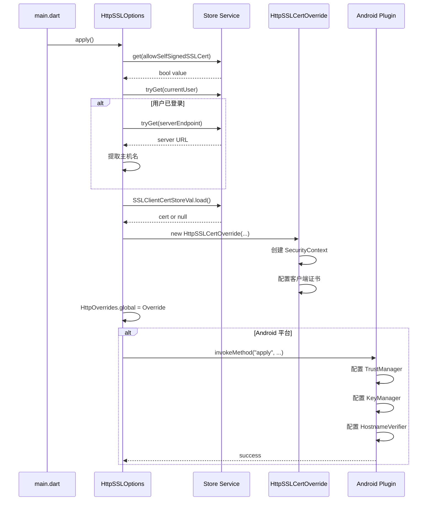
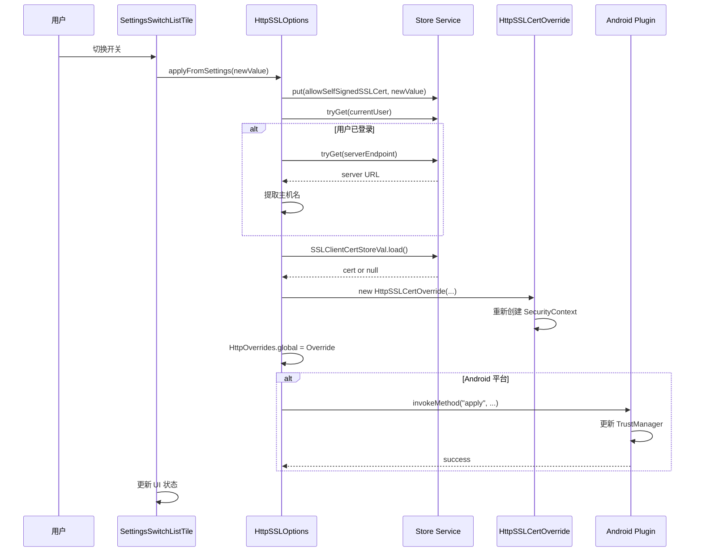
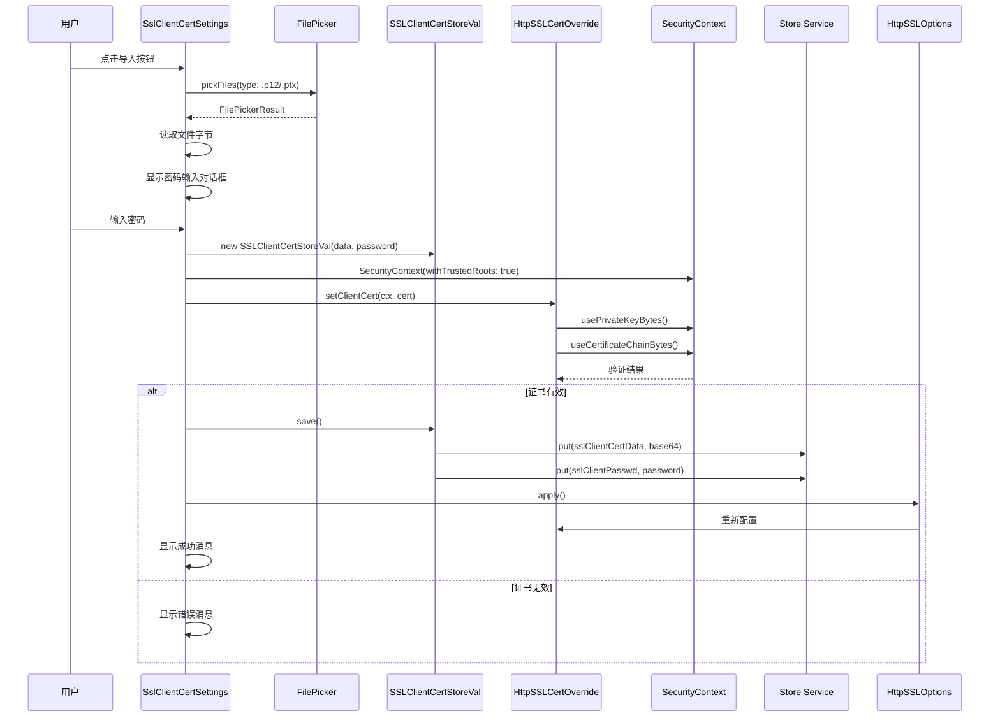
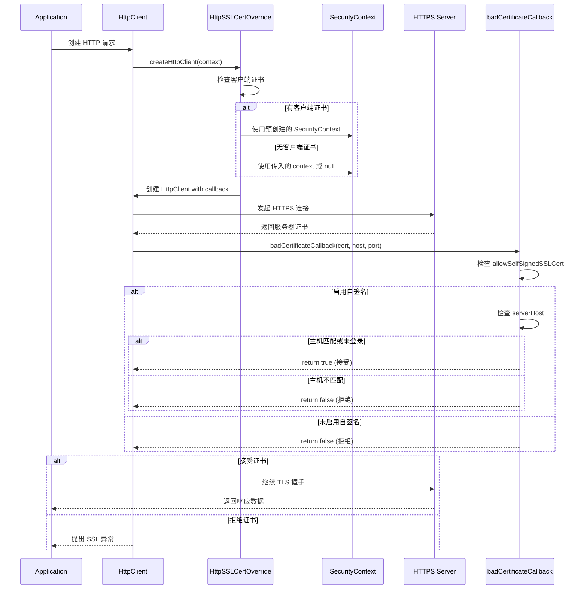
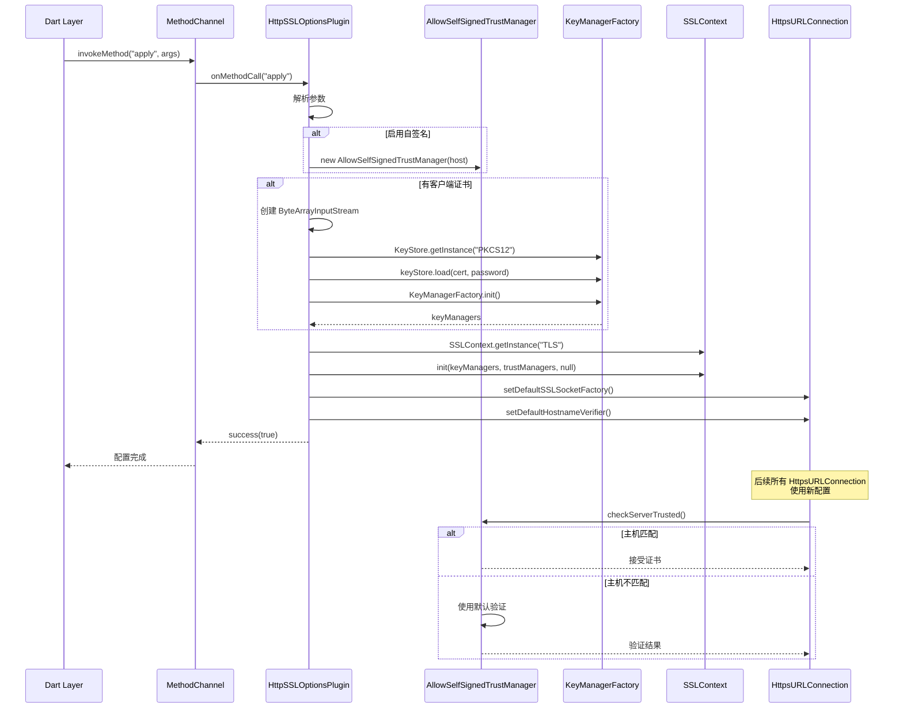

# Immich Mobile HTTPS 支持模块架构详解

## 1. 架构设计概览

### 1.1 设计原则

HTTPS 支持模块遵循以下核心设计原则：

- **分层配置**：Dart 层与原生层（Android/iOS）协同工作，确保跨平台一致性
- **安全优先**：默认严格验证，允许用户选择放宽（自签名证书）
- **主机验证**：启用自签名时，仅对已登录用户的服务器主机放宽验证
- **客户端证书**：支持 PKCS12 格式的客户端证书双向认证
- **全局覆盖**：通过 `HttpOverrides` 全局生效，统一管理所有 HTTP 请求

### 1.2 架构层次

```
┌─────────────────────────────────────────┐
│         UI Layer (Settings)             │
│  - AdvancedSettings (自签名证书开关)     │
│  - SslClientCertSettings (客户端证书)    │
└─────────────────────────────────────────┘
                    ↓
┌─────────────────────────────────────────┐
│      Configuration Layer                │
│  - HttpSSLOptions (配置管理器)          │
│  - AppSettingsService (设置存储)         │
└─────────────────────────────────────────┘
                    ↓
┌─────────────────────────────────────────┐
│      Dart HTTP Layer                    │
│  - HttpSSLCertOverride (HttpOverrides)  │
│  - SecurityContext (证书上下文)          │
└─────────────────────────────────────────┘
                    ↓
┌─────────────────────────────────────────┐
│      Native Layer (Android)             │
│  - HttpSSLOptionsPlugin (MethodChannel) │
│  - AllowSelfSignedTrustManager          │
│  - AllowSelfSignedHostnameVerifier      │
└─────────────────────────────────────────┘
```

## 2. 核心组件设计

### 2.1 配置管理层

#### HttpSSLOptions

**职责**：统一管理 SSL 配置的入口点

**核心方法**：

1. **`apply()`** - 从设置加载并应用配置
   - 读取 `allowSelfSignedSSLCert` 设置
   - 调用 `_apply()` 执行实际配置

2. **`applyFromSettings(bool newValue)`** - 响应设置变更
   - 用户切换自签名证书开关时调用
   - 立即应用新配置

3. **`_apply()`** - 内部配置逻辑
   - 获取服务器主机（如果已登录）
   - 加载客户端证书（如果存在）
   - 设置 Dart 层 `HttpOverrides.global`
   - Android 平台通过 MethodChannel 同步到原生层

**设计特点**：

- **条件主机验证**：仅在已登录且启用自签名时提取服务器主机
- **平台差异**：Android 需要原生层配置，iOS 依赖 Dart 层
- **错误处理**：原生层调用失败时记录日志，不影响 Dart 层

### 2.2 Dart HTTP 层

#### HttpSSLCertOverride

**职责**：实现 `HttpOverrides`，自定义 HTTP 客户端创建

**核心功能**：

1. **客户端证书支持**
   - 构造函数中加载客户端证书
   - 创建 `SecurityContext` 并配置证书
   - 支持 PKCS12 格式（.p12/.pfx）

2. **证书验证回调**
   - `badCertificateCallback` 处理服务器证书验证
   - 自签名证书处理逻辑：
     - 如果启用自签名且服务器主机匹配，接受证书
     - 否则拒绝并记录错误

3. **安全上下文管理**
   - 预创建带证书的 `SecurityContext`
   - 在 `createHttpClient` 中复用或注入

**设计亮点**：

- **主机匹配检查**：`_serverHost.contains(host)` 防止中间人攻击
- **证书预加载**：初始化时验证并加载客户端证书
- **上下文复用**：避免每次创建 HTTP 客户端时重复加载

### 2.3 客户端证书管理

#### SSLClientCertStoreVal

**职责**：客户端证书的存储与加载

**存储策略**：

- **数据格式**：Base64 编码的证书二进制数据
- **存储位置**：使用 `Store` 服务持久化
- **密码保护**：证书密码单独存储（如果存在）

**核心方法**：

1. **`save()`** - 保存证书
   - Base64 编码证书数据
   - 分别存储数据和密码

2. **`load()`** - 加载证书
   - 从 Store 读取 Base64 数据
   - 解码并返回证书对象

3. **`delete()`** - 删除证书
   - 清除存储的证书数据和密码

**设计考虑**：

- **安全性**：密码与数据分离存储
- **可空性**：证书为可选功能，支持 null 值
- **持久化**：使用应用级存储，重启后仍有效

### 2.4 Android 原生层

#### HttpSSLOptionsPlugin

**职责**：通过 MethodChannel 同步 SSL 配置到 Android 原生层

**核心功能**：

1. **TrustManager 配置**
   - `AllowSelfSignedTrustManager`：自定义信任管理器
   - 仅在服务器主机匹配时接受自签名证书
   - 其他情况使用系统默认 TrustManager

2. **KeyManager 配置**
   - 从 PKCS12 证书加载密钥
   - 配置 KeyManagerFactory
   - 支持密码保护的证书

3. **HostnameVerifier 配置**
   - `AllowSelfSignedHostnameVerifier`：自定义主机名验证
   - 服务器主机匹配时直接通过
   - 其他情况使用默认验证器

**设计特点**：

- **安全边界**：仅在指定主机上放宽验证
- **系统集成**：设置 `HttpsURLConnection` 的默认配置
- **错误处理**：捕获异常并返回错误信息

#### AllowSelfSignedTrustManager

**职责**：实现 `X509ExtendedTrustManager`，处理自签名证书验证

**验证逻辑**：

- **客户端证书**：始终使用默认 TrustManager 验证
- **服务器证书**：
  - 如果 `serverHost` 为 null，直接接受（仅登录前）
  - 如果主机名匹配，接受证书
  - 否则使用默认 TrustManager 验证

**安全考虑**：

- **登录前**：允许任意自签名证书（用于首次连接）
- **登录后**：仅接受服务器主机的自签名证书
- **其他连接**：使用系统默认验证，保证安全

## 3. 数据流设计

### 3.1 应用启动时的 SSL 配置

```
应用启动 (main.dart)
    ↓
HttpSSLOptions.apply()
    ↓
读取设置 (allowSelfSignedSSLCert)
    ↓
获取服务器主机 (如果已登录)
    ↓
加载客户端证书 (如果存在)
    ↓
设置 HttpOverrides.global
    ↓
Android: 调用原生插件配置
    ↓
所有 HTTP 请求使用新配置
```

### 3.2 用户切换自签名证书设置

```
用户在设置中切换开关
    ↓
SettingsSwitchListTile.onChanged
    ↓
HttpSSLOptions.applyFromSettings(newValue)
    ↓
更新 Store 中的设置值
    ↓
_apply(newValue)
    ↓
重新配置 HttpOverrides.global
    ↓
Android: 同步到原生层
    ↓
后续请求使用新配置
```

### 3.3 客户端证书导入流程

```
用户选择证书文件 (.p12/.pfx)
    ↓
FilePicker 读取文件
    ↓
提示用户输入密码
    ↓
创建 SSLClientCertStoreVal
    ↓
验证证书有效性 (setClientCert)
    ↓
保存到 Store
    ↓
HttpSSLOptions.apply()
    ↓
重新配置 HTTP 客户端
    ↓
后续请求使用客户端证书
```

### 3.4 HTTPS 请求处理流程

```
应用发起 HTTPS 请求
    ↓
HttpClient.createHttpClient()
    ↓
HttpSSLCertOverride.createHttpClient()
    ↓
检查是否有客户端证书
    ↓
创建 SecurityContext (带证书或默认)
    ↓
设置 badCertificateCallback
    ↓
服务器返回证书
    ↓
badCertificateCallback 被调用
    ↓
检查是否启用自签名
    ↓
验证服务器主机是否匹配
    ↓
接受或拒绝连接
```

## 4. 安全机制设计

### 4.1 自签名证书处理

**安全策略**：

1. **登录前**：允许任意自签名证书
   - **场景**：首次连接服务器，可能使用自签名证书
   - **风险**：相对较低，用户尚未登录

2. **登录后**：仅接受服务器主机的自签名证书
   - **场景**：已登录用户，服务器主机已知
   - **保护**：防止中间人攻击，确保连接到正确服务器

3. **其他连接**：使用系统默认验证
   - **场景**：第三方 API、CDN 等
   - **保证**：标准证书验证，不降低安全性

### 4.2 客户端证书支持

**使用场景**：

- **企业环境**：需要客户端证书双向认证
- **高安全要求**：额外的身份验证层

**实现细节**：

- **格式支持**：PKCS12 (.p12/.pfx)
- **密码保护**：支持密码保护的证书
- **验证机制**：导入时验证证书有效性
- **持久化**：证书安全存储在应用数据中

### 4.3 主机验证机制

**验证逻辑**：

```dart
if (_allowSelfSignedSSLCert) {
  if (_serverHost == null || _serverHost.contains(host)) {
    return true; // 接受证书
  }
}
return false; // 拒绝证书
```

**安全考虑**：

- **主机匹配**：使用 `contains` 而非精确匹配，支持子域名
- **空值处理**：`serverHost == null` 表示登录前状态
- **日志记录**：拒绝证书时记录错误日志

## 5. 时序图

### 5.1 应用启动与 SSL 初始化



### 5.2 用户切换自签名证书设置



### 5.3 客户端证书导入



### 5.4 HTTPS 请求处理



### 5.5 Android 原生层证书验证



## 6. 与 Let's Encrypt 的关系

### 6.1 为什么移动端不使用 certbot/Let's Encrypt

**关键区别**：

- **certbot/Let's Encrypt 是服务器端工具**：
  - 在服务器上运行，用于获取和管理 SSL/TLS 证书
  - 为服务器域名颁发证书（如 `immich.example.com`）
  - 证书安装在服务器上，用于 HTTPS 服务

- **移动应用是客户端**：
  - 不运行服务器，不拥有域名
  - 只负责连接到服务器并验证服务器证书
  - 无法使用 certbot 获取证书

### 6.2 Immich 的推荐方案

根据官方文档，Immich **强烈推荐**使用 Let's Encrypt：

> "Instead of these experimental features, we recommend using the URL switching feature, a VPN, or a [free trusted SSL certificate](https://letsencrypt.org/) for your domain."

**推荐部署架构**：

```
┌─────────────────────────────────────────┐
│         服务器端 (推荐方案)               │
│                                         │
│  ┌─────────────────────────────────┐   │
│  │  Nginx/Caddy (反向代理)         │   │
│  │  ┌───────────────────────────┐ │   │
│  │  │ certbot + Let's Encrypt   │ │   │
│  │  │ 获取并自动续期证书          │ │   │
│  │  └───────────────────────────┘ │   │
│  │  HTTPS (443) → Immich (2283)   │   │
│  └─────────────────────────────────┘   │
│                                         │
│  标准 HTTPS，证书由 Let's Encrypt 提供   │
└─────────────────────────────────────────┘
                    ↓ HTTPS
┌─────────────────────────────────────────┐
│         移动端 (标准验证)                 │
│                                         │
│  ┌─────────────────────────────────┐   │
│  │  HttpClient                     │   │
│  │  ┌───────────────────────────┐ │   │
│  │  │ 系统默认证书验证            │ │   │
│  │  │ (信任 Let's Encrypt CA)    │ │   │
│  │  └───────────────────────────┘ │   │
│  └─────────────────────────────────┘   │
│                                         │
│  自动验证，无需特殊配置                  │
└─────────────────────────────────────────┘
```

### 6.3 为什么仍支持自签名证书

移动端支持自签名证书的原因：

#### 6.3.1 开发与测试环境
- 本地开发服务器可能使用自签名证书
- 内网部署可能没有公网域名，无法使用 Let's Encrypt
- 测试环境需要快速部署，不想配置反向代理

#### 6.3.2 企业内网部署
- 企业内网可能使用内部 CA 签发的证书
- 某些环境不允许使用公网证书服务
- 需要客户端证书双向认证（mTLS）

#### 6.3.3 向后兼容
- 已有用户使用自签名证书部署
- 提供过渡方案，逐步迁移到标准证书

### 6.4 最佳实践建议

#### 生产环境（推荐）

**服务器端配置**：

```nginx
# Nginx 配置示例
server {
    server_name immich.example.com;
    
    # Let's Encrypt 证书（由 certbot 自动管理）
    ssl_certificate /etc/letsencrypt/live/immich.example.com/fullchain.pem;
    ssl_certificate_key /etc/letsencrypt/live/immich.example.com/privkey.pem;
    
    location / {
        proxy_pass http://localhost:2283;
    }
}
```

**移动端**：
- ✅ 无需任何特殊配置
- ✅ 使用系统默认证书验证
- ✅ 自动信任 Let's Encrypt 证书

#### 开发/内网环境（实验性）

**服务器端**：
- 使用自签名证书或内部 CA 证书

**移动端**：
- ⚠️ 需要用户手动启用"允许自签名证书"
- ⚠️ 仅对已知服务器主机放宽验证
- ⚠️ 存在安全风险，不推荐用于生产

### 6.5 方案对比

| 方面           | certbot/Let's Encrypt | 移动端自签名支持   |
| -------------- | --------------------- | ------------------ |
| **位置**       | 服务器端              | 客户端             |
| **用途**       | 获取服务器证书        | 验证服务器证书     |
| **推荐度**     | ✅ 生产环境推荐        | ⚠️ 仅开发/内网      |
| **安全性**     | ✅ 高（受信任 CA）     | ⚠️ 低（需手动信任） |
| **配置复杂度** | 中等（需反向代理）    | 简单（但不安全）   |
| **适用场景**   | 公网部署              | 内网/开发环境      |

**结论**：
- certbot/Let's Encrypt 是服务器端工具，移动端无法直接使用
- Immich 推荐服务器端使用 Let's Encrypt，移动端使用标准验证
- 移动端的自签名证书支持是实验性功能，用于特殊场景
- 生产环境应使用 Let's Encrypt + 反向代理的标准方案

## 7. 关键设计亮点

### 7.1 安全与便利的平衡

- **默认严格**：未启用自签名时使用系统默认验证
- **条件放宽**：仅在明确场景下放宽验证
- **主机限制**：自签名证书仅对已知服务器主机生效

### 7.2 跨平台一致性

- **Dart 层统一**：通过 `HttpOverrides` 统一管理
- **平台适配**：Android 需要原生层配置，iOS 依赖 Dart 层
- **配置同步**：确保 Dart 层与原生层配置一致

### 7.3 客户端证书支持

- **标准格式**：支持 PKCS12 行业标准
- **密码保护**：支持加密证书
- **验证机制**：导入时验证有效性，避免运行时错误

### 7.4 配置持久化

- **设置存储**：使用 Store 服务持久化配置
- **证书存储**：Base64 编码存储，密码分离
- **自动应用**：应用启动时自动加载配置

## 8. 关键文件清单

### Dart 层
- `utils/http_ssl_options.dart` - SSL 配置管理器
- `utils/http_ssl_cert_override.dart` - HTTP 覆盖实现
- `entities/store.entity.dart` - 客户端证书存储类
- `widgets/settings/ssl_client_cert_settings.dart` - 客户端证书设置 UI
- `widgets/settings/advanced_settings.dart` - 高级设置页面

### Android 原生层
- `android/app/src/main/kotlin/app/alextran/immich/HttpSSLOptionsPlugin.kt` - Android 插件实现

### 初始化点
- `main.dart` - 应用启动时调用 `HttpSSLOptions.apply()`
- `services/background.service.dart` - 后台服务初始化时应用配置
- `utils/isolate.dart` - Isolate 中应用配置（不调用原生层）
- `domain/services/background_worker.service.dart` - 后台工作器初始化

## 9. 潜在优化方向

### 9.1 安全性增强

- **证书固定**：支持证书固定（Certificate Pinning）
- **证书链验证**：更严格的证书链验证
- **过期检查**：检查证书有效期并提醒用户

### 9.2 用户体验

- **证书信息显示**：显示证书详情（颁发者、有效期等）
- **错误提示优化**：更友好的 SSL 错误提示
- **导入向导**：引导用户完成证书导入流程

### 9.3 功能扩展

- **多证书支持**：支持多个客户端证书
- **证书管理**：证书列表、删除、重命名等
- **iOS 原生支持**：为 iOS 添加原生层配置（如需要）

### 9.4 与 Let's Encrypt 集成

- **自动检测**：检测服务器是否使用 Let's Encrypt 证书
- **证书信息**：显示证书颁发者和有效期
- **续期提醒**：提醒用户证书即将过期

## 10. 安全注意事项

### 10.1 自签名证书的风险

⚠️ **警告**：使用自签名证书存在以下风险：

1. **中间人攻击**：攻击者可能伪造证书
2. **无 CA 验证**：无法验证证书的真实性
3. **用户教育**：用户可能不理解安全风险

**缓解措施**：
- 仅在登录后对已知服务器主机放宽验证
- 记录所有证书验证失败事件
- 在 UI 中明确标注实验性功能

### 10.2 客户端证书安全

✅ **最佳实践**：

1. **密码保护**：始终使用密码保护客户端证书
2. **安全存储**：证书存储在应用安全存储中
3. **定期更新**：定期更换客户端证书
4. **访问控制**：限制证书导入功能（仅未登录时可用）

### 10.3 生产环境建议

✅ **强烈推荐**：

1. **使用 Let's Encrypt**：通过反向代理配置标准证书
2. **禁用自签名**：生产环境禁用自签名证书支持
3. **监控告警**：监控证书过期和验证失败
4. **定期审计**：定期检查 SSL/TLS 配置

---

该架构在安全性与易用性之间取得了良好平衡，通过分层设计和条件验证，既支持企业环境的高级安全需求，又保持了对标准 HTTPS 连接的严格验证。移动端的 HTTPS 支持模块是为了兼容特殊部署场景，而不是替代标准的 Let's Encrypt 方案。**生产环境应优先使用 Let's Encrypt + 反向代理的标准方案，自签名证书仅用于开发/内网环境。**

