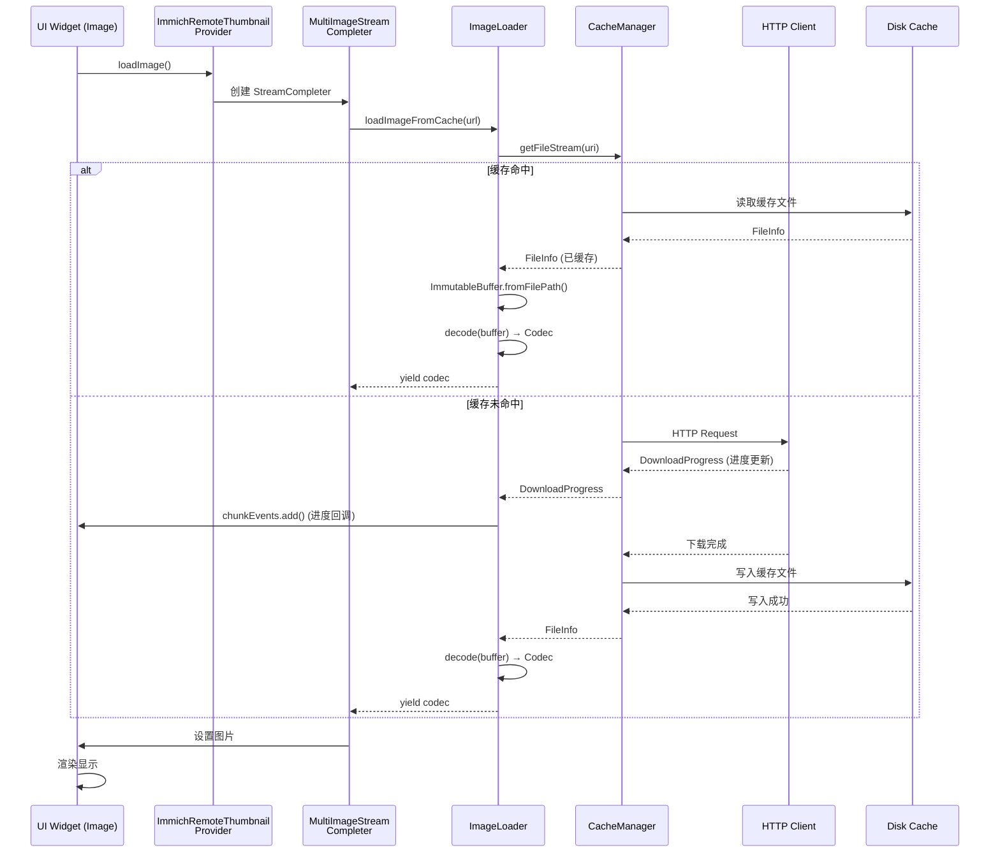
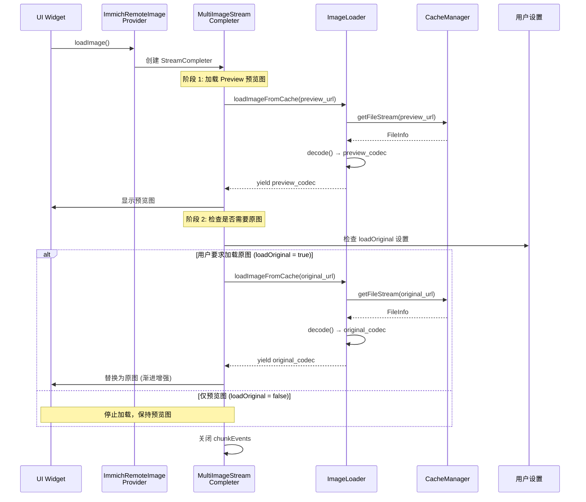
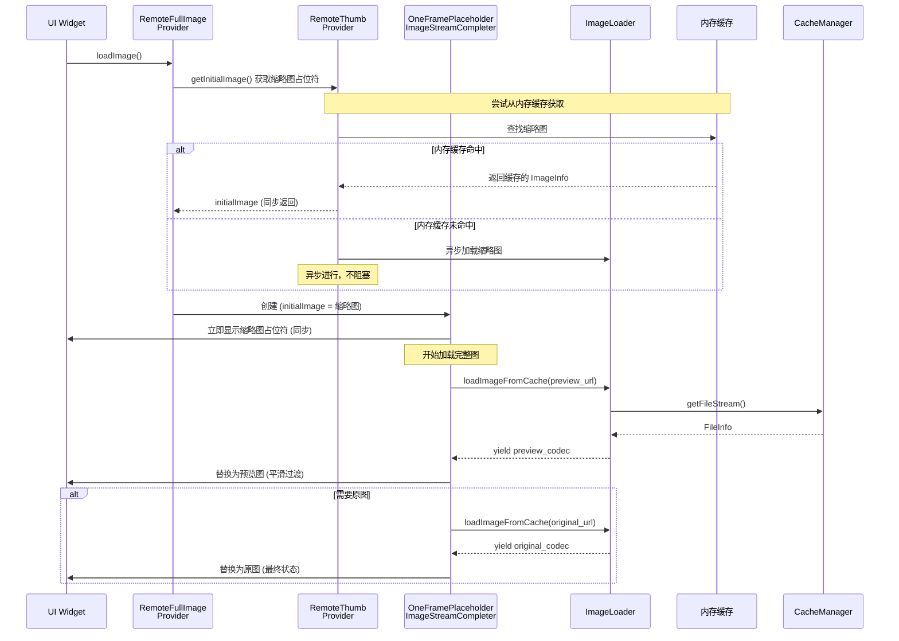
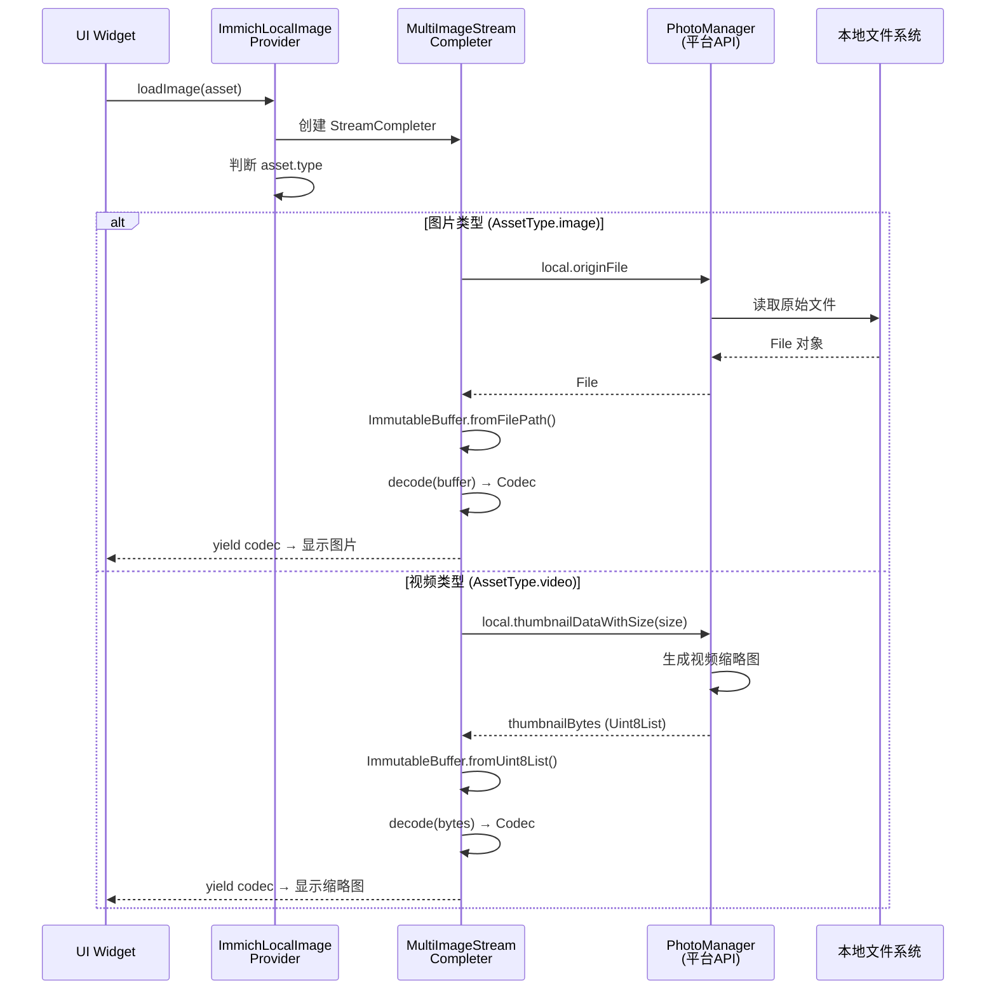
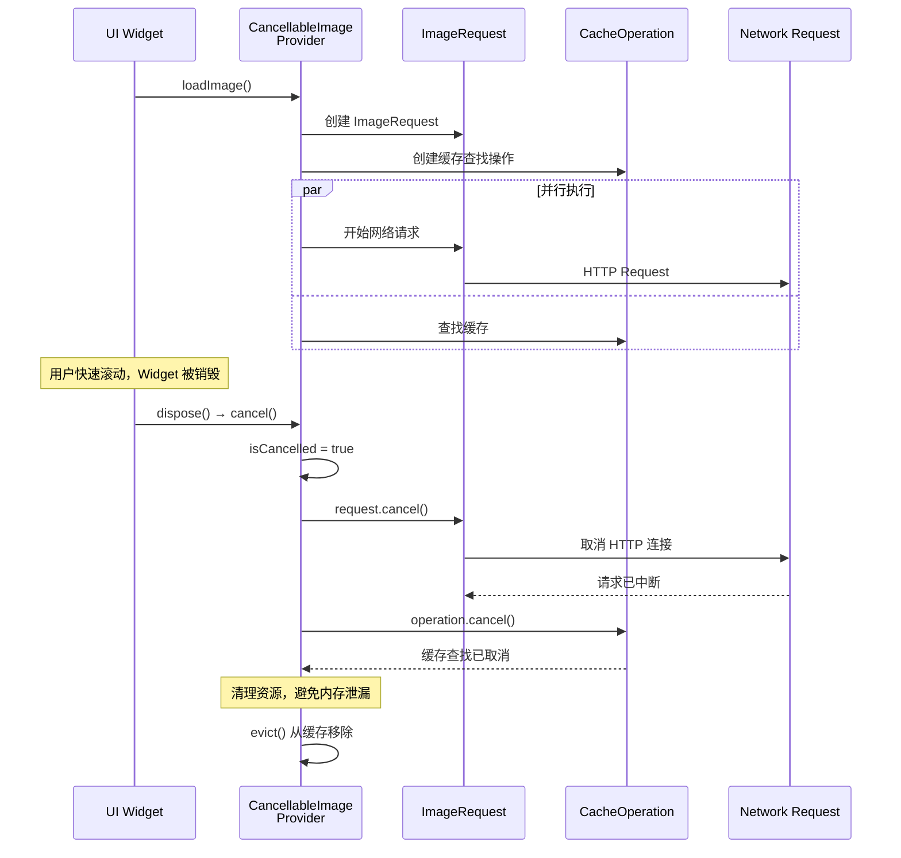
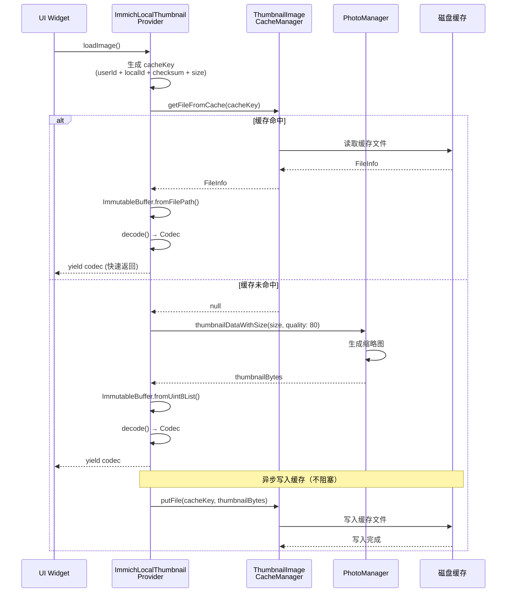

# Immich Mobile 图片加载与缓存模块 - 深度架构分析

> 本文档深入分析 Immich Mobile 应用中图片加载与缓存模块的架构设计、实现思路和核心机制。

## 1. 架构设计理念

### 1.1 核心设计原则

图片加载与缓存模块采用**三层架构设计**，遵循以下核心原则：

1. **双层内存缓存策略**：将小图（缩略图）与大图（完整图）分离缓存，避免大图挤占内存导致小图被频繁驱逐
2. **渐进式加载**：缩略图 → 预览图 → 原图，确保用户快速看到内容
3. **多级磁盘缓存**：针对不同场景使用独立的 CacheManager，精细化控制缓存策略
4. **请求可取消**：支持组件卸载时取消加载，避免内存泄漏与无效网络请求

### 1.2 架构分层

```
┌─────────────────────────────────────────────────────────────┐
│                        UI 层                                  │
│  (ImmichImage, AssetViewer, Timeline Grid 等)                │
└──────────────────────┬──────────────────────────────────────┘
                       │ 使用 ImageProvider
┌──────────────────────▼──────────────────────────────────────┐
│                   Provider 层                                │
│  ┌──────────────────┐  ┌──────────────────┐                │
│  │ ImmichRemote*    │  │ ImmichLocal*     │                │
│  │ - ImageProvider  │  │ - ImageProvider  │                │
│  │ - ThumbProvider  │  │ - ThumbProvider  │                │
│  └──────────────────┘  └──────────────────┘                │
│  ┌──────────────────┐  ┌──────────────────┐                │
│  │ RemoteFull*      │  │ LocalFull*       │                │
│  │ RemoteThumb*     │  │ LocalThumb*      │                │
│  └──────────────────┘  └──────────────────┘                │
└──────────────────────┬──────────────────────────────────────┘
                       │ 委托加载
┌──────────────────────▼──────────────────────────────────────┐
│                  加载层                                       │
│  ┌──────────────────┐  ┌──────────────────┐                │
│  │ ImageRequest     │  │ ImageLoader      │                │
│  │ - RemoteRequest  │  │ - 从Cache加载     │                │
│  │ - LocalRequest   │  │ - 解码Codec      │                │
│  └──────────────────┘  └──────────────────┘                │
└──────────────────────┬──────────────────────────────────────┘
                       │
┌──────────────────────▼──────────────────────────────────────┐
│                  缓存层                                       │
│  ┌──────────────┐  ┌──────────────┐  ┌──────────────┐     │
│  │内存缓存      │  │磁盘缓存      │  │Platform缓存  │     │
│  │CustomImage   │  │CacheManager  │  │PhotoManager  │     │
│  │Cache         │  │系列          │  │(本地)        │     │
│  └──────────────┘  └──────────────┘  └──────────────┘     │
└─────────────────────────────────────────────────────────────┘
```

## 2. 内存缓存架构（CustomImageCache）

### 2.1 三池分离策略

系统实现了**三池分离**的内存缓存策略：

- **`_small` 池**：存储缩略图，数量大但占内存小，默认配置由 Flutter 管理
- **`_large` 池**：存储完整图，限制最多 5 张（`maximumSize = 5`），避免大图过多占用内存
- **`_thumbhash` 池**：ThumbHash 占位符，`maximumSize = 0` 仅临时存储，不长期保留

**为什么需要分离？**

- **避免大图驱逐小图**：单张大图（如 50MB）可能挤占内存，导致数百张缩略图被驱逐
- **独立 LRU 策略**：大图池独立，确保查看器中的大图不会影响列表缩略图
- **提升缓存命中率**：各池独立管理，避免相互干扰

### 2.2 初始化时机

在 `main()` 函数启动时，通过自定义 `WidgetsFlutterBinding` 替换默认的 `ImageCache`，确保应用全局生效。

## 3. 磁盘缓存架构

### 3.1 多 CacheManager 策略

系统使用三个独立的 CacheManager，各自有明确的策略：

| CacheManager | 用途 | 最大对象数 | 过期时间 | 说明 |
|-------------|------|-----------|---------|------|
| `RemoteImageCacheManager` | 远程完整图 | 500 | 30天 | 大文件，数量受限 |
| `RemoteThumbnailCacheManager` | 远程缩略图 | 5000 | 30天 | 小文件，可存更多 |
| `ThumbnailImageCacheManager` | 本地缩略图缓存 | 5000 | 30天 | 本地生成的缩略图 |

**设计考量：**

1. **完整图与缩略图分离**：避免大文件占用过多磁盘空间
2. **数量限制 + 过期策略**：自动清理旧数据，防止无限增长
3. **单例模式**：避免重复创建，保证缓存一致性

### 3.2 流式下载优化

`RemoteCacheManager` 实现了优化的流式下载机制，关键特性：

- **取消时自动清理**：如果下载被取消，自动删除未完成的文件，避免脏数据
- **UUID 文件名**：使用 UUID 生成临时文件名，避免冲突
- **原子性写入**：仅在文件完全写入后才写入数据库记录，保证一致性

## 4. 渐进式加载机制

### 4.1 多阶段加载流程

远程完整图加载采用**三阶段渐进式加载**：

1. **预览图（Preview）**：中等分辨率（通常 1080p），快速展示
2. **原图（Original，可选）**：仅在用户设置 `loadOriginal = true` 时加载

这种设计确保用户快速看到内容，同时支持按需加载高质量版本。

### 4.2 占位符机制

`RemoteFullImageProvider` 使用缩略图作为初始占位符，实现**无缝渐进增强**：

- 先显示缩略图（从内存缓存快速获取）
- 然后加载预览图（从磁盘缓存或网络）
- 最后按需加载原图

### 4.3 MultiImageStreamCompleter 原理

`MultiImageStreamCompleter` 允许流式产生多个 Codec，每次 yield 新的 Codec 时替换当前显示的图片，实现渐进增强效果。

## 5. Provider 体系设计

### 5.1 Provider 分类

系统有两套 Provider 体系：

#### 体系 A：Immich 系列（新架构）

- `ImmichRemoteImageProvider`：远程完整图
- `ImmichRemoteThumbnailProvider`：远程缩略图
- `ImmichLocalImageProvider`：本地完整图
- `ImmichLocalThumbnailProvider`：本地缩略图

#### 体系 B：Cancellable 系列（支持取消）

- `RemoteFullImageProvider` / `RemoteThumbProvider`
- `LocalFullImageProvider` / `LocalThumbProvider`

### 5.2 本地与远程选择逻辑

系统根据以下规则智能选择使用本地还是远程 Provider：

- **优先级**：本地存在 && (无远程 || 用户未偏好远程) → 使用本地
- **否则**：使用远程 Provider

这种设计在性能（本地更快）和数据一致性（远程最新）之间取得平衡。

## 6. 请求取消机制

### 6.1 取消时机

- Widget 被 dispose
- 路由切换，旧页面卸载
- 用户快速滚动，旧请求不再需要

### 6.2 取消实现

取消机制通过 `CancellableImageProviderMixin` 实现，包含：

1. **标记取消状态**：`isCancelled = true`
2. **取消网络请求**：调用 `ImageRequest.cancel()` 中断网络连接
3. **取消缓存查找**：取消正在进行的缓存操作

完整的取消链路确保资源及时释放，避免内存泄漏。

## 7. 加载进度反馈

### 7.1 ImageChunkEvent 机制

通过 `ImageChunkEvent` 提供加载进度反馈，UI 可以监听并显示进度条，提升用户体验。

## 8. 时序图

### 8.1 远程缩略图加载时序



### 8.2 远程完整图渐进式加载时序



### 8.3 带占位符的完整图加载时序



### 8.4 本地图片加载时序



### 8.5 请求取消机制时序



### 8.6 本地缩略图缓存机制时序



## 9. 性能优化要点

1. **内存缓存分离**：大图/小图独立缓存，避免相互驱逐
2. **磁盘缓存分级**：完整图/缩略图独立管理，容量与策略分离
3. **渐进式加载**：先显示低分辨率，再逐步提升
4. **请求取消**：及时取消无效请求，节省资源
5. **并发控制**：`HttpClient.maxConnectionsPerHost = 16`，控制并发连接数
6. **本地优先**：本地存在时优先使用本地，避免网络延迟

## 10. 设计亮点总结

- **多级缓存**：内存（分层）+ 磁盘（分级），最大化缓存命中率
- **渐进式体验**：缩略图 → 预览 → 原图，确保快速首屏
- **智能选择**：本地/远程自动选择，兼顾性能与数据源
- **资源管理**：取消机制 + 内存限制，避免内存泄漏与 OOM
- **可扩展性**：Provider 体系清晰，易于扩展新场景

## 11. 关键文件索引

### 核心 Provider
- `mobile/lib/providers/image/immich_remote_image_provider.dart`
- `mobile/lib/providers/image/immich_remote_thumbnail_provider.dart`
- `mobile/lib/providers/image/immich_local_image_provider.dart`
- `mobile/lib/providers/image/immich_local_thumbnail_provider.dart`
- `mobile/lib/presentation/widgets/images/remote_image_provider.dart`
- `mobile/lib/presentation/widgets/images/local_image_provider.dart`

### 缓存管理
- `mobile/lib/utils/cache/custom_image_cache.dart`
- `mobile/lib/providers/image/cache/remote_image_cache_manager.dart`
- `mobile/lib/providers/image/cache/thumbnail_image_cache_manager.dart`
- `mobile/lib/providers/image/cache/image_loader.dart`

### 加载器
- `mobile/lib/infrastructure/loaders/image_request.dart`
- `mobile/lib/infrastructure/loaders/remote_image_request.dart`
- `mobile/lib/infrastructure/loaders/local_image_request.dart`

### 工具类
- `mobile/lib/utils/image_url_builder.dart`
- `mobile/lib/presentation/widgets/images/image_provider.dart`
- `mobile/lib/presentation/widgets/images/one_frame_multi_image_stream_completer.dart`

---

**文档版本**：v1.0  
**最后更新**：2024  
**相关文档**：`mobile-architecture-detail.md`

