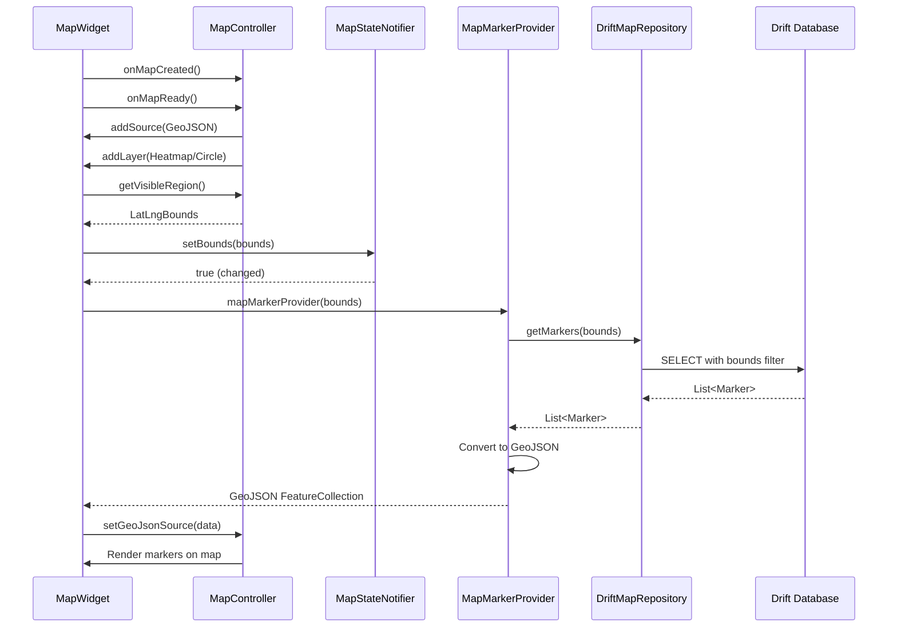
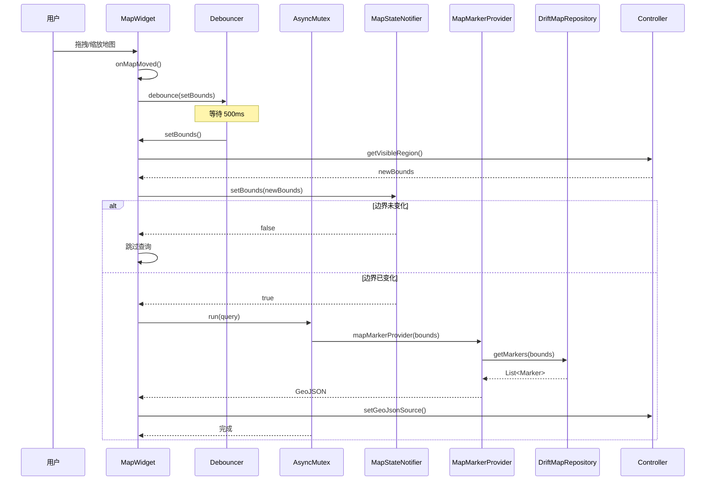
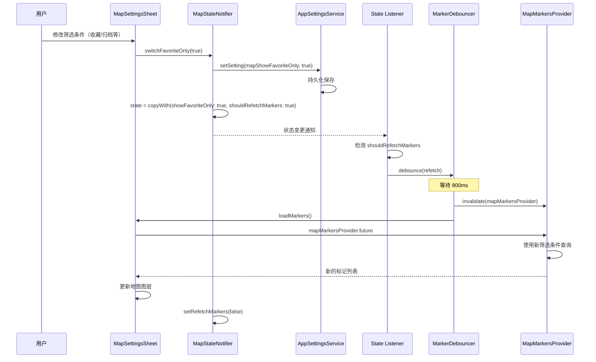
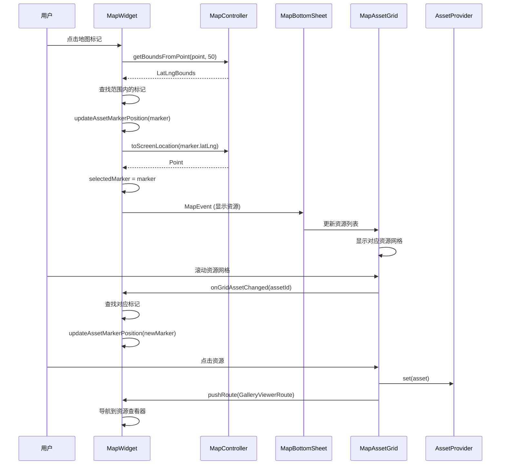

# Immich Mobile 地图与位置模块架构详解

## 1. 架构设计概览

### 1.1 设计原则

地图模块采用分层架构，遵循以下核心设计原则：

- **数据源分离**：本地数据库（Drift）与远程 API 双轨并行，支持离线查看已同步资源
- **响应式更新**：基于地图可视区域（Bounds）动态加载标记，避免一次性加载全部数据
- **状态集中管理**：通过 Riverpod 统一管理地图状态、筛选条件、主题等配置
- **性能优化**：防抖、异步互斥锁、查询限制等多层优化机制

### 1.2 架构层次

```
┌─────────────────────────────────────────┐
│         UI Layer (Presentation)         │
│  - MapWidget / MapPage                 │
│  - MapBottomSheet / MapAssetGrid       │
│  - MapAppBar / MapSettingsSheet        │
└─────────────────────────────────────────┘
                    ↓
┌─────────────────────────────────────────┐
│        Provider Layer (State)           │
│  - MapStateNotifier (筛选/主题状态)      │
│  - MapMarkerProvider (标记数据)          │
│  - MapServiceProvider (服务注入)         │
└─────────────────────────────────────────┘
                    ↓
┌─────────────────────────────────────────┐
│      Service Layer (Business Logic)     │
│  - MapService (API调用)                  │
│  - Domain MapService (本地查询)          │
└─────────────────────────────────────────┘
                    ↓
┌─────────────────────────────────────────┐
│   Infrastructure Layer (Data Access)    │
│  - DriftMapRepository (本地数据库)       │
│  - API Repository (远程接口)             │
└─────────────────────────────────────────┘
```

## 2. 核心组件设计

### 2.1 Domain 层：业务抽象

#### MapFactory 工厂模式

- **职责**：根据用户 ID 创建对应的 MapService 实例
- **设计思路**：支持多用户场景，每个用户拥有独立的地图查询上下文
- **关键点**：通过 `remote(ownerId)` 方法创建用户专属服务，实现数据隔离

#### MapService（Domain）

- **职责**：封装标记数据源，提供统一的 `getMarkers` 接口
- **设计思路**：使用函数式接口 `MapMarkerSource`，实现查询逻辑的延迟执行
- **优势**：解耦数据源与业务逻辑，支持本地/远程数据源无缝切换

#### MapQuery 类型定义

- **结构**：`({MapMarkerSource markerSource})`
- **作用**：将标记查询函数作为数据传递，实现查询逻辑的抽象化
- **优势**：函数即数据，支持查询逻辑的组合与传递

### 2.2 Infrastructure 层：数据访问

#### DriftMapRepository

**核心功能**：

1. **边界查询**：根据 `LatLngBounds` 筛选可视区域内的资源
2. **资源过滤**：支持按可见性、删除状态、所有者等多维度过滤
3. **地理边界扩展**：处理跨经度 180° 的特殊情况

**边界查询优化**：

- 使用 `inBounds` 扩展方法，将地理坐标转换为 SQL 表达式
- 处理经度跨越：当西南角经度 > 东北角经度时（跨越 180°），使用 OR 条件组合
- 查询限制：最多返回 10000 条记录，防止内存溢出

**数据关联**：

- 通过 `innerJoin` 关联 `RemoteExifEntity` 和 `RemoteAssetEntity`
- 只查询有经纬度信息的资源（`latitude.isNotNull() & longitude.isNotNull()`）
- 支持按资源可见性、删除状态、所有者进行过滤

### 2.3 Service 层：API 调用

#### MapService（Service）

- **职责**：调用服务器 API 获取地图标记数据
- **功能特性**：
  - 支持多维度筛选：收藏、归档、合作伙伴、时间范围
  - 错误处理：使用 `ErrorLoggerMixin` 统一记录错误日志
  - User-Agent 设置：为地图请求设置正确的用户代理标识

### 2.4 Provider 层：状态管理

#### MapStateNotifier

**状态内容**：

- 主题模式（ThemeMode）：系统/亮色/暗色
- 筛选条件：收藏、归档、合作伙伴、相对时间
- 地图样式 URL：亮色/暗色主题的样式地址
- 标记刷新标志：`shouldRefetchMarkers` 控制是否需要重新获取标记

**设计特点**：

- `keepAlive: true` 保持状态持久化，避免重复初始化
- 状态变更自动保存到本地设置，实现配置持久化
- 筛选条件变更时自动触发标记刷新，保证数据一致性

#### MapMarkerProvider

- **类型**：`FutureProvider.family<Map<String, dynamic>, LatLngBounds?>`
- **功能**：根据边界参数动态查询标记数据
- **数据转换**：将 `Marker` 列表转换为 GeoJSON 格式供地图渲染
- **依赖追踪**：自动监听 `mapServiceProvider` 变化，实现响应式更新

#### 依赖注入链

```
mapRepositoryProvider 
    ↓
mapFactoryProvider 
    ↓
mapServiceProvider (需要 currentUserProvider)
```

### 2.5 UI 层：交互与渲染

#### DriftMap Widget

**核心功能**：

1. **地图初始化**：加载地图样式、创建数据源和图层
2. **可视区域监听**：监听地图移动事件，触发标记更新
3. **标记渲染**：支持热力图（iOS）和圆圈图层（Android）
4. **底部面板联动**：与底部资源网格实现双向同步

**性能优化机制**：

- **Debouncer**：地图移动事件防抖（500ms 间隔，最大等待 2s）
- **AsyncMutex**：防止并发查询导致的状态冲突
- **条件更新**：仅在边界真正变化时触发查询，避免无效更新

#### MapBottomSheet

**功能特性**：

- 可拖拽底部面板，显示当前可视区域的资源网格
- 三个吸附位置（10%、50%、80%），提供良好的交互体验
- 根据面板位置动态调整"我的位置"按钮透明度
- 通过 `MapEvent` 流与地图组件进行通信

## 3. 数据流设计

### 3.1 标记加载流程

```
用户操作/地图移动
    ↓
获取可视区域 (getVisibleRegion)
    ↓
检查边界是否变化 (MapStateNotifier.setBounds)
    ↓
触发 MapMarkerProvider 查询
    ↓
DriftMapRepository 执行数据库查询
    ↓
转换为 GeoJSON 格式
    ↓
更新地图图层 (setGeoJsonSource)
```

### 3.2 筛选条件变更流程

```
用户修改筛选条件
    ↓
MapStateNotifier 更新状态
    ↓
保存到本地设置 (AppSettingsService)
    ↓
设置 shouldRefetchMarkers = true
    ↓
监听器检测到变化
    ↓
防抖后触发 (markerDebouncer)
    ↓
使 MapMarkersProvider 失效
    ↓
重新加载标记
```

### 3.3 标记选择与资源查看流程

```
用户点击地图标记
    ↓
计算点击区域 (getBoundsFromPoint)
    ↓
查找范围内的标记
    ↓
更新 selectedMarker 状态
    ↓
底部面板显示对应资源
    ↓
用户滚动资源网格
    ↓
同步更新标记位置 (updateAssetMarkerPosition)
    ↓
用户点击资源
    ↓
导航到资源查看器
```

## 4. 性能优化策略

### 4.1 查询优化

- **边界限制**：只查询可视区域内的资源，大幅减少数据库压力
- **数量限制**：单次查询最多 10000 条，防止内存溢出
- **索引利用**：依赖 `RemoteExifEntity` 表的经纬度索引，提升查询速度

### 4.2 渲染优化

- **防抖机制**：地图移动事件防抖，避免频繁查询和渲染
- **异步互斥**：使用 `AsyncMutex` 确保查询串行执行，避免状态冲突
- **条件渲染**：仅在边界真正变化时更新图层，减少不必要的渲染

### 4.3 状态管理优化

- **Provider 缓存**：使用 `keepAlive` 保持状态，避免重复初始化
- **按需加载**：使用 `FutureProvider.family` 按边界参数懒加载数据
- **依赖追踪**：Provider 自动追踪依赖变化，实现精确更新

## 5. 时序图

### 5.1 地图初始化与标记加载



### 5.2 地图移动与动态加载



### 5.3 筛选条件变更



### 5.4 标记选择与资源查看



## 6. 关键文件清单

### Domain 层
- `domain/services/map.service.dart` - 领域服务，封装标记查询逻辑
- `domain/models/map.model.dart` - 标记数据模型

### Infrastructure 层
- `infrastructure/repositories/map.repository.dart` - 数据库仓库实现

### Service 层
- `services/map.service.dart` - API 服务，调用服务器接口

### Provider 层
- `providers/infrastructure/map.provider.dart` - 基础设施 Provider
- `providers/map/map_service.provider.dart` - 服务注入 Provider
- `providers/map/map_state.provider.dart` - 状态管理 Provider
- `providers/map/map_marker.provider.dart` - 标记数据 Provider

### UI 层
- `presentation/widgets/map/map.widget.dart` - 主地图组件
- `presentation/widgets/map/map.state.dart` - 地图状态管理
- `presentation/widgets/map/map_utils.dart` - 地图工具类
- `widgets/map/map_bottom_sheet.dart` - 底部面板组件
- `widgets/map/map_asset_grid.dart` - 资源网格组件
- `widgets/map/map_app_bar.dart` - 地图应用栏
- `widgets/map/map_settings_sheet.dart` - 设置面板

### 模型层
- `models/map/map_marker.model.dart` - 标记模型
- `models/map/map_state.model.dart` - 状态模型
- `models/map/map_event.model.dart` - 事件模型

## 7. 设计亮点总结

### 7.1 架构优势

1. **双数据源支持**：本地数据库 + 远程 API，支持离线查看已同步资源
2. **响应式设计**：基于可视区域动态加载，性能可控且用户体验良好
3. **状态集中管理**：通过 Provider 统一管理，易于维护和扩展
4. **工厂模式应用**：支持多用户场景，扩展性强

### 7.2 性能优化亮点

1. **多层防抖**：地图移动、标记加载、图层更新都有防抖机制
2. **异步互斥**：避免并发查询导致的状态冲突和数据不一致
3. **查询限制**：边界查询 + 数量限制，有效控制数据量
4. **按需加载**：使用 `FutureProvider.family` 实现懒加载，提升启动速度

### 7.3 用户体验优化

1. **底部面板联动**：地图与资源网格双向同步，交互流畅
2. **平滑动画**：标记选择、地图移动都有动画过渡，视觉体验佳
3. **主题适配**：支持亮色/暗色主题切换，符合系统偏好
4. **权限处理**：位置权限请求与错误提示完善，用户引导清晰

### 7.4 扩展性考虑

1. **查询抽象**：`MapQuery` 类型支持不同数据源的切换
2. **筛选扩展**：状态管理支持新增筛选条件，易于扩展
3. **图层支持**：支持热力图、圆圈图层等多种渲染方式
4. **事件驱动**：通过 `MapEvent` 流实现组件间解耦通信

## 8. 潜在优化方向

### 8.1 性能优化

- **标记聚类**：在缩放级别较低时，对标记进行聚类显示，减少渲染压力
- **增量更新**：只更新变化的标记，而非全量替换
- **缓存策略**：缓存已查询的边界数据，避免重复查询

### 8.2 功能增强

- **路径规划**：支持在多个标记点之间规划路径
- **区域统计**：显示指定区域内的资源统计信息
- **时间轴视图**：结合时间维度，展示资源的时间分布

### 8.3 用户体验

- **搜索定位**：支持通过地址搜索定位到指定位置
- **收藏位置**：允许用户收藏常用位置，快速跳转
- **分享功能**：支持分享地图视图和标记位置

---

该架构在性能、可维护性和用户体验之间取得了良好平衡，特别适合大规模资源的地图展示场景。通过分层设计、响应式更新和多重优化机制，确保了系统的高效运行和良好的扩展性。

