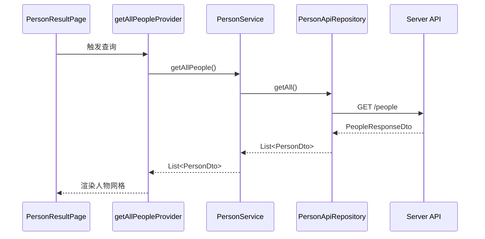
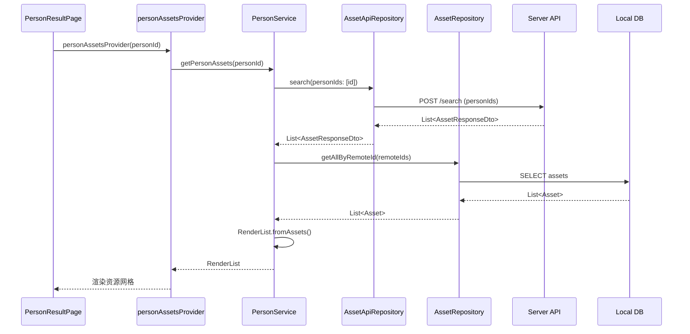
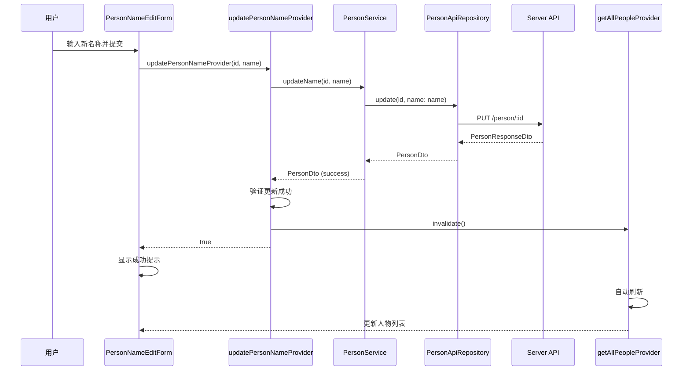
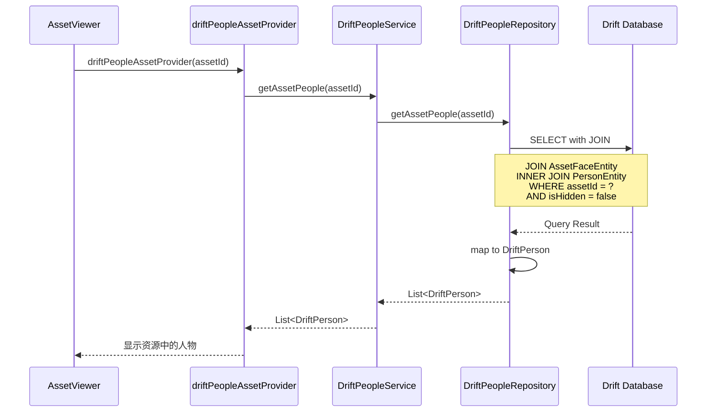
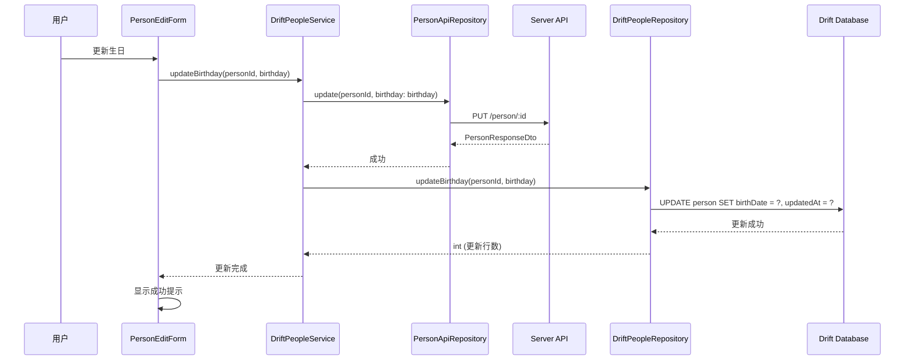

# Immich Mobile 人物识别模块架构详解

## 1. 架构设计概览

### 1.1 设计原则

人物识别模块遵循以下核心设计原则：

- **数据模型分离**：Person（人物）与 AssetFace（人脸）分离设计，支持多对多关系
- **本地优先策略**：优先使用本地数据库查询，减少网络请求，提升响应速度
- **增量更新机制**：支持人物信息（姓名、生日）的增量更新，保证数据一致性
- **智能过滤机制**：自动过滤隐藏人物和低质量聚类（少于3张人脸），提升用户体验

### 1.2 架构层次

```
┌─────────────────────────────────────────┐
│         UI Layer (Presentation)         │
│  - PersonResultPage (人物详情页)         │
│  - PersonNameEditForm (编辑表单)         │
│  - PersonSliverAppBar (应用栏)          │
│  - PersonOptionSheet (操作面板)          │
└─────────────────────────────────────────┘
                    ↓
┌─────────────────────────────────────────┐
│        Provider Layer (State)           │
│  - getAllPeopleProvider (人物列表)       │
│  - personAssetsProvider (人物资源)       │
│  - updatePersonNameProvider (更新名称)    │
│  - driftPeopleAssetProvider (本地查询)   │
└─────────────────────────────────────────┘
                    ↓
┌─────────────────────────────────────────┐
│      Service Layer (Business Logic)     │
│  - PersonService (API服务)               │
│  - DriftPeopleService (本地服务)         │
└─────────────────────────────────────────┘
                    ↓
┌─────────────────────────────────────────┐
│   Infrastructure Layer (Data Access)    │
│  - DriftPeopleRepository (本地数据库)    │
│  - PersonApiRepository (远程API)         │
└─────────────────────────────────────────┘
```

## 2. 核心组件设计

### 2.1 数据模型层

#### Person 模型

**双模型设计**：

1. **PersonDto（API模型）**
   - 用于与服务器通信
   - 包含字段：id、name、birthDate、isHidden、thumbnailPath
   - 轻量级设计，适合网络传输

2. **DriftPerson（本地模型）**
   - 存储在 Drift 数据库中
   - 额外字段：ownerId、faceAssetId、isFavorite、color
   - 支持完整的本地查询和更新操作

#### AssetFace 模型

- **职责**：表示资源中检测到的人脸
- **关键字段**：
  - `boundingBox`：人脸边界框坐标（x1, y1, x2, y2）
  - `imageWidth/Height`：原始图片尺寸
  - `personId`：关联的人物ID（可为空，表示未识别）
  - `sourceType`：来源类型（机器学习/EXIF）

### 2.2 Infrastructure 层：数据访问

#### DriftPeopleRepository

**核心查询方法**：

1. **getAssetPeople(assetId)**
   - **功能**：获取指定资源中的所有已识别人物
   - **查询策略**：
     - 通过 `innerJoin` 关联 `AssetFaceEntity` 和 `PersonEntity`
     - 过滤条件：`isHidden = false`
     - 只返回已分配人物的面孔

2. **getAllPeople()**
   - **功能**：获取所有人物列表（用于探索页）
   - **查询策略**：
     - 使用 `leftOuterJoin` 关联面孔表
     - 过滤隐藏人物
     - 分组统计：`HAVING COUNT(face.id) >= 3`（至少3张人脸）
     - **排序规则**：
       1. 优先显示已命名人物（`name != ''`）
       2. 按人脸数量降序排列

3. **updateName / updateBirthday**
   - **功能**：更新人物信息
   - **设计**：同时更新 `updatedAt` 时间戳

### 2.3 Service 层：业务逻辑

#### PersonService（API服务）

**职责**：处理与服务器的人物相关API调用

**核心方法**：

1. **getAllPeople()**
   - 调用 `PersonApiRepository.getAll()`
   - 错误处理：捕获异常并返回空列表

2. **getPersonAssets(personId)**
   - 通过 `AssetApiRepository.search(personIds: [id])` 搜索
   - 将远程ID转换为本地Asset实体
   - 支持按人物ID搜索资源

3. **updateName(id, name)**
   - 调用API更新人物名称
   - 返回更新后的PersonDto

#### DriftPeopleService（本地服务）

**职责**：封装本地数据库操作，同时处理API同步

**设计特点**：

- **双写策略**：更新操作先调用API，再更新本地数据库
- **保证一致性**：API成功后才更新本地，确保数据同步
- **方法映射**：
  - `getAssetPeople` → 本地查询
  - `getAllPeople` → 本地查询
  - `updateName` → API + 本地更新
  - `updateBirthday` → API + 本地更新

### 2.4 Provider 层：状态管理

#### 远程数据Provider

1. **getAllPeopleProvider**
   - **类型**：`FutureProvider<List<PersonDto>>`
   - **功能**：获取服务器端人物列表
   - **用途**：探索页人物展示

2. **personAssetsProvider**
   - **类型**：`FutureProvider.family<RenderList, String>`
   - **功能**：获取指定人物的资源列表
   - **数据转换**：将Asset列表转换为RenderList（支持分组）

3. **updatePersonNameProvider**
   - **类型**：`FutureProvider.family<bool, (String, String)>`
   - **功能**：更新人物名称
   - **副作用**：成功后使 `getAllPeopleProvider` 失效，触发刷新

#### 本地数据Provider

1. **driftPeopleRepositoryProvider**
   - **注入**：`DriftPeopleRepository` 实例

2. **driftPeopleServiceProvider**
   - **注入**：`DriftPeopleService` 实例
   - **依赖**：`driftPeopleRepositoryProvider` + `personApiRepositoryProvider`

3. **driftPeopleAssetProvider**
   - **类型**：`FutureProvider.family<List<DriftPerson>, String>`
   - **功能**：根据资源ID查询本地人物数据
   - **用途**：资源详情页显示人物信息

4. **driftGetAllPeopleProvider**
   - **类型**：`FutureProvider<List<DriftPerson>>`
   - **功能**：获取本地所有人物（已过滤和排序）

### 2.5 UI 层：交互与展示

#### PersonResultPage

**功能特性**：

- **人物详情展示**：头像、名称、资源网格
- **名称编辑**：支持点击编辑人物名称
- **资源展示**：使用 `MultiselectGrid` 展示人物相关资源
- **状态管理**：使用 `useState` 管理本地名称状态

#### PersonNameEditForm

**功能特性**：

- **表单验证**：名称输入验证
- **API调用**：通过 `updatePersonNameProvider` 更新
- **回调处理**：更新成功后通知父组件

## 3. 数据流设计

### 3.1 人物列表加载流程

```
用户进入探索页
    ↓
getAllPeopleProvider 触发
    ↓
PersonService.getAllPeople()
    ↓
PersonApiRepository.getAll()
    ↓
调用服务器 API
    ↓
返回 List<PersonDto>
    ↓
UI 渲染人物网格
```

### 3.2 人物资源加载流程

```
用户点击人物
    ↓
导航到 PersonResultPage
    ↓
personAssetsProvider(personId) 触发
    ↓
PersonService.getPersonAssets(personId)
    ↓
AssetApiRepository.search(personIds: [id])
    ↓
AssetRepository.getAllByRemoteId()
    ↓
转换为 RenderList（支持分组）
    ↓
UI 渲染资源网格
```

### 3.3 人物信息更新流程

```
用户编辑人物名称
    ↓
PersonNameEditForm 提交
    ↓
updatePersonNameProvider 触发
    ↓
PersonService.updateName(id, name)
    ↓
PersonApiRepository.update(id, name)
    ↓
服务器更新成功
    ↓
使 getAllPeopleProvider 失效
    ↓
UI 自动刷新人物列表
```

### 3.4 资源人物查询流程（本地优先）

```
资源详情页加载
    ↓
driftPeopleAssetProvider(assetId) 触发
    ↓
DriftPeopleService.getAssetPeople(assetId)
    ↓
DriftPeopleRepository.getAssetPeople(assetId)
    ↓
数据库查询（JOIN AssetFace + Person）
    ↓
返回 List<DriftPerson>
    ↓
UI 显示资源中的人物
```

## 4. 查询优化策略

### 4.1 数据库查询优化

- **JOIN优化**：
  - `getAssetPeople` 使用 `innerJoin`，只返回已识别人物
  - `getAllPeople` 使用 `leftOuterJoin`，统计所有人物的人脸数量
- **过滤策略**：
  - 自动过滤隐藏人物（`isHidden = false`）
  - 质量过滤：只显示至少3张人脸的人物（减少噪声）
- **排序策略**：
  - 优先显示已命名人物
  - 按人脸数量降序，突出重要人物

### 4.2 数据同步策略

- **双写模式**：更新操作先API后本地，保证一致性
- **失效刷新**：更新成功后使相关Provider失效，触发自动刷新
- **本地优先**：资源详情页使用本地查询，减少网络请求

## 5. 时序图

### 5.1 人物列表加载



### 5.2 人物资源加载



### 5.3 人物名称更新



### 5.4 资源人物查询（本地）



### 5.5 人物信息同步更新（双写）



## 6. 关键设计亮点

### 6.1 数据模型设计

- **人物与面孔分离**：Person 和 AssetFace 独立设计，支持多对多关系
- **双模型策略**：PersonDto（API）和 DriftPerson（本地）分离，职责清晰
- **质量过滤**：自动过滤低质量聚类（少于3张人脸），提升用户体验

### 6.2 查询优化

- **智能排序**：已命名人物优先，按人脸数量降序
- **JOIN优化**：根据场景选择 innerJoin 或 leftOuterJoin
- **本地优先**：资源详情页使用本地查询，提升响应速度

### 6.3 数据一致性

- **双写策略**：更新操作先API后本地，保证一致性
- **失效刷新**：更新成功后自动刷新相关数据
- **错误处理**：API失败时不影响本地状态

### 6.4 用户体验

- **即时反馈**：本地更新立即生效
- **自动刷新**：数据变更后自动更新UI
- **离线支持**：本地数据库支持离线查看

## 7. 关键文件清单

### Domain 层
- `domain/models/person.model.dart` - 人物数据模型
- `domain/models/asset_face.model.dart` - 人脸数据模型
- `domain/services/people.service.dart` - 领域服务（本地）

### Infrastructure 层
- `infrastructure/repositories/people.repository.dart` - 数据库仓库
- `infrastructure/entities/person.entity.dart` - 人物实体定义
- `infrastructure/entities/asset_face.entity.dart` - 人脸实体定义

### Service 层
- `services/person.service.dart` - API服务

### Repository 层
- `repositories/person_api.repository.dart` - API仓库

### Provider 层
- `providers/infrastructure/people.provider.dart` - 基础设施Provider
- `providers/search/people.provider.dart` - 搜索相关Provider
- `providers/asset_viewer/asset_people.provider.dart` - 资源查看器Provider

### UI 层
- `pages/search/person_result.page.dart` - 人物详情页
- `widgets/search/person_name_edit_form.dart` - 名称编辑表单
- `widgets/common/person_sliver_app_bar.dart` - 应用栏组件
- `presentation/widgets/people/person_edit_name_modal.widget.dart` - 编辑名称模态框
- `presentation/widgets/people/person_edit_birthday_modal.widget.dart` - 编辑生日模态框
- `presentation/widgets/people/person_option_sheet.widget.dart` - 操作面板

## 8. 人物识别算法原理

### 8.1 服务器端识别流程

人物识别主要在服务器端完成，使用基于 DBSCAN 的聚类算法：

1. **人脸检测**：
   - 机器学习服务处理预览图
   - 使用人脸检测模型识别边界框
   - 提取人脸特征向量（embedding）

2. **特征索引**：
   - 将 embedding 存储到向量数据库
   - 建立索引以支持快速相似度搜索

3. **聚类识别**：
   - 对每个检测到的人脸，搜索相似人脸
   - 使用最大距离阈值判断是否相似
   - 核心点判断：如果相似人脸数量 >= 最小阈值，创建新人物
   - 非核心点：分配给已有相似人物

4. **增量更新**：
   - 新资源上传时，只处理新检测的人脸
   - 避免全量重新聚类，提升效率

### 8.2 移动端角色

移动端主要负责：

- **数据展示**：显示已识别的人物和关联资源
- **信息管理**：编辑人物名称、生日等信息
- **本地查询**：使用本地数据库快速查询人物信息
- **数据同步**：与服务器同步人物数据更新

## 9. 潜在优化方向

### 9.1 性能优化

- **缓存策略**：缓存人物列表，减少重复查询
- **分页加载**：人物列表分页加载，提升加载速度
- **预加载机制**：预加载人物缩略图，提升用户体验

### 9.2 功能增强

- **人物合并**：支持合并多个未命名人物
- **人脸编辑**：支持手动调整人脸边界框
- **批量操作**：支持批量更新人物信息
- **人物分组**：支持创建人物分组（如家庭、朋友）

### 9.3 用户体验

- **搜索功能**：支持按名称搜索人物
- **筛选功能**：支持按人脸数量、创建时间筛选
- **统计信息**：显示人物相关资源数量、时间范围等
- **智能推荐**：基于时间、地点推荐可能的人物

### 9.4 数据质量

- **人脸验证**：允许用户确认/拒绝识别结果
- **质量评分**：显示人脸识别质量评分
- **冲突检测**：检测可能的人物重复

---

该架构在数据一致性、查询性能和用户体验之间取得了良好平衡，通过本地优先策略和双写模式，确保了数据同步和离线支持。人物识别模块作为 Immich 的核心功能之一，为用户提供了智能的照片管理和检索能力。

