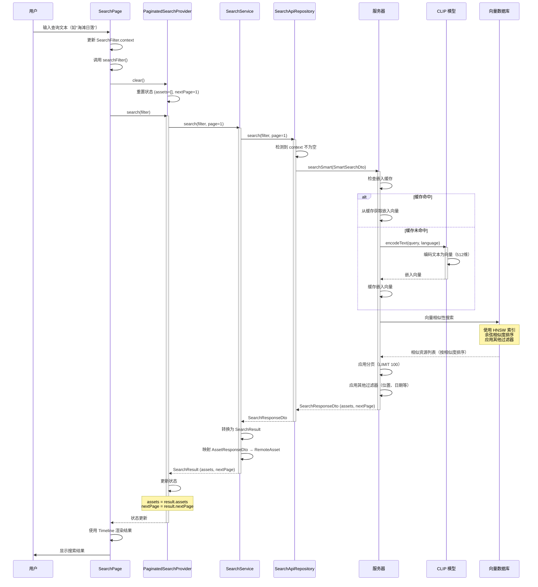
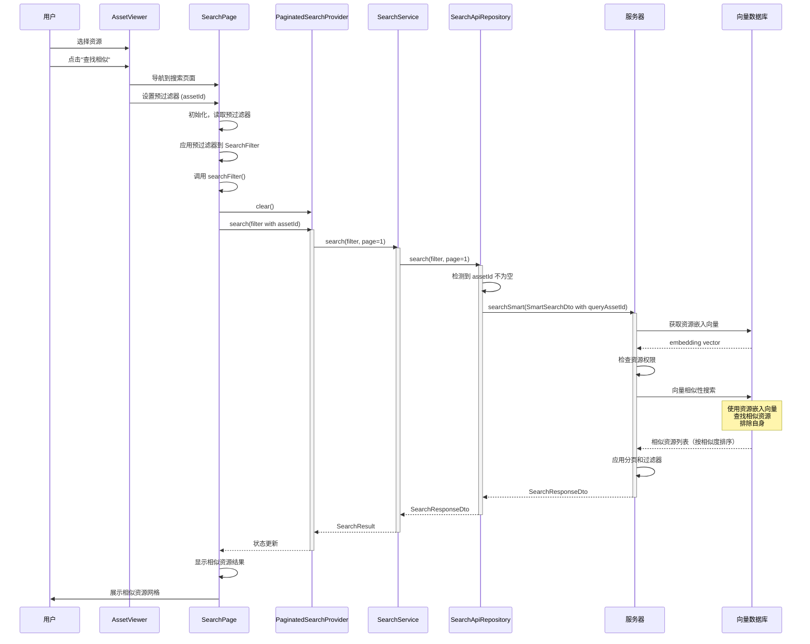
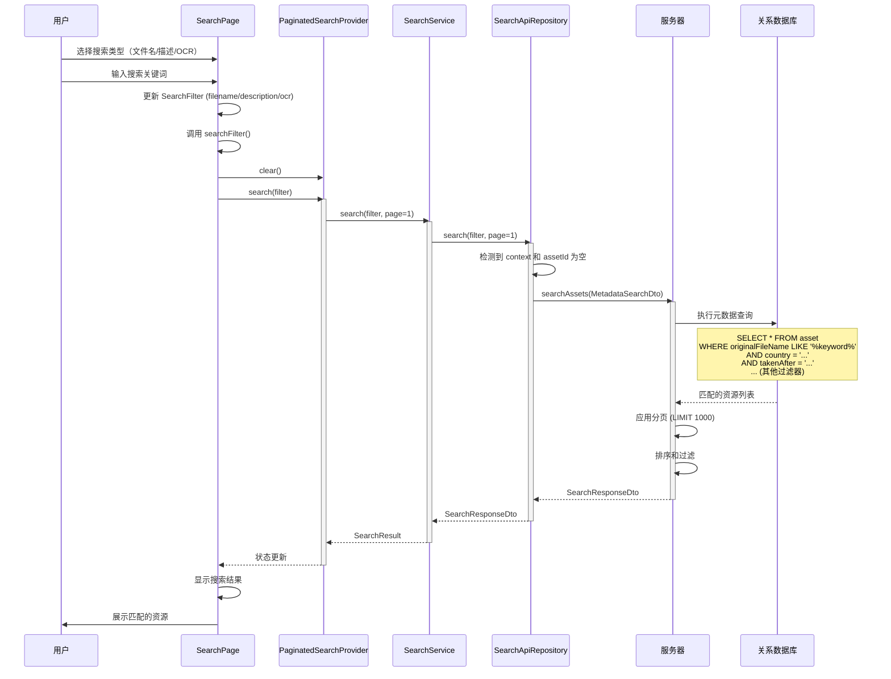
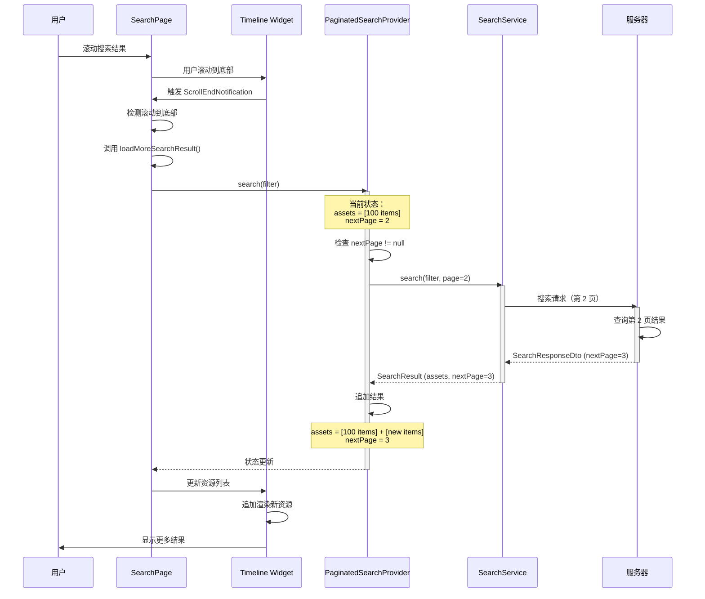
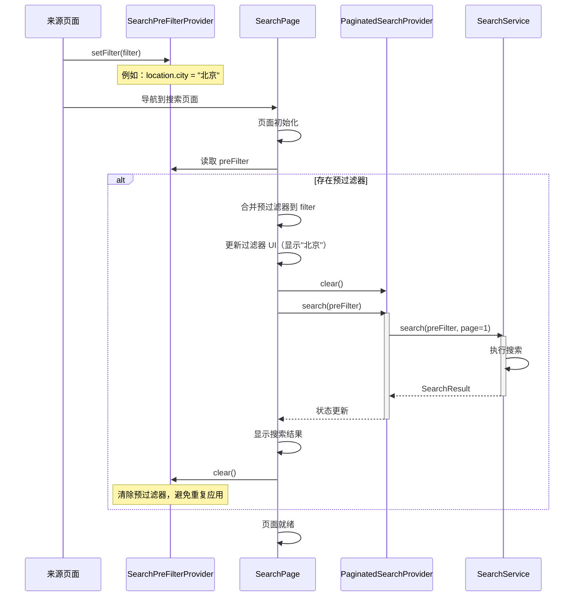

# Immich Mobile 搜索模块架构深度分析

## 一、整体架构概览

### 1.1 模块职责

搜索模块是 Immich Mobile 的核心功能模块，负责：

- **智能语义搜索**：基于 CLIP 模型的语义理解和相似性搜索
- **元数据搜索**：基于文件名、描述、OCR 等元数据的精确搜索
- **多维度过滤**：支持位置、相机、日期、人物、显示选项等多维度组合过滤
- **搜索建议**：为不同字段提供智能自动完成建议
- **分页结果管理**：高效的分页加载和结果状态管理

### 1.2 架构层次

```
┌─────────────────────────────────────────┐
│   Presentation Layer (UI 渲染)          │
│   - SearchPage                          │
│   - SearchFilterChips                   │
│   - Filter Pickers                      │
└─────────────────────────────────────────┘
                  ↓
┌─────────────────────────────────────────┐
│   Provider Layer (状态管理)             │
│   - paginatedSearchProvider             │
│   - searchFilterProvider                │
│   - searchSuggestionProvider            │
└─────────────────────────────────────────┘
                  ↓
┌─────────────────────────────────────────┐
│   Domain Layer (业务逻辑)               │
│   - SearchService                       │
└─────────────────────────────────────────┘
                  ↓
┌─────────────────────────────────────────┐
│   Infrastructure Layer (数据访问)       │
│   - SearchApiRepository                 │
└─────────────────────────────────────────┘
                  ↓
┌─────────────────────────────────────────┐
│   Server API (服务器端搜索)             │
│   - Smart Search (CLIP)                 │
│   - Metadata Search                     │
└─────────────────────────────────────────┘
```

### 1.3 关键文件组织结构

```
mobile/lib/
├── domain/
│   └── services/
│       └── search.service.dart           # 搜索服务核心逻辑
├── infrastructure/
│   └── repositories/
│       └── search_api.repository.dart    # 搜索 API 仓库
├── models/
│   └── search/
│       ├── search_filter.model.dart      # 搜索过滤器模型
│       └── search_result.model.dart      # 搜索结果模型
├── providers/
│   └── search/
│       ├── paginated_search.provider.dart    # 分页搜索状态
│       ├── search_filter.provider.dart       # 搜索建议
│       └── search_page_state.provider.dart   # 搜索页面状态
├── services/
│   └── search.service.dart               # 搜索服务（可选，复用 domain）
└── presentation/
    └── pages/
        └── search/
            └── drift_search.page.dart    # 搜索页面 UI
```

## 二、核心设计理念

### 2.1 双模式搜索架构：智能搜索 vs 元数据搜索

搜索模块采用**双模式架构**，根据查询条件自动选择最优搜索策略：

#### 智能搜索（Smart Search）

**触发条件**：
- 存在 `context` 查询文本（自然语言描述）
- 存在 `assetId`（基于资源的相似性搜索）

**核心机制**：

1. **文本语义编码**：
   - 使用 CLIP 模型将自然语言查询编码为向量嵌入
   - 支持多语言（通过 language 参数）
   - 嵌入结果缓存，避免重复编码

2. **向量相似性搜索**：
   - 使用向量数据库（HNSW 索引）进行快速相似性搜索
   - 通过余弦距离（<=> 操作符）计算相似度
   - 结果按相似度排序

3. **资源相似性搜索**：
   - 基于已有资源的嵌入向量进行搜索
   - 查找视觉上相似的资源
   - 用于"查找相似图片"等功能

**应用场景**：
- 自然语言查询："海滩上的日落"
- 相似资源搜索：基于某张图片查找相似图片
- 语义理解：理解查询意图而非精确匹配

#### 元数据搜索（Metadata Search）

**触发条件**：
- 没有 `context` 和 `assetId`
- 使用文件名、描述、OCR 等精确字段

**核心机制**：

1. **精确字段匹配**：
   - 文件名（originalFileName）
   - 描述（description）
   - OCR 文本（ocr）

2. **组合过滤**：
   - 位置、相机、日期等 EXIF 数据
   - 显示选项（收藏、归档等）
   - 人物标签
   - 媒体类型

**应用场景**：
- 按文件名搜索
- 按 OCR 文本搜索
- 精确的多条件组合查询

### 2.2 搜索过滤器组合模式

`SearchFilter` 采用**组合模式**，将多个维度的过滤器统一管理：

**过滤器维度**：

1. **文本搜索维度**：
   - `context`：智能搜索文本
   - `filename`：文件名搜索
   - `description`：描述搜索
   - `ocr`：OCR 文本搜索
   - `assetId`：资源 ID（相似性搜索）

2. **位置维度**（SearchLocationFilter）：
   - `country`：国家
   - `state`：州/省
   - `city`：城市
   - 支持级联过滤（国家 -> 州 -> 城市）

3. **相机维度**（SearchCameraFilter）：
   - `make`：相机品牌
   - `model`：相机型号
   - 支持级联过滤（品牌 -> 型号）

4. **日期维度**（SearchDateFilter）：
   - `takenAfter`：拍摄日期起始
   - `takenBefore`：拍摄日期结束

5. **人物维度**：
   - `people`：人物 ID 集合（Set<PersonDto>）

6. **显示选项维度**（SearchDisplayFilters）：
   - `isFavorite`：是否收藏
   - `isArchive`：是否归档
   - `isNotInAlbum`：是否不在相册中

7. **媒体类型维度**：
   - `mediaType`：图片、视频、其他

**设计优势**：

1. **类型安全**：每个维度都有独立的类型，避免参数混乱
2. **组合灵活**：任意维度可以组合使用
3. **易于扩展**：新增维度只需添加新的过滤器类
4. **空值处理**：通过 `isEmpty` 属性快速判断是否有有效过滤条件

### 2.3 分页搜索状态管理

`PaginatedSearchProvider` 采用**累加式分页**策略：

**核心机制**：

1. **状态维护**：
   - `assets`：所有已加载的资源列表（累加）
   - `nextPage`：下一页页码（null 表示没有更多）
   - `scrollOffset`：滚动位置（用于恢复）

2. **搜索流程**：
   - 新搜索：清空结果，从第一页开始
   - 加载更多：追加到现有结果，更新页码

3. **状态持久化**：
   - 保存滚动位置，支持页面恢复后回到原位置
   - 避免重新搜索时丢失已加载的结果

**设计优势**：

1. **无缝加载**：用户滚动到底部自动加载更多
2. **状态恢复**：页面重建后可以恢复滚动位置
3. **内存可控**：只保存已加载的资源，未加载的不占用内存

### 2.4 搜索建议系统

搜索建议采用**级联依赖**机制：

**核心机制**：

1. **建议类型**：
   - `country`：国家建议
   - `state`：州建议（依赖国家）
   - `city`：城市建议（依赖国家和州）
   - `cameraMake`：相机品牌建议
   - `cameraModel`：相机型号建议（依赖品牌）

2. **级联更新**：
   - 选择国家后，自动更新州建议列表
   - 选择品牌后，自动更新型号建议列表
   - 通过 Provider 依赖实现自动更新

3. **缓存策略**：
   - 建议结果通过 FutureProvider 缓存
   - 相同参数的建议不会重复请求
   - 参数变化时自动失效和重新加载

## 三、搜索流程设计

### 3.1 搜索请求流程

**搜索触发**：

1. **用户输入文本**：
   - 根据 `textSearchType` 确定搜索字段
   - 更新 `SearchFilter` 对应字段
   - 触发搜索

2. **用户选择过滤器**：
   - 打开对应的过滤器选择器
   - 选择过滤条件
   - 更新 `SearchFilter` 对应维度
   - 触发搜索

3. **预过滤器**（PreFilter）：
   - 从其他页面跳转时传入的预设过滤器
   - 页面初始化时自动应用

**搜索执行**：

1. **验证过滤器**：
   - 检查 `filter.isEmpty`，为空则跳过

2. **清空结果**：
   - 调用 `paginatedSearchProvider.clear()`
   - 重置到第一页

3. **执行搜索**：
   - 调用 `SearchService.search(filter, page)`
   - 判断使用智能搜索还是元数据搜索

4. **结果处理**：
   - 转换服务器响应为 `SearchResult`
   - 更新 Provider 状态
   - 更新 UI

### 3.2 智能搜索流程

**文本查询流程**：

1. **文本输入**：用户输入自然语言查询
2. **语言检测**：根据用户语言设置确定 language 参数
3. **服务器处理**：
   - CLIP 模型编码文本为向量
   - 在向量数据库中搜索相似资源
   - 应用其他过滤器（位置、日期等）
4. **结果返回**：按相似度排序的资源列表

**资源相似性搜索流程**：

1. **资源选择**：用户选择某个资源
2. **获取嵌入**：从服务器获取资源的嵌入向量
3. **向量搜索**：在向量数据库中查找相似资源
4. **结果返回**：按相似度排序的资源列表

### 3.3 元数据搜索流程

**精确字段搜索**：

1. **字段选择**：用户选择搜索字段类型（文件名/描述/OCR）
2. **文本输入**：输入搜索关键词
3. **服务器处理**：
   - 在对应字段中搜索关键词
   - 应用其他过滤器
   - 组合所有条件
4. **结果返回**：匹配的资源列表

**多条件组合**：

1. **选择多个过滤器**：用户选择位置、日期、相机等多个条件
2. **组合查询**：所有条件通过 AND 逻辑组合
3. **服务器处理**：在数据库中执行多条件查询
4. **结果返回**：满足所有条件的资源列表

### 3.4 搜索结果展示

**结果集成时间线**：

1. **结果转换**：将搜索结果转换为 `BaseAsset` 列表
2. **创建时间线**：使用 `TimelineFactory.fromAssets()` 创建时间线服务
3. **渲染展示**：使用标准的 `Timeline` 组件渲染
4. **无缝体验**：搜索结果与时间线使用相同的展示方式

**分页加载**：

1. **滚动监听**：监听滚动事件
2. **到达底部**：检测滚动到底部
3. **加载更多**：调用 `loadMoreSearchResult()`
4. **追加结果**：新结果追加到现有列表
5. **更新 UI**：时间线自动更新显示新结果

## 四、搜索建议系统

### 4.1 建议类型与依赖

**独立建议**：
- 国家建议：不需要依赖，直接查询所有国家
- 相机品牌建议：不需要依赖，直接查询所有品牌

**依赖建议**：
- 州建议：依赖已选择的国家
- 城市建议：依赖已选择的国家和州
- 相机型号建议：依赖已选择的品牌

### 4.2 级联更新机制

**Provider 依赖链**：

```dart
// 国家建议（独立）
getSearchSuggestions(SearchSuggestionType.country)

// 州建议（依赖国家）
getSearchSuggestions(
  SearchSuggestionType.state,
  locationCountry: selectedCountry
)

// 城市建议（依赖国家和州）
getSearchSuggestions(
  SearchSuggestionType.city,
  locationCountry: selectedCountry,
  locationState: selectedState
)
```

**自动失效**：

- 当依赖参数变化时，Provider 自动失效
- 自动重新加载新的建议列表
- UI 自动更新显示新的建议

### 4.3 服务器端建议生成

**建议来源**：

1. **数据库聚合**：从现有资源的元数据中聚合唯一值
2. **去重排序**：去除重复项，按使用频率或字母顺序排序
3. **过滤优化**：根据已选择的上级过滤器缩小范围

**性能优化**：

1. **缓存机制**：服务器端缓存常用建议
2. **限制数量**：返回前 N 条建议，避免传输过多数据
3. **按需加载**：只在用户打开选择器时才请求建议

## 五、过滤器 UI 设计

### 5.1 过滤器选择器

**设计模式**：

每个过滤器都有独立的选择器组件：
- `PeoplePicker`：人物选择器
- `LocationPicker`：位置选择器（三级级联）
- `CameraPicker`：相机选择器（两级级联）
- `DatePicker`：日期选择器
- `MediaTypePicker`：媒体类型选择器
- `DisplayOptionPicker`：显示选项选择器

**交互流程**：

1. **点击过滤器芯片**：打开对应的选择器底部表单
2. **选择条件**：用户在选择器中选择过滤条件
3. **应用过滤**：更新 `SearchFilter`，触发搜索
4. **显示状态**：过滤器芯片显示当前选择的过滤条件

### 5.2 过滤器芯片

**状态显示**：

- **未选择**：显示过滤器标签（如"位置"）
- **已选择**：显示选择的过滤条件（如"北京"）
- **视觉反馈**：不同状态有不同的视觉样式

**清除机制**：

- 每个过滤器都可以独立清除
- 清除后自动触发搜索更新结果

### 5.3 文本搜索类型切换

**支持的类型**：

- **Context**：智能搜索（默认）
- **Filename**：文件名搜索
- **Description**：描述搜索
- **OCR**：OCR 文本搜索

**切换机制**：

- 通过菜单切换搜索类型
- 切换后更新搜索框提示文本
- 切换后更新搜索图标
- 切换类型时清空其他文本字段，避免混淆

## 六、性能优化策略

### 6.1 搜索请求优化

1. **请求去重**：
   - 检查过滤器是否变化，相同过滤器不重复搜索
   - 检查 `previousFilter`，避免重复请求

2. **空查询跳过**：
   - 过滤器为空时直接跳过搜索
   - 避免无效的 API 调用

3. **智能搜索优化**：
   - 嵌入向量缓存（服务器端）
   - 批量处理相似性计算

### 6.2 结果渲染优化

1. **复用时间线组件**：
   - 搜索结果复用时间线渲染逻辑
   - 利用时间线的虚拟滚动和懒加载

2. **分页加载**：
   - 只加载可见区域的资源
   - 滚动到底部才加载更多

3. **状态恢复**：
   - 保存滚动位置
   - 页面恢复后快速回到原位置

### 6.3 建议加载优化

1. **按需加载**：
   - 只在打开选择器时加载建议
   - 避免预加载不必要的建议

2. **依赖缓存**：
   - 相同参数的建议结果缓存
   - 减少重复 API 调用

3. **级联优化**：
   - 级联更新时只重新加载依赖的建议
   - 独立建议不受影响

## 七、智能搜索技术细节

### 7.1 CLIP 模型集成

**文本编码**：

1. **多语言支持**：根据用户语言设置选择对应的 CLIP 模型
2. **向量维度**：生成 512 维的向量嵌入
3. **缓存机制**：相同查询和语言的嵌入结果缓存

**资源编码**：

1. **自动编码**：上传或处理资源时自动生成嵌入向量
2. **向量存储**：存储在 `smart_search` 表中
3. **索引优化**：使用 HNSW 向量索引加速搜索

### 7.2 向量相似性搜索

**距离计算**：

- 使用余弦相似度（cosine similarity）
- PostgreSQL 的 `<=>` 操作符计算向量距离
- 距离越小，相似度越高

**索引优化**：

- HNSW（Hierarchical Navigable Small World）索引
- 支持快速近似最近邻搜索
- 可配置的索引参数（ef_construction, m）

**查询优化**：

- 设置合适的 `probes` 参数平衡精度和性能
- 事务级别设置，避免全局影响

### 7.3 混合搜索策略

**智能搜索 + 元数据过滤**：

- 向量搜索提供相似性排序
- 元数据过滤器进一步缩小范围
- 两者结合提供精确且相关的搜索结果

**示例**：
- 查询："海滩日落"（智能搜索）
- 过滤：位置=夏威夷，日期=2023年（元数据过滤）
- 结果：夏威夷 2023 年的海滩日落相关资源

## 八、搜索状态管理

### 8.1 SearchResult 状态

**状态组成**：

- `assets`：已加载的资源列表（累加）
- `nextPage`：下一页页码（null 表示没有更多）
- `scrollOffset`：滚动位置（可选，用于恢复）

**状态更新**：

1. **新搜索**：
   - `clear()` → `assets = []`, `nextPage = 1`
   - `search(filter)` → 加载第一页，追加结果

2. **加载更多**：
   - `search(filter)` → 追加新结果，更新 `nextPage`

3. **滚动保存**：
   - `setScrollOffset(offset)` → 保存滚动位置

### 8.2 预过滤器机制

**应用场景**：

- 从地图页面跳转：预设置位置过滤器
- 从人物页面跳转：预设置人物过滤器
- 从资源查看器跳转：预设置相似资源搜索

**实现机制**：

1. **设置预过滤器**：
   - `searchPreFilterProvider.setFilter(filter)`

2. **自动应用**：
   - 搜索页面初始化时读取预过滤器
   - 自动应用并触发搜索
   - 应用后清除预过滤器

3. **UI 反馈**：
   - 显示预设置的过滤条件
   - 更新过滤器芯片状态

## 九、错误处理与用户体验

### 9.1 错误处理策略

1. **空结果处理**：
   - 显示友好的空状态提示
   - 提供搜索建议或清除过滤器的选项

2. **网络错误处理**：
   - 捕获异常，记录日志
   - 显示错误提示
   - 允许重试

3. **超时处理**：
   - 设置合理的超时时间
   - 超时后提示用户
   - 允许取消或重试

### 9.2 用户体验优化

1. **加载状态**：
   - 显示加载指示器
   - 禁用搜索按钮防止重复提交

2. **即时反馈**：
   - 搜索建议实时更新
   - 过滤器选择即时应用

3. **状态持久化**：
   - 保存滚动位置
   - 页面恢复后快速回到原状态

## 十、设计模式应用

### 10.1 策略模式

**搜索模式选择**：
- 根据过滤器内容自动选择搜索策略（智能搜索 vs 元数据搜索）
- 不同的搜索策略有不同的实现，但接口统一

### 10.2 组合模式

**过滤器组合**：
- `SearchFilter` 组合多个子过滤器
- 每个子过滤器独立管理，可以任意组合

### 10.3 观察者模式

**状态更新**：
- Provider 监听搜索状态变化
- UI 自动响应状态更新

### 10.4 工厂模式

**时间线创建**：
- 搜索结果通过 `TimelineFactory.fromAssets()` 创建时间线
- 统一的时间线接口，不同的数据来源

## 十一、时序图

### 11.1 智能搜索流程（文本查询）



### 11.2 智能搜索流程（资源相似性）



### 11.3 元数据搜索流程



### 11.4 分页加载流程



### 11.5 搜索建议级联加载流程

```mermaid
sequenceDiagram
    participant User as 用户
    participant UI as SearchPage
    participant Picker as LocationPicker
    participant Provider as SuggestionProvider
    participant Service as SearchService
    participant Server as 服务器

    User->>UI: 点击位置过滤器
    UI->>Picker: 打开 LocationPicker
    
    Picker->>Provider: getSearchSuggestions(COUNTRY)
    activate Provider
    Provider->>Service: getSearchSuggestions(COUNTRY)
    activate Service
    Service->>Server: 请求国家建议
    Server-->>Service: 国家列表
    Service-->>Provider: 国家列表
    Provider-->>Picker: 国家建议列表
    deactivate Service
    deactivate Provider
    
    Picker->>User: 显示国家列表
    
    User->>Picker: 选择"中国"
    Picker->>UI: 更新 filter.location.country = "中国"
    
    Picker->>Provider: getSearchSuggestions(STATE, country="中国")
    activate Provider
    Note over Provider: 依赖参数变化，自动失效并重新加载
    
    Provider->>Service: getSearchSuggestions(STATE, country="中国")
    activate Service
    Service->>Server: 请求州建议（过滤：country="中国"）
    Server-->>Service: 州列表（如：北京、上海、广东...）
    Service-->>Provider: 州列表
    Provider-->>Picker: 州建议列表
    deactivate Service
    deactivate Provider
    
    Picker->>User: 显示州列表
    
    User->>Picker: 选择"北京"
    Picker->>UI: 更新 filter.location.city = "北京"
    
    Picker->>Provider: getSearchSuggestions(CITY, country="中国", state="北京")
    activate Provider
    Provider->>Service: getSearchSuggestions(CITY, ...)
    activate Service
    Service->>Server: 请求城市建议
    Server-->>Service: 城市列表
    Service-->>Provider: 城市列表
    Provider-->>Picker: 城市建议列表
    deactivate Service
    deactivate Provider
    
    User->>Picker: 确认选择
    Picker->>UI: 应用过滤器
    UI->>UI: 触发搜索
```



### 11.6 预过滤器应用流程



## 十二、架构设计亮点总结

### 12.1 双模式智能切换

- **自动判断**：根据过滤器内容自动选择最优搜索模式
- **性能优化**：智能搜索用于语义查询，元数据搜索用于精确查询
- **用户体验**：用户无需关心底层实现，只需输入查询

### 12.2 灵活的过滤器组合

- **多维度支持**：位置、日期、相机、人物等多个维度
- **任意组合**：所有过滤器可以任意组合使用
- **级联依赖**：支持级联过滤（国家->州->城市）

### 12.3 高效的分页管理

- **累加式加载**：结果累加，支持无限滚动
- **状态恢复**：保存滚动位置，支持页面恢复
- **内存优化**：只保存已加载的结果

### 12.4 智能建议系统

- **按需加载**：只在需要时加载建议
- **依赖更新**：级联依赖自动更新
- **缓存优化**：相同参数的建议结果缓存

### 12.5 无缝的 UI 集成

- **复用时间线**：搜索结果复用时间线渲染
- **统一体验**：搜索和时间线使用相同的展示方式
- **平滑过渡**：从搜索到查看资源的体验流畅

## 十三、总结

Immich Mobile 的搜索模块采用了**双模式搜索、组合过滤、智能建议**等先进设计理念，实现了强大而灵活的搜索功能。通过智能搜索和元数据搜索的自动切换、多维度过滤器的灵活组合、级联建议系统等方式，为用户提供了高效、精准、易用的搜索体验。

整个架构不仅满足了移动端对性能和响应速度的要求，还充分利用了服务器端的机器学习能力（CLIP 模型）提供智能语义搜索。搜索模块的设计体现了对现代搜索系统、向量数据库、用户交互设计等多个领域的深入理解和应用。

