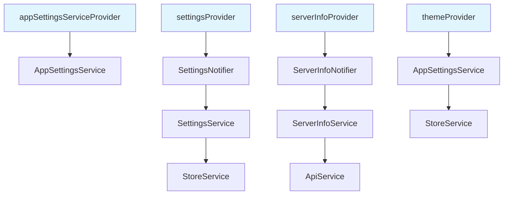
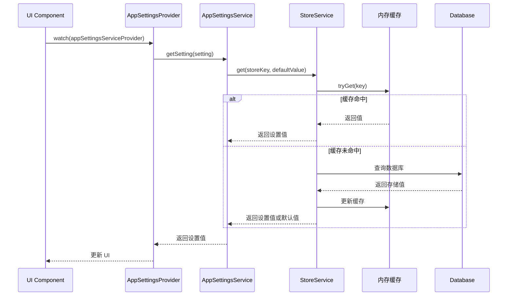
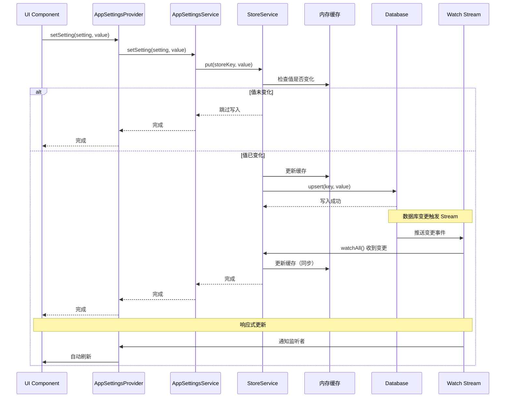
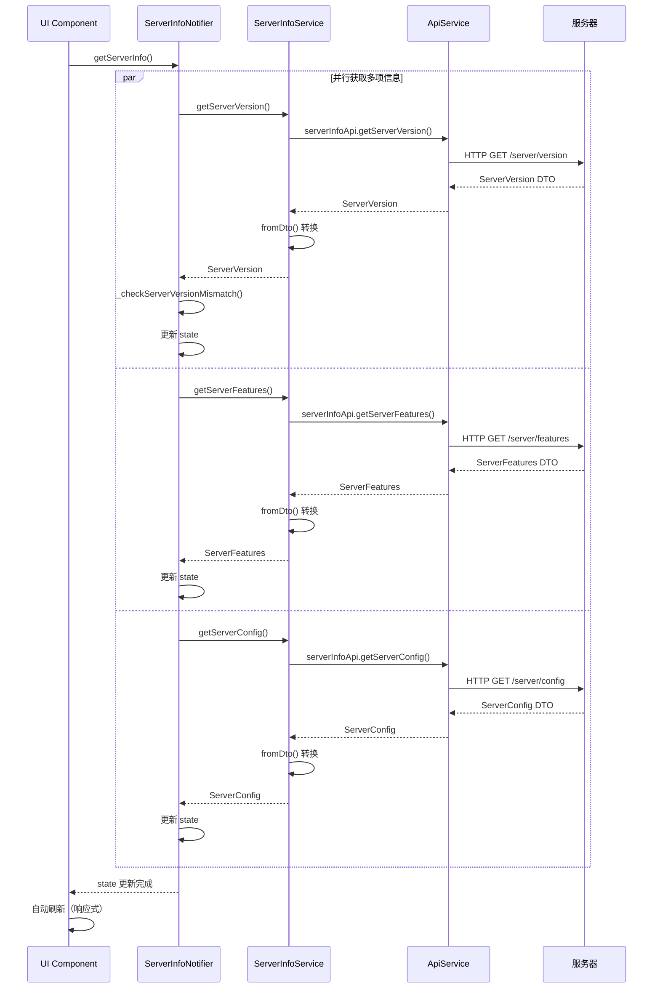
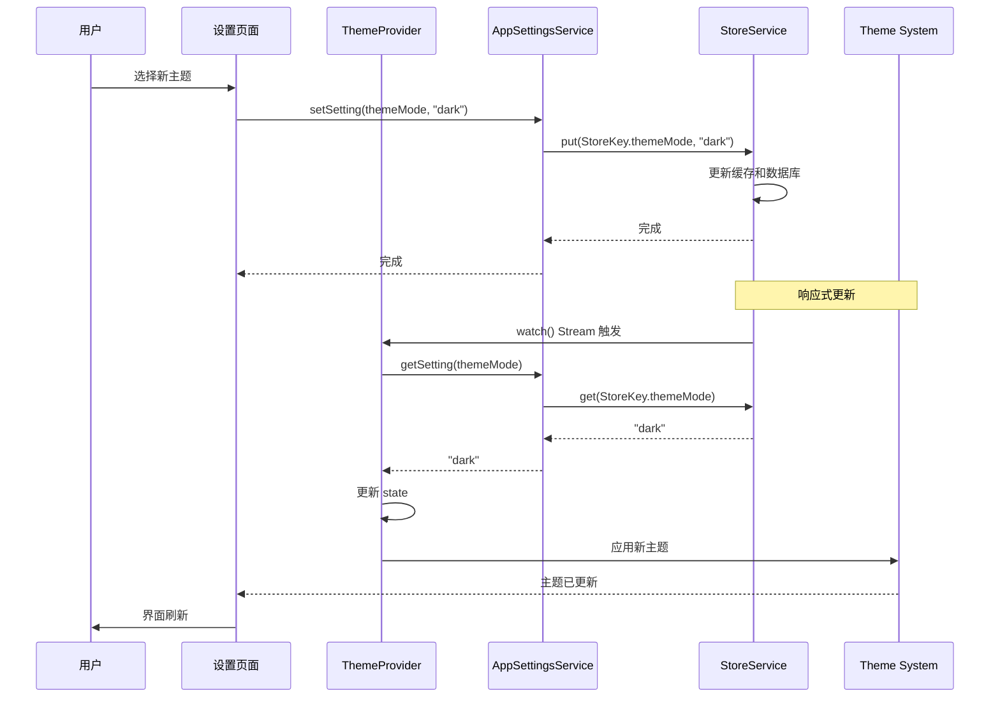

# Immich Mobile 设置与配置模块 - 深度架构分析

> 本文档深入分析 Immich Mobile 应用中设置与配置模块的架构设计、实现思路和核心机制。

## 1. 架构设计理念

### 1.1 核心设计原则

设置与配置模块采用**分层抽象设计**，遵循以下核心设计原则：

1. **类型安全**：通过泛型枚举确保类型安全，编译时检查
2. **分层抽象**：底层存储键 → 设置枚举 → 服务层 → Provider 层
3. **响应式更新**：通过 Stream 监听设置变更，实现 UI 自动更新
4. **默认值管理**：每个设置都有明确的默认值，确保应用稳定运行
5. **服务端信息分离**：区分本地设置和服务器配置信息

### 1.2 模块分层架构

```
┌─────────────────────────────────────────────────────────────┐
│                    UI 层 / 设置页面                            │
│  (Settings Page, Theme Settings, etc.)                       │
└──────────────────────┬──────────────────────────────────────┘
                       │ 使用 Provider
┌──────────────────────▼──────────────────────────────────────┐
│                   Provider 层                                │
│  ┌──────────────┐  ┌──────────────┐  ┌──────────────┐     │
│  │appSettings   │  │serverInfo    │  │theme         │     │
│  │Provider      │  │Provider      │  │Provider      │     │
│  └──────────────┘  └──────────────┘  └──────────────┘     │
└──────────────────────┬──────────────────────────────────────┘
                       │ 使用 Service
┌──────────────────────▼──────────────────────────────────────┐
│                   Service 层                                 │
│  ┌──────────────┐  ┌──────────────┐  ┌──────────────┐     │
│  │AppSettings   │  │ServerInfo    │  │Settings      │     │
│  │Service       │  │Service       │  │Service       │     │
│  └──────────────┘  └──────────────┘  └──────────────┘     │
└──────────────────────┬──────────────────────────────────────┘
                       │ 使用 StoreKey / Setting
┌──────────────────────▼──────────────────────────────────────┐
│                   设置模型层                                  │
│  ┌──────────────┐  ┌──────────────┐                        │
│  │AppSettings   │  │Setting       │                        │
│  │Enum          │  │Enum          │                        │
│  └──────────────┘  └──────────────┘                        │
│  ┌──────────────────────────────────────┐                  │
│  │        StoreKey (存储键)              │                  │
│  │  - 类型安全的枚举                     │                  │
│  │  - 唯一 ID 标识                       │                  │
│  └──────────────────────────────────────┘                  │
└──────────────────────┬──────────────────────────────────────┘
                       │
┌──────────────────────▼──────────────────────────────────────┐
│                   Store Service                              │
│  (内存缓存 + 数据库持久化)                                    │
└─────────────────────────────────────────────────────────────┘
```

## 2. 设置系统架构

### 2.1 三层设置模型

系统采用**三层抽象模型**，从底层到上层：

#### 2.1.1 底层：StoreKey（存储键）

`StoreKey` 是存储层的底层键定义：

- **类型安全**：泛型 `StoreKey<T>` 确保类型正确
- **唯一标识**：每个键有唯一的整数 ID
- **分类管理**：ID 范围分类（如 100+ 为用户设置）

#### 2.1.2 中层：Setting / AppSettingsEnum（设置枚举）

提供更高级的抽象：

- **默认值管理**：每个设置都有默认值
- **向后兼容**：保留 `hiveKey`（历史原因）
- **语义化命名**：使用有意义的枚举名称

#### 2.1.3 上层：SettingsService / AppSettingsService（服务层）

封装设置操作：

- **统一接口**：`get()`, `set()`, `watch()`
- **类型推断**：自动从枚举推断类型
- **响应式支持**：提供 Stream 监听

### 2.2 设置分类体系

设置按功能分为多个类别：

#### UI 相关设置
- **主题设置**：主题模式、主色调、动态主题
- **布局设置**：网格布局（tilesPerRow、动态布局）
- **缓存设置**：缓存大小（缩略图、图片、相册）

#### 功能设置
- **备份设置**：启用备份、触发延迟、充电要求
- **同步设置**：同步相册、端点切换
- **视频设置**：自动播放、循环播放、加载原图

#### 系统设置
- **日志级别**：控制日志详细程度
- **高级选项**：调试选项、实验性功能
- **安全设置**：SSL 证书设置

#### 地图设置
- **显示选项**：主题模式、显示收藏、包含归档
- **数据过滤**：合作伙伴显示、相对日期

### 2.3 双设置系统

系统维护两套设置枚举：

1. **`AppSettingsEnum`**：完整设置（56+ 项）
2. **`Setting`**：精简设置（8 项，向后兼容）

**设计原因**：
- **历史兼容性**：`Setting` 用于旧代码
- **渐进迁移**：逐步迁移到 `AppSettingsEnum`
- **功能分离**：区分完整功能设置和核心设置

## 3. AppSettingsService - 应用设置服务

### 3.1 职责范围

`AppSettingsService` 是应用设置的统一服务：

- **提供类型安全的设置访问**：通过枚举确保类型正确
- **封装 Store 操作**：隐藏底层存储细节
- **支持默认值回退**：设置未配置时使用默认值

### 3.2 核心接口

**读取设置（带默认值）**：
```dart
T getSetting<T>(AppSettingsEnum<T> setting)
```

**设置值**：
```dart
Future<void> setSetting<T>(AppSettingsEnum<T> setting, T value)
```

**设计特点**：
- **类型安全**：泛型确保类型匹配
- **默认值**：自动使用枚举中的默认值
- **异步写入**：`setSetting` 返回 Future，支持异步持久化

## 4. SettingsService - 领域设置服务

### 4.1 职责范围

`SettingsService` 是领域层的设置服务：

- **响应式支持**：提供 `watch()` Stream
- **单例访问**：通过 `AppSetting` 全局访问（向后兼容）
- **依赖注入**：可通过 Provider 注入

### 4.2 响应式更新

```dart
Stream<T> watch<T>(Setting<T> setting)
```

**特点**：
- **Stream 监听**：返回设置变更的 Stream
- **自动更新**：UI 可以监听并自动刷新
- **默认值处理**：空值时返回默认值

## 5. Server Info Service - 服务器信息管理

### 5.1 职责范围

`ServerInfoService` 管理服务器端信息：

- **服务器版本信息**：当前版本、最新版本
- **服务器功能特性**：地图、回收站、OAuth 等
- **服务器配置**：主题 URL、域名等
- **磁盘使用情况**：存储空间信息

### 5.2 信息获取

服务提供四个核心方法：

1. **`getServerVersion()`** - 获取服务器版本
2. **`getServerFeatures()`** - 获取功能特性（地图、回收站、OAuth 等）
3. **`getServerConfig()`** - 获取服务器配置（主题 URL、域名等）
4. **`getDiskInfo()`** - 获取磁盘使用情况

**设计特点**：
- **错误处理**：失败时返回 null，不抛出异常
- **异步获取**：所有方法都是异步的
- **API 封装**：通过 `ApiService` 调用 OpenAPI 生成的客户端

### 5.3 版本检查机制

`ServerInfoNotifier` 实现智能版本检查：

- **版本比较**：客户端版本 vs 服务器版本
- **状态管理**：`upToDate`, `clientOutOfDate`, `serverOutOfDate`, `error`
- **智能判断**：根据版本差异类型（major/minor/patch）判断是否需要更新
- **警告显示**：根据用户角色（管理员/普通用户）显示不同警告

## 6. 本地化服务

### 6.1 职责范围

本地化服务管理多语言支持：

- **50+ 种语言支持**：覆盖全球主要语言
- **运行时语言切换**：无需重启应用
- **Isolate 支持**：在 Isolate 中加载翻译

### 6.2 架构设计

基于 `easy_localization` 框架：

- **翻译文件**：存储在 `assets/i18n/` 目录
- **代码生成**：使用 `CodegenLoader` 加载翻译
- **回退机制**：未找到翻译时使用回退语言（英语）

### 6.3 Isolate 支持

`loadTranslations()` 函数支持在 Isolate 中加载翻译：

- **独立初始化**：在 Isolate 中手动初始化
- **支持后台任务**：后台同步等场景可以使用
- **延迟加载**：需要时才加载翻译

## 7. Provider 体系

### 7.1 设置 Provider



### 7.2 Provider 生命周期

- **`@Riverpod(keepAlive: true)`**：长期保持，避免重复创建
- **`StateNotifierProvider`**：管理有状态的服务信息
- **`NotifierProvider`**：管理设置变更

## 8. 设置变更流程

### 8.1 设置读取流程



### 8.2 设置写入流程



### 8.3 服务器信息获取流程



### 8.4 主题设置变更流程



## 9. 设计亮点总结

1. **类型安全设计**：泛型枚举确保编译时类型检查，避免运行时错误
2. **分层抽象模型**：三层模型分离关注点，便于维护和扩展
3. **响应式更新机制**：Stream 机制实现 UI 自动同步，提升用户体验
4. **默认值管理策略**：每个设置都有明确默认值，保证应用稳定性
5. **服务器信息分离**：区分本地设置和服务器配置，职责清晰
6. **智能版本检查**：版本比较算法提供明确的更新建议
7. **多语言支持**：50+ 种语言，支持运行时切换和 Isolate 加载
8. **向后兼容设计**：保留旧设置系统，平滑迁移

## 10. 关键文件索引

### 核心服务
- `mobile/lib/services/app_settings.service.dart` - 应用设置服务
- `mobile/lib/services/server_info.service.dart` - 服务器信息服务
- `mobile/lib/services/localization.service.dart` - 本地化服务

### 领域服务
- `mobile/lib/domain/services/setting.service.dart` - 领域设置服务

### 模型
- `mobile/lib/domain/models/setting.model.dart` - Setting 枚举
- `mobile/lib/domain/models/store.model.dart` - StoreKey 定义

### Provider
- `mobile/lib/providers/app_settings.provider.dart` - 应用设置 Provider
- `mobile/lib/providers/server_info.provider.dart` - 服务器信息 Provider
- `mobile/lib/providers/infrastructure/setting.provider.dart` - 设置 Provider
- `mobile/lib/providers/theme.provider.dart` - 主题 Provider

---

**文档版本**：v1.0  
**最后更新**：2024  
**相关文档**：`mobile-architecture-detail.md`, `mobile-base-services-module.md`, `mobile-image-cache-module.md`

