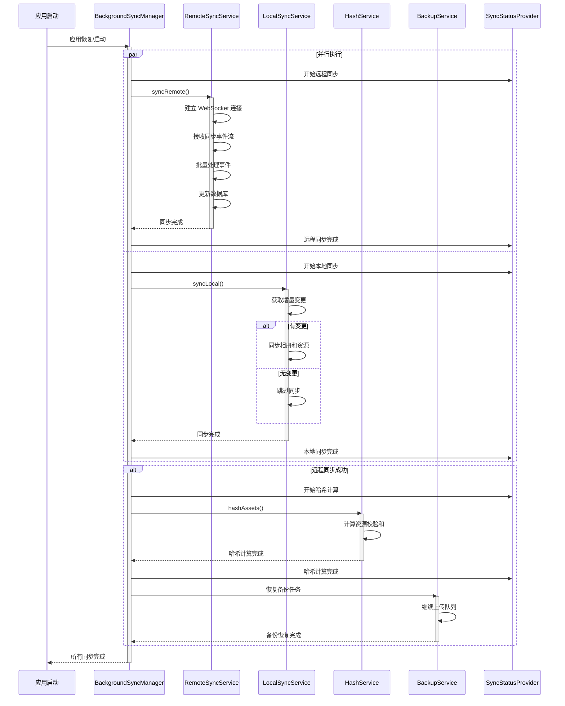
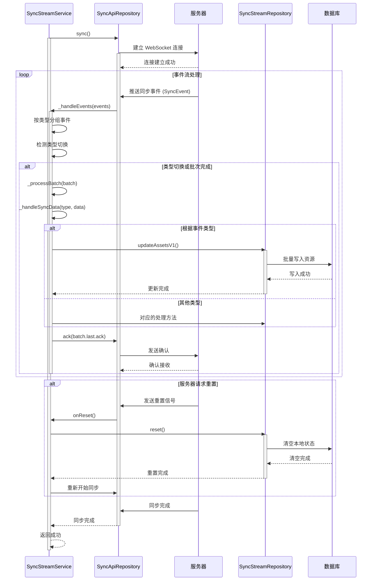
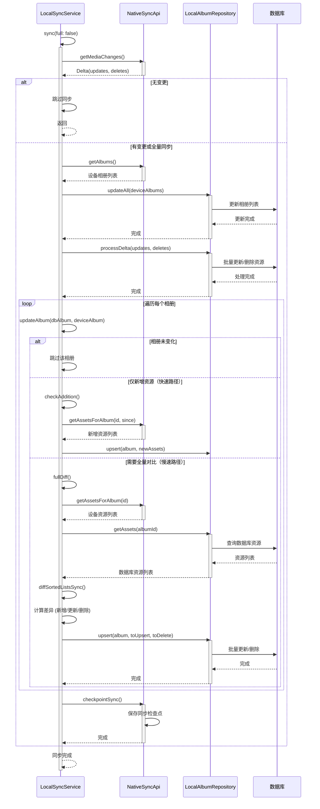
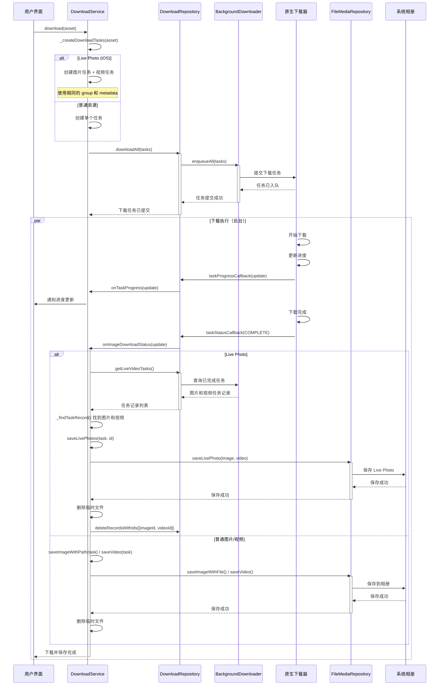
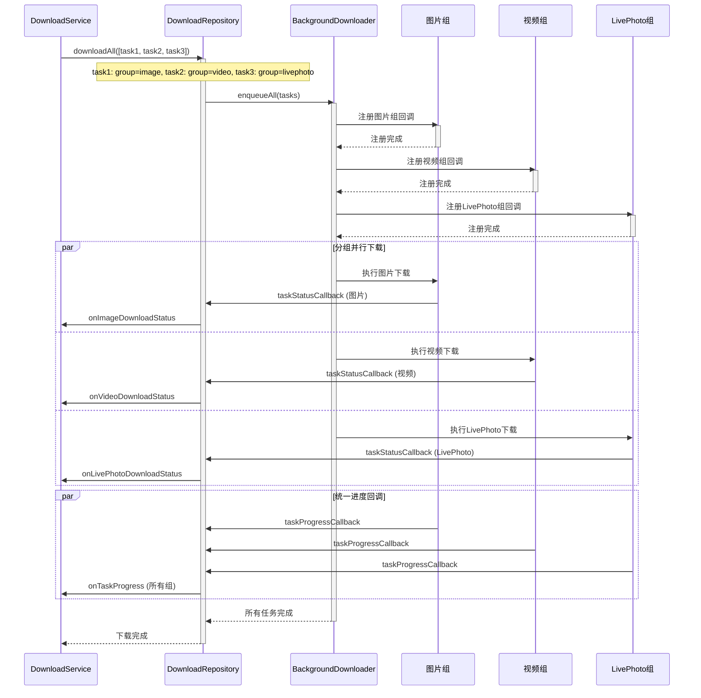
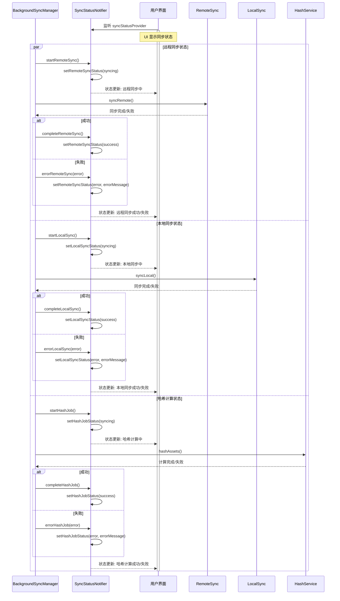

# Immich Mobile 下载与同步模块架构深度分析

## 一、整体架构概览

### 1.1 模块职责划分

该模块负责三个核心功能：

- **远程同步（Remote Sync）**：从服务器同步数据到客户端
- **本地同步（Local Sync）**：从设备媒体库同步到应用数据库
- **资源下载（Download）**：从服务器下载资源到本地设备

### 1.2 架构层次

```
┌─────────────────────────────────────────┐
│   Provider Layer (状态管理与协调)       │
│   - syncStatusProvider                  │
│   - backgroundSyncProvider              │
└─────────────────────────────────────────┘
                  ↓
┌─────────────────────────────────────────┐
│   Service Layer (业务逻辑协调)          │
│   - SyncStreamService (远程)            │
│   - LocalSyncService (本地)             │
│   - DownloadService (下载)              │
│   - SyncService (元数据同步)            │
└─────────────────────────────────────────┘
                  ↓
┌─────────────────────────────────────────┐
│   Repository Layer (数据访问)           │
│   - SyncApiRepository / SyncStreamRepo  │
│   - LocalAlbumRepository                │
│   - DownloadRepository                  │
└─────────────────────────────────────────┘
```

### 1.3 关键文件组织结构

```
mobile/lib/
├── domain/
│   ├── services/
│   │   ├── sync_stream.service.dart      # 远程流式同步服务
│   │   ├── local_sync.service.dart       # 本地媒体库同步服务
│   │   └── store.service.dart            # 存储服务
│   └── utils/
│       └── background_sync.dart          # 后台同步协调器
├── services/
│   ├── sync.service.dart                 # 同步协调服务
│   ├── download.service.dart             # 下载服务
│   └── etag.service.dart                 # ETag 优化服务
├── providers/
│   ├── infrastructure/
│   │   └── sync.provider.dart            # 同步服务 Provider
│   ├── sync_status.provider.dart         # 同步状态管理
│   └── background_sync.provider.dart     # 后台同步协调 Provider
└── repositories/
    ├── sync_api.repository.dart          # 同步 API 访问
    ├── sync_stream.repository.dart       # 同步流数据仓库
    └── download.repository.dart          # 下载任务仓库
```

## 二、远程同步架构设计

### 2.1 核心设计理念：事件流驱动 + 批量处理

`SyncStreamService` 采用 **WebSocket 流式同步** 架构，这是整个远程同步的核心。

#### 设计要点：

1. **事件驱动架构**
   - 服务端通过 WebSocket 推送类型化事件（AssetV1、AlbumV1、UserV1 等）
   - 客户端按事件类型分类处理，支持多种实体类型的同步
   - 支持同步重置、回滚等控制机制

2. **批量处理优化**
   - 相同类型的事件聚合后批量写入数据库
   - 减少数据库事务开销，提高写入性能
   - 类型切换时触发批次处理

3. **确认机制（Ack）**
   - 每个批次处理完成后发送确认
   - 支持断点续传和状态恢复

### 2.2 事件处理流程

```
WebSocket Stream
    ↓
事件接收 (streamChanges)
    ↓
事件分类 (按 type 分组)
    ↓
批量处理 (_processBatch)
    ↓
分发到 Repository (_handleSyncData)
    ↓
数据库更新
    ↓
发送确认 (ack)
```

### 2.3 多实体类型支持

`SyncStreamService` 支持丰富的实体类型同步：
- **资源（Asset）**：创建、更新、删除、元数据变更
- **相册（Album）**：创建、更新、删除、用户关联、资源关联
- **用户（User）**：认证用户、普通用户、合作伙伴
- **其他**：Memory、Stack、Person、Metadata 等

每种实体类型都有对应的处理逻辑，采用策略模式分发到对应的 Repository 方法。

### 2.4 同步重置机制

当服务端检测到数据不一致时，可以触发客户端重置：
- 清空本地状态
- 重新进行完整同步
- 确保数据一致性

### 2.5 取消机制

通过 `cancelChecker` 回调支持同步取消：
- 用户主动取消或应用退出时可以中断同步
- 确保资源正确释放

## 三、本地同步架构设计

### 3.1 核心设计理念：增量优先 + 快速路径优化

`LocalSyncService` 负责将设备媒体库的资源同步到应用数据库。

#### 设计要点：

1. **增量同步优先**
   - 通过 Native API 获取增量变更（新增、删除）
   - 无变更时直接跳过，避免不必要的处理

2. **快速路径优化**
   - 仅新增场景：只处理新增资源，跳过完整对比
   - 全量对比：检测到删除或修改时，采用完整差异对比算法

3. **全量同步兜底**
   - 首次同步或 Native API 建议时触发全量同步
   - 使用有序列表差异算法，时间复杂度 O(n)

### 3.2 相册同步策略

1. **相册元数据同步**
   - 先同步相册列表（名称、数量、时间等）
   - 通过对比判断是否需要同步资源

2. **资源差异对比**
   - 使用有序列表差异算法（O(n) 复杂度）
   - 精确识别新增、更新、删除的资源

3. **平台差异化处理**
   - Android：需要遍历所有相册检测删除（平台限制）
   - iOS：需要单独处理 iCloud 相册

### 3.3 性能优化策略

1. **快速路径判断**
   - 比较资源数量、更新时间等元数据
   - 快速判断是否可以跳过全量对比

2. **资源比较优化**
   - 比较修改时间、宽高、时长等元数据
   - 避免计算校验和（Checksum）等耗时操作

3. **批量操作**
   - 批量 upsert/delete 减少数据库事务次数

## 四、下载架构设计

### 4.1 核心设计理念：分组管理 + 后台执行

`DownloadService` 使用 `background_downloader` 插件管理下载任务。

#### 设计要点：

1. **分组下载策略**
   - 图片、视频、Live Photo 分别分组
   - 不同分组可以独立管理和限流

2. **后台下载执行**
   - 利用原生后台下载能力
   - 支持应用切换到后台继续下载
   - 自动重试和错误恢复

3. **进度回调机制**
   - 分组回调，状态与进度分离
   - 支持 UI 实时更新

### 4.2 Live Photo 特殊处理

iOS Live Photo 需要同时下载图片和视频：
- 通过 metadata 关联两个任务
- 两个任务完成后统一保存

### 4.3 下载完成处理

1. 下载到临时目录
2. 保存到相册
3. 清理临时文件
4. 避免重复存储

## 五、同步协调架构设计

### 5.1 BackgroundSyncManager：统一协调器

`BackgroundSyncManager` 负责协调所有同步任务。

#### 设计要点：

1. **任务生命周期管理**
   - 使用 `Cancelable` 包装异步任务
   - 支持取消和状态跟踪

2. **Isolate 隔离执行**
   - 同步任务在独立 Isolate 中执行
   - 不阻塞主线程
   - 支持 Provider 注入

3. **回调机制**
   - 提供开始/完成/错误回调
   - 通过 `syncStatusProvider` 统一状态管理
   - UI 可以监听状态变化

### 5.2 同步执行顺序

应用恢复时的执行顺序：

```
1. 并行执行本地和远程同步（无依赖）
   ↓
2. 远程同步成功后执行哈希计算和备份恢复
   ↓
3. 哈希计算完成后恢复备份任务
```

设计思路：
- 本地和远程同步可以并行（无依赖）
- 哈希计算依赖同步完成（需要完整数据）
- 备份恢复依赖哈希完成（需要校验和）

### 5.3 状态聚合设计

`SyncStatusProvider` 聚合所有同步状态：
- 状态集中管理，UI 统一监听
- 支持错误信息传递
- 状态变化触发 UI 更新

## 六、ETag 优化机制

### 6.1 ETag 的作用

`SyncService` 使用 ETag 实现增量同步优化：

1. **时间戳记录**
   - 记录上次同步时间
   - 只获取变更的资源

2. **资源计数缓存**
   - 缓存相册资源数量
   - 快速判断是否需要同步

### 6.2 ETag 更新策略

- 同步成功后更新 ETag
- 数据变更时清除 ETag（强制全量）
- 支持用户级别的 ETag

## 七、冲突处理策略

### 7.1 远程删除处理

- Android 支持自动移动到回收站
- 支持恢复机制

### 7.2 本地删除同步

- 跟踪需要删除的资源
- 批量执行删除操作

## 八、架构设计亮点总结

### 8.1 分层清晰

- **Domain Layer**：纯业务逻辑，无基础设施依赖
- **Infrastructure Layer**：数据访问抽象，可替换实现
- **Service Layer**：业务协调，组合多个 Repository
- **Provider Layer**：状态管理与依赖注入

### 8.2 性能优化

1. **批量处理**
   - 远程同步批量写入
   - 本地同步批量对比

2. **增量同步**
   - ETag 机制减少数据传输
   - 快速路径优化常见场景

3. **异步隔离**
   - Isolate 执行，不阻塞 UI
   - 并行执行独立任务

### 8.3 可维护性

1. **职责单一**
   - 每个服务职责清晰
   - 易于测试和修改

2. **依赖注入**
   - Provider 注入依赖
   - 易于 Mock 和替换

3. **错误处理**
   - 统一的错误回调
   - 状态跟踪与恢复

### 8.4 可扩展性

1. **策略模式**
   - 事件类型分发处理
   - 易于扩展新实体类型

2. **插件化设计**
   - Repository 接口抽象
   - 可替换实现

## 九、设计模式应用

1. **观察者模式**：状态变化通过 Provider 通知 UI
2. **策略模式**：不同实体类型采用不同处理策略
3. **工厂模式**：通过 Provider 创建服务实例
4. **模板方法模式**：同步流程模板化，具体步骤可替换

## 十、时序图

### 10.1 应用启动时的同步协调流程



### 10.2 远程同步详细流程



### 10.3 本地同步详细流程



### 10.4 下载流程时序图



### 10.5 下载任务分组管理



### 10.6 同步状态管理流程



## 十一、总结

Immich Mobile 的下载与同步模块采用了**事件驱动、增量优先、分组管理**等先进的设计思路，在性能、可维护性和可扩展性之间取得了良好的平衡。通过清晰的分层架构、异步隔离执行、批量处理优化等设计，实现了高效可靠的同步与下载能力。

该架构不仅满足了移动端对性能和资源消耗的严格要求，还为未来扩展新功能提供了坚实的基础。整个设计体现了对移动应用开发最佳实践的深入理解和应用。

