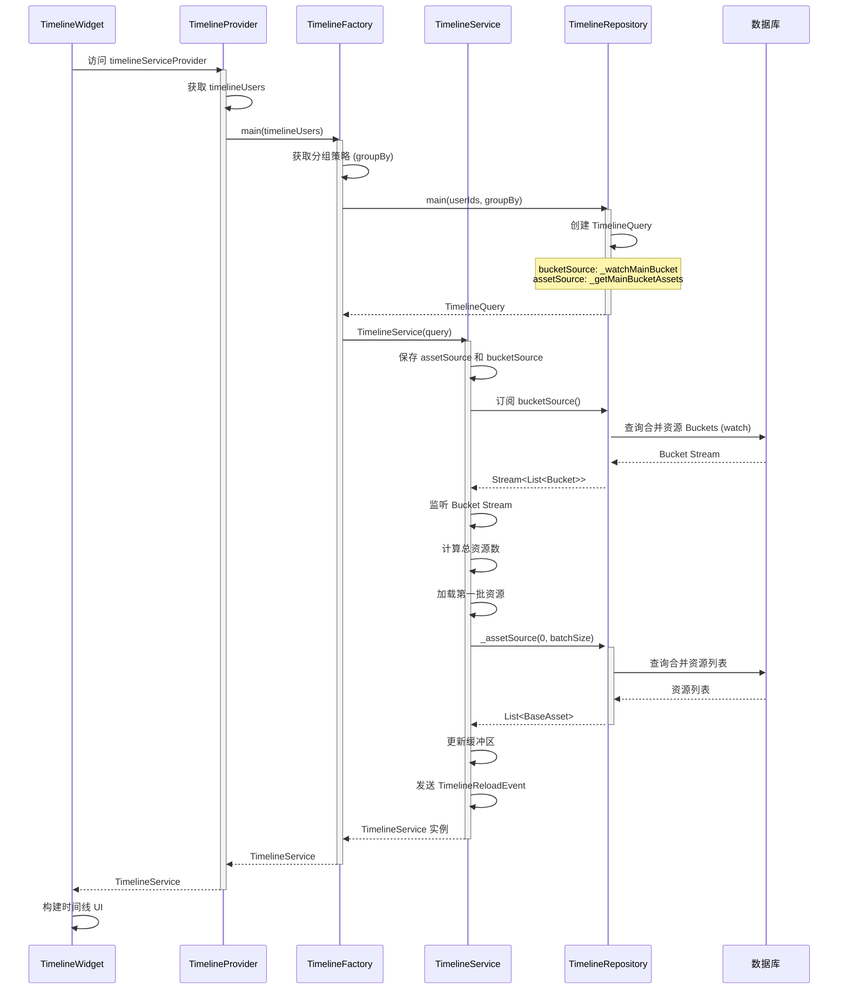
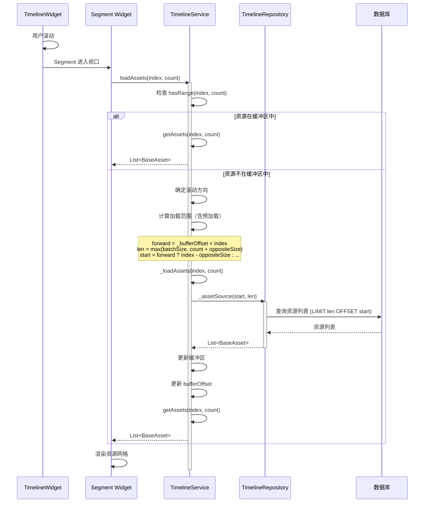
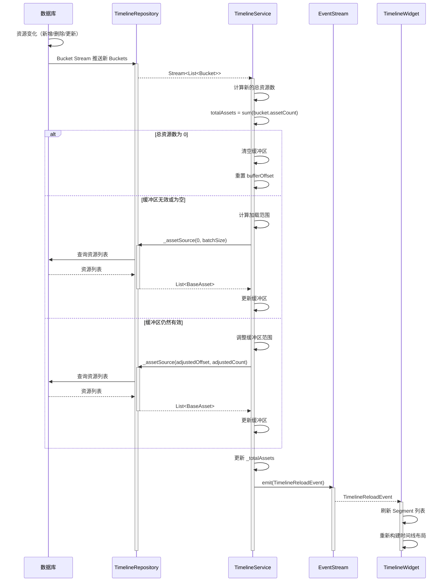
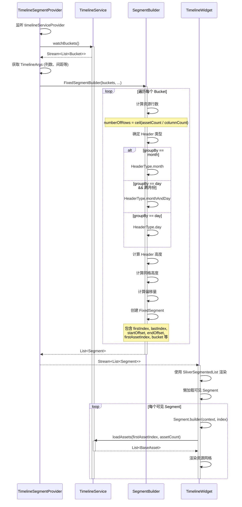
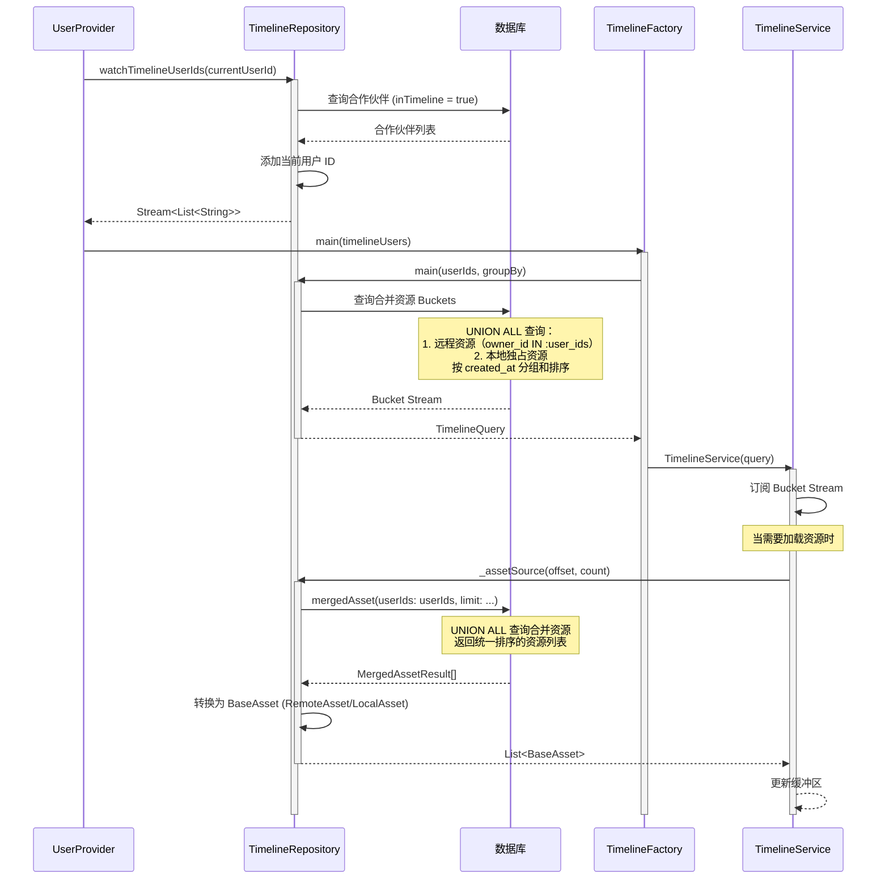
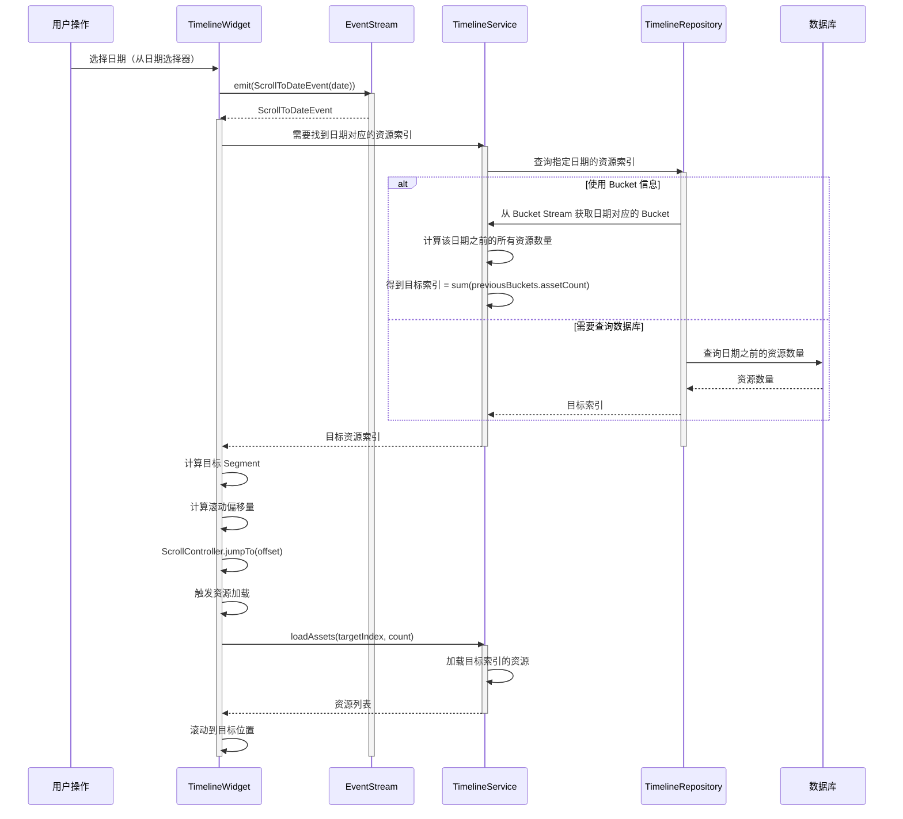

# Immich Mobile 时间线模块架构深度分析

## 一、整体架构概览

### 1.1 模块职责

时间线模块是 Immich Mobile 的核心展示模块，负责：

- **时间线构建**：将资源按时间顺序组织，支持多种分组策略
- **多用户支持**：聚合多个用户（包括合作伙伴）的资源到统一时间线
- **智能加载**：按需懒加载资源，优化内存和性能
- **统一视图**：融合本地和远程资源，呈现无缝的用户体验
- **多样化展示**：支持主时间线、相册、收藏、归档、回收站等多种视图

### 1.2 架构层次

```
┌─────────────────────────────────────────┐
│   Presentation Layer (UI 渲染)          │
│   - TimelineWidget                      │
│   - SegmentBuilder                      │
│   - TimelineState                       │
└─────────────────────────────────────────┘
                  ↓
┌─────────────────────────────────────────┐
│   Provider Layer (状态管理与依赖注入)    │
│   - timelineServiceProvider             │
│   - timelineFactoryProvider             │
│   - timelineSegmentProvider             │
└─────────────────────────────────────────┘
                  ↓
┌─────────────────────────────────────────┐
│   Domain Layer (业务逻辑)               │
│   - TimelineService                     │
│   - TimelineFactory                     │
└─────────────────────────────────────────┘
                  ↓
┌─────────────────────────────────────────┐
│   Infrastructure Layer (数据访问)       │
│   - TimelineRepository                  │
│   - MergedAssetView (数据库视图)        │
└─────────────────────────────────────────┘
```

### 1.3 关键文件组织结构

```
mobile/lib/
├── domain/
│   ├── models/
│   │   └── timeline.model.dart           # 时间线模型（Bucket, TimeBucket）
│   └── services/
│       └── timeline.service.dart         # 时间线服务核心逻辑
├── infrastructure/
│   ├── entities/
│   │   └── merged_asset.drift            # 合并资源数据库视图
│   └── repositories/
│       └── timeline.repository.dart      # 时间线数据仓库
├── providers/
│   └── infrastructure/
│       └── timeline.provider.dart        # 时间线 Provider
└── presentation/
    └── widgets/
        └── timeline/
            ├── timeline.widget.dart      # 时间线主组件
            ├── timeline.state.dart       # 时间线状态管理
            ├── segment_builder.dart      # 段构建器
            └── fixed/                    # 固定布局实现
```

## 二、核心设计理念

### 2.1 双流架构：分离元数据与资源数据

时间线模块采用**双流架构**，将元数据（Buckets）和资源数据（Assets）分离管理：

- **Bucket Stream**：实时监听时间分组元数据变化（日期、资源数量）
- **Asset Source**：按需加载具体资源列表

**设计优势**：

1. **性能优化**：只加载可见区域的资源，避免一次性加载所有资源
2. **响应式更新**：Bucket 流可以实时反映数据库变化，自动更新 UI
3. **内存友好**：通过智能缓冲区管理，控制内存占用
4. **解耦设计**：元数据查询和资源查询逻辑分离，易于优化和维护

### 2.2 智能缓冲区管理

`TimelineService` 维护一个智能缓冲区系统：

**核心机制**：

1. **按需加载**：只在需要时才从数据库加载资源
2. **预加载优化**：
   - 向前滚动时，提前加载一部分反向资源（防止用户快速反向滚动）
   - 向后滚动时，提前加载一部分正向资源
3. **缓冲区验证**：检查请求的资源是否已在缓冲区中，避免重复加载
4. **批量加载**：一次加载一个批次的资源，而非单个资源

**滚动方向检测**：

当用户滚动时，系统会判断滚动方向：
- **向前滚动**：索引增加，提前加载反向资源作为缓冲
- **向后滚动**：索引减少，提前加载正向资源作为缓冲

### 2.3 合并资源视图（Merged Asset View）

时间线模块的核心创新是**合并资源视图**，通过 SQL UNION 查询将本地和远程资源统一：

**视图逻辑**：

1. **远程资源优先**：查询远程资源，同时关联本地资源（通过 checksum 匹配）
2. **本地独占资源**：查询未被远程资源覆盖的本地资源（仅在已选择的备份相册中）
3. **堆叠处理**：只显示堆叠的主资源，避免重复展示
4. **过滤规则**：
   - 排除已删除的资源
   - 排除未选择备份的相册资源
   - 排除明确排除的相册资源

**多用户支持**：

合并视图支持多用户 ID 列表，通过 `IN (:user_ids)` 查询实现：
- 当前用户的所有资源
- 合作伙伴在时间线中共享的资源

### 2.4 TimelineQuery 抽象：统一查询接口

`TimelineQuery` 是一个记录类型，包含三个核心组件：

```dart
typedef TimelineQuery = ({
  TimelineAssetSource assetSource,      // 资源加载函数
  TimelineBucketSource bucketSource,    // Bucket 流函数
  TimelineOrigin origin                 // 来源标识
});
```

**设计优势**：

1. **统一接口**：所有时间线类型（主时间线、相册、收藏等）使用相同接口
2. **灵活实现**：不同的时间线来源可以有不同的实现策略
3. **易于扩展**：添加新的时间线类型只需实现 TimelineQuery
4. **解耦依赖**：TimelineService 不依赖具体的 Repository 实现

## 三、时间线构建流程

### 3.1 TimelineFactory：工厂模式创建时间线

`TimelineFactory` 负责根据不同的来源创建对应的 `TimelineService`：

**支持的时间线类型**：

- **main**：主时间线（多用户聚合）
- **localAlbum**：本地相册时间线
- **remoteAlbum**：远程相册时间线
- **favorite**：收藏时间线
- **trash**：回收站时间线
- **archive**：归档时间线
- **lockedFolder**：锁定文件夹时间线
- **video**：视频时间线
- **place**：地点时间线
- **person**：人物时间线
- **map**：地图区域时间线

**分组策略**：

Factory 从设置中读取分组偏好（day/month/auto），并传递给 Repository。

### 3.2 TimelineService：核心服务逻辑

`TimelineService` 是时间线模块的核心，负责：

1. **监听 Bucket 变化**：订阅 Bucket Stream，自动更新总资源数量
2. **管理缓冲区**：维护当前加载的资源缓冲区
3. **按需加载资源**：根据索引范围智能加载资源
4. **提供同步接口**：对外提供同步的资源访问接口

**初始化流程**：

1. 接收 `TimelineQuery`（包含 assetSource 和 bucketSource）
2. 订阅 Bucket Stream
3. 当 Bucket 变化时：
   - 计算总资源数量
   - 如果缓冲区为空或无效，加载第一批资源
   - 更新总资源计数
   - 发送重载事件

**资源加载策略**：

1. **范围检查**：首先检查请求的资源是否已在缓冲区中
2. **方向判断**：确定用户是向前还是向后滚动
3. **范围计算**：计算加载范围，包含预加载的缓冲区域
4. **数据库查询**：从数据库加载资源
5. **缓冲区更新**：更新缓冲区，返回请求的资源

### 3.3 TimelineRepository：数据访问层

`TimelineRepository` 负责实现具体的查询逻辑：

**核心查询方法**：

1. **主时间线查询**：
   - `_watchMainBucket`：监听合并资源的 Bucket 流
   - `_getMainBucketAssets`：加载合并资源列表

2. **相册查询**：
   - `_watchLocalAlbumBucket`：本地相册 Bucket 流
   - `_watchRemoteAlbumBucket`：远程相册 Bucket 流（支持排序方向）

3. **过滤查询**：
   - `_remoteQueryBuilder`：通用远程资源查询构建器
   - 支持自定义过滤条件（收藏、归档、删除等）

**查询优化**：

1. **数据库视图**：使用 MergedAsset 视图减少 JOIN 查询
2. **分组聚合**：在数据库层进行日期分组和计数
3. **流式查询**：使用 Drift 的 `watch()` 方法实现响应式更新
4. **索引利用**：通过合适的排序和过滤条件利用数据库索引

## 四、分组策略详解

### 4.1 分组类型

时间线支持多种分组策略：

- **day**：按天分组（默认）
- **month**：按月分组
- **auto**：自动分组（当前回退到 day）
- **none**：不分组（所有资源连续排列）

### 4.2 分组实现机制

**数据库层分组**：

使用 SQL 的日期格式化函数进行分组：
- 按天：`STRFTIME('%Y-%m-%d', created_at, 'localtime')`
- 按月：`STRFTIME('%Y-%m', created_at, 'localtime')`

**关键设计点**：

1. **时区处理**：使用 `localtime` 转换为本地时区，确保分组正确
2. **字符串格式**：使用标准日期格式（YYYY-MM-DD 或 YYYY-MM）便于排序
3. **聚合查询**：使用 `GROUP BY` 和 `COUNT(*)` 在数据库层完成分组和计数

**UI 层分组展示**：

- **Month Header**：当切换月份时显示月份标题
- **Day Header**：每天显示日期标题
- **Month and Day Header**：同时显示月份和日期（跨月份的第一天）

## 五、Segment 构建与渲染

### 5.1 Segment 概念

`Segment` 是时间线 UI 的基本渲染单元，代表一个时间分组的可视化表示：

**Segment 组成**：

- **Header**：时间标题（日期/月份）
- **Grid**：资源网格（多行多列）
- **Metadata**：偏移量、索引范围等布局信息

### 5.2 SegmentBuilder：段构建器

`FixedSegmentBuilder` 负责将 Bucket 列表转换为 Segment 列表：

**构建流程**：

1. **遍历 Buckets**：为每个 Bucket 创建对应的 Segment
2. **计算布局**：
   - 根据资源数量和列数计算行数
   - 计算 Header 高度
   - 计算资源网格总高度
   - 累加偏移量
3. **确定 Header 类型**：
   - 根据分组策略和日期变化确定 Header 类型
   - 跨月份时显示 Month and Day Header
4. **生成 Segment**：创建包含所有布局信息的 Segment 对象

### 5.3 懒加载渲染

时间线使用 Flutter 的 `Sliver` 机制实现虚拟滚动：

**渲染策略**：

1. **虚拟滚动**：只渲染可见区域的 Segment
2. **懒加载资源**：Segment 内的资源按需从 TimelineService 加载
3. **占位符**：加载过程中显示占位符，避免布局跳动
4. **缓存复用**：已加载的资源保持在缓冲区中，避免重复加载

## 六、多用户时间线支持

### 6.1 用户列表监听

时间线模块通过 `watchTimelineUserIds` 监听应该显示在时间线中的用户：

**用户来源**：

1. **当前用户**：总是包含在列表中
2. **合作伙伴**：查询 `partnerEntity` 表，筛选 `inTimeline = true` 的合作伙伴

**响应式更新**：

- 当合作伙伴关系变化时，Stream 自动推送新的用户列表
- TimelineService 重新创建，使用新的用户列表查询

### 6.2 多用户资源合并

**合并逻辑**：

1. **Union 查询**：在数据库层使用 UNION ALL 合并多个用户的资源
2. **统一排序**：所有资源按创建时间降序排列
3. **去重处理**：通过 checksum 匹配，避免重复显示
4. **权限过滤**：只显示用户有权限访问的资源

## 七、性能优化策略

### 7.1 数据库查询优化

1. **视图优化**：使用 MergedAsset 视图预计算合并结果
2. **索引利用**：通过创建时间、所有者 ID 等字段的索引加速查询
3. **批量查询**：一次性查询多个资源，而非逐个查询
4. **流式更新**：使用数据库流自动推送变化，无需轮询

### 7.2 内存管理

1. **缓冲区限制**：缓冲区只保留最近加载的资源
2. **自动清理**：当 Bucket 变化导致缓冲区无效时自动清理
3. **按需释放**：TimelineService 销毁时释放所有资源

### 7.3 渲染优化

1. **虚拟滚动**：只渲染可见区域，减少 Widget 数量
2. **RepaintBoundary**：使用重绘边界隔离资源瓦片的渲染
3. **占位符策略**：加载过程中显示占位符，避免布局重算
4. **缓存复用**：已加载的资源保持在缓冲区中

### 7.4 预加载策略

1. **双向预加载**：根据滚动方向预加载相反方向的资源
2. **批次大小优化**：合理的批次大小平衡加载次数和内存占用
3. **查看器预加载**：打开资源查看器时预加载相邻资源

## 八、事件驱动更新

### 8.1 EventStream 机制

时间线模块使用事件流机制实现跨组件通信：

**支持的事件**：

- `TimelineReloadEvent`：时间线重载事件（Bucket 变化时触发）
- `ScrollToTopEvent`：滚动到顶部事件
- `ScrollToDateEvent`：滚动到指定日期事件

**事件流程**：

1. TimelineService 监听 Bucket 变化
2. 当 Bucket 变化时，发送 `TimelineReloadEvent`
3. TimelineWidget 监听事件流
4. 收到事件后刷新 UI

### 8.2 状态同步

**TimelineState** 管理时间线的交互状态：

- `isScrubbing`：是否正在使用时间轴拖拽
- `isScrolling`：是否正在滚动
- `isInteracting`：综合交互状态

这些状态用于优化渲染性能（例如，拖拽时显示占位符而非实际资源）。

## 九、设计模式应用

### 9.1 工厂模式

`TimelineFactory` 使用工厂模式创建不同类型的时间线服务，封装创建逻辑，便于扩展。

### 9.2 策略模式

不同的时间线来源使用不同的查询策略，通过 `TimelineQuery` 统一接口，实现策略的可替换性。

### 9.3 观察者模式

- Bucket Stream 观察数据库变化
- EventStream 观察时间线事件
- Provider 观察状态变化

### 9.4 代理模式

`TimelineService` 作为资源访问的代理，隐藏了复杂的缓冲区和加载逻辑，对外提供简单的接口。

## 十、时序图

### 10.1 时间线初始化流程



### 10.2 资源加载流程（滚动触发）



### 10.3 Bucket 变化响应流程



### 10.4 Segment 构建流程



### 10.5 多用户时间线查询流程



### 10.6 滚动到日期流程



## 十一、架构设计亮点总结

### 11.1 分离关注点

- **元数据与数据分离**：Bucket Stream 管理分组信息，Asset Source 管理具体资源
- **查询与渲染分离**：Repository 负责查询，UI 负责渲染
- **状态与逻辑分离**：Provider 管理状态，Service 处理业务逻辑

### 11.2 性能优化

1. **智能缓冲**：按需加载，双向预加载
2. **数据库优化**：使用视图、索引、批量查询
3. **虚拟滚动**：只渲染可见区域
4. **流式更新**：实时响应数据库变化

### 11.3 可扩展性

1. **工厂模式**：易于添加新的时间线类型
2. **查询抽象**：TimelineQuery 统一接口
3. **策略模式**：不同的查询策略可替换

### 11.4 用户体验

1. **无缝融合**：本地和远程资源统一展示
2. **多用户支持**：自动聚合合作伙伴资源
3. **流畅滚动**：智能预加载保证流畅体验
4. **实时更新**：数据库变化自动反映到 UI

## 十二、总结

Immich Mobile 的时间线模块采用了**双流架构、智能缓冲、合并视图**等先进设计理念，实现了高性能、可扩展、用户友好的时间线展示功能。通过分离元数据和资源数据、使用数据库视图优化查询、智能缓冲区管理等方式，在保证性能的同时提供了丰富的功能和良好的用户体验。

整个架构不仅满足了移动端对性能和内存的严格要求，还为未来扩展新功能（如更多分组策略、更多过滤选项等）提供了坚实的基础。时间线模块的设计体现了对移动应用开发、数据库优化、响应式编程等多个领域的深入理解和应用。

