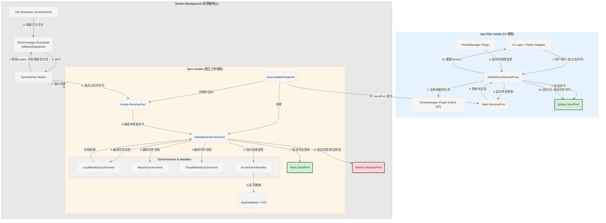

### 架构总览图

---

### 图例 (Legend)

*   **蓝色方框**: 代表应用的主 Isolate，负责UI渲染和轻量级逻辑。
*   **橙色方框**: 代表专门用于同步的后台 Isolate，所有耗时操作都在这里执行。
*   **灰色方框**: 代表独立于应用的系统级后台执行环境。
*   **绿色/红色菱形**: 代表 Isolate 之间通信的 `Port` (端口)，是数据交换的桥梁。
*   **蓝色实线箭头**: 代表**应用内同步**时的主要命令流。
*   **绿色虚线箭头**: 代表**应用内同步**时的状态返回流。
*   **红色虚线箭头**: 代表**系统后台同步**时的独特流程。

---

### 核心组件解析

1.  **App Main Isolate (蓝色区域)**:
    *   **UI Layer**: 用户界面，是所有操作的发起点。
    *   **MediaSyncServiceProxy**: 同步服务的“代理”或“门面”，UI层只与它打交道。它负责管理 `Sync Isolate` 的生命周期，发送命令和接收状态。
    *   **PhotoManager Plugin**: 用于监听设备相册的原生变更通知。
    *   **Workmanager Plugin (Client API)**: 用于向操作系统注册周期性的后台任务。
    *   **Main ReceivePort**: 主 Isolate 的接收端口，专门用来接收来自 `Sync Isolate` 的状态更新。

2.  **Sync Isolate (橙色区域)**:
    *   **syncIsolateEntrypoint**: `Isolate` 的入口函数，负责初始化环境（如依赖注入、数据库连接）和建立通信。
    *   **MediaSyncServiceCore**: 同步逻辑的“大脑”和“指挥官”。它接收命令，并按照预定顺序调用各个 `Synchronizer` 和 `Handler` 来完成复杂的同步任务。
    *   **Synchronizers & Handlers**:
        *   **LocalMediaSynchronizer**: 负责扫描本地相册并与数据库比对，找出差异。
        *   **AssetActionHandler**: 负责执行具体的数据库操作（增、删、改），包含文件哈希计算等复杂逻辑。
        *   **(Cloud/Album)Synchronizer**: 其他负责特定数据源同步的模块。
    *   **AppDatabase**: 应用的本地数据库 (Drift)。
    *   **Isolate ReceivePort**: `Sync Isolate` 的接收端口，用来接收来自 `Proxy` 或 `Worker` 的命令。

3.  **System Background (灰色区域)**:
    *   **OS Scheduler**: 操作系统（Android/iOS）的后台任务调度器。
    *   **Workmanager Entrypoint**: `workmanager` 插件在后台被唤醒时执行的顶层函数 (`callbackDispatcher`)。
    *   **SyncWorker**: 一个辅助模块，在 `callbackDispatcher` 中被调用，它的职责是临时创建一个 `Sync Isolate` 来完成一次性的同步任务，并在完成后清理所有资源。

---

### 关键流程解析

#### 流程一：应用内的同步 (手动触发或相册变更)

这个流程对应图中的 **蓝色实线箭头 (命令)** 和 **绿色虚线箭头 (状态)**。

1.  **用户点击同步 (1)** 或 **相册发生变化 (A)**。
2.  **Proxy** 接收到信号。如果是相册变化，会先进行防抖处理 (B)。然后，Proxy 将一个 `SyncCommand` (如 `triggerFullSync`) 通过它持有的 `Isolate SendPort` 发送出去 **(2)**。
3.  `Sync Isolate` 中的 **Isolate ReceivePort** 收到命令，并将其转发给 **MediaSyncServiceCore (3)**。
4.  **Core** 开始执行同步逻辑，它会按顺序调用 **LocalMediaSynchronizer** 等模块进行对账 **(4)**。
5.  对账完成后，**Core** 指示 **AssetActionHandler** 将变更应用到数据库 **(5, 6)**。
6.  在同步过程的各个阶段（开始、进行中、结束），**Core** 会通过 **Main SendPort** 将 `SyncState` 对象发送回主 Isolate **(7)**。
7.  主 Isolate 的 **Main ReceivePort** 收到状态 **(8)**，**Proxy** 监听到这个端口，并将新状态放入一个 `Stream` 中 **(9)**。
8.  **UI** 层监听这个 `Stream`，并根据新的状态更新界面（如显示加载动画或完成提示）**(10)**。

#### 流程二：应用被终止后的后台同步 (Workmanager 触发)

这个流程对应图中的 **红色虚线箭头** 和灰色区域。

1.  **操作系统调度器** 在满足预设条件（如时间到达、网络连接）时，唤醒应用的一个后台入口 **(D)**。
2.  **Workmanager Entrypoint (`callbackDispatcher`)** 被执行，它会调用 **SyncWorker (E)**。
3.  **SyncWorker** 的核心任务是：**临时创建一个全新的 Sync Isolate (F)**。这个 Isolate 与应用正常运行时创建的那个是完全独立的。
4.  **SyncWorker** 向这个新创建的 `Sync Isolate` 发送一个特定的同步命令，比如 `triggerCloudSync` **(G)**。
5.  `Sync Isolate` 内部的执行流程与 **流程一的步骤 3-6** 完全相同，因为它复用了 `MediaSyncServiceCore` 的所有逻辑。
6.  当 **Core** 完成同步后，它会发送一个最终状态（如 `Idle` 或 `Error`）。这次，消息是发往 **SyncWorker** 的 `ReceivePort` **(H)**。
7.  **SyncWorker** 收到完成信号后，就知道任务结束了。它会负责**销毁临时的 Sync Isolate**，并调用 `Workmanager` 的 API 向操作系统报告任务成功或失败 **(I)**。之后，整个应用进程可能会被系统再次回收。

通过这个图表和解析，您可以清晰地看到该架构如何通过责任分离和双重后台机制，实现了一个既高效又可靠的跨应用生命周期的同步系统。
