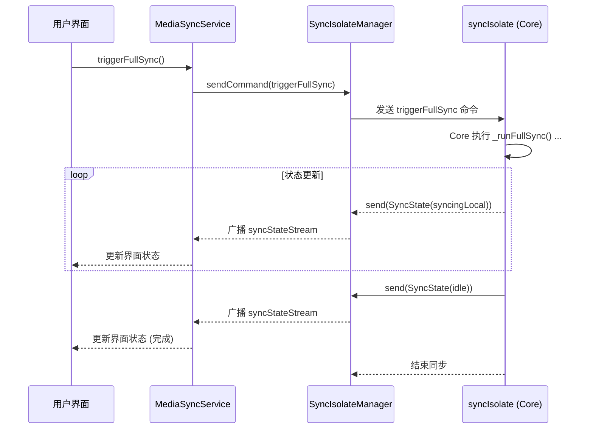
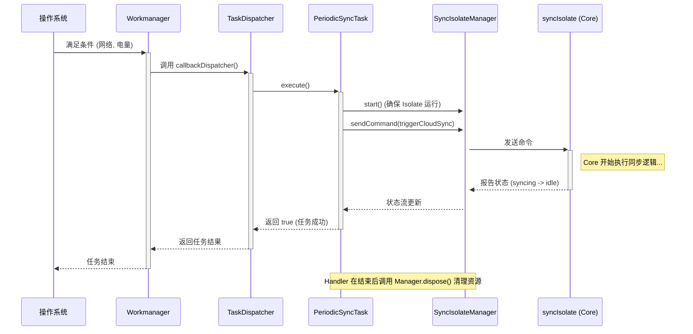

## **同步模块架构重构说明文档 (Onboarding Guide)**

### **1. 概述 (Overview)**

同步模块的核心使命是**确保设备本地的媒体资源（照片、视频）与应用数据库的状态保持最终一致性**。它负责处理前台用户操作和后台静默任务，以响应本地相册的变更。

本次重构旨在解决旧架构中存在的**职责不清、逻辑分散、代码重复和扩展困难**等问题，建立一个更健壮、可维护和可扩展的同步子系统。

### **2. 核心设计原则 (Core Design Principles)**

新架构遵循以下几个核心设计原则：

*   **单一职责原则 (Single Responsibility Principle)**: 每个类或模块只做一件事，并把它做好。例如，`Isolate` 的管理、后台任务的调度、与 UI 的交互都被分离到不同的模块中。
*   **Isolate 统一管理 (Centralized Isolate Management)**: 整个应用中只有一个管理者 (`SyncIsolateManager`) 负责 `syncIsolate` 的生命周期和通信，彻底消除了“双重控制中心”问题。
*   **开闭原则 (Open/Closed Principle)**: 系统对扩展开放，对修改关闭。尤其体现在后台任务系统中，**新增一个后台任务，无需修改任何现有的调度代码**，只需新增文件即可。
*   **门面模式 (Facade Pattern)**: `MediaSyncService` 作为整个同步功能的唯一入口，为上层（UI）提供了一个简洁、统一的接口，隐藏了内部的复杂性。
*   **依赖注入 (Dependency Injection)**: 通过公共的 DI 配置，解决了在主 Isolate 和后台 Isolate 中重复初始化依赖的问题。

### **3. 新架构组件详解 (Architecture Components)**

新架构将 `sync` 功能拆分为以下几个高内聚的模块：

#### **3.1 `manager/SyncIsolateManager` - Isolate 管理中心**

*   **职责**: **整个同步系统的“心脏”和“大脑”**。它是一个单例 (Singleton)，作为应用内唯一的 `syncIsolate` 管理者，全权负责：
    1.  `syncIsolate` 的创建 (`start`) 和销毁 (`dispose`)。
    2.  与 `syncIsolate` 的双向通信（发送命令、接收状态）。
    3.  向整个应用广播实时的同步状态 (`syncStateStream`)。
*   **关键点**: 任何模块（无论是前台服务还是后台任务）想要与 `syncIsolate` 交互，**必须**通过 `SyncIsolateManager`。它屏蔽了所有 `Isolate.spawn`, `SendPort`, `ReceivePort` 等底层复杂性。

#### **3.2 `service/MediaSyncService` - 应用服务门面**

*   **职责**: **同步功能对外的“官方发言人”或“客户服务中心”**。它直接面向 UI 层和应用的其他部分，负责：
    1.  向 UI 提供简洁的 API，如 `triggerFullSync()`。
    2.  监听系统相册的变更事件 (`PhotoManager`)，并经过防抖处理后，将变更意图转换为对 `SyncIsolateManager` 的命令调用。
    3.  向 UI 转发 `SyncIsolateManager` 广播的同步状态流。
*   **关键点**: 这个模块非常轻量，它**不关心** Isolate 如何创建、后台任务如何运行，只负责“承上启下”，将应用层的意图传递给 `SyncIsolateManager`。

#### **3.3 `background/` - 后台任务系统**

这是一个完全独立的、插件化的后台任务处理中心，替代了旧的 `worker` 目录。

*   **`task_dispatcher.dart`**: **后台任务的“总调度员”**。
    *   它是 `Workmanager` 的**唯一入口点** (`callbackDispatcher`)。
    *   内部维护一个 `Map`，将任务名称映射到具体的任务处理器。
    *   当 `Workmanager` 触发任务时，它只负责查找对应的处理器并执行，**完全无需 `switch-case`**。

*   **`contracts/background_task.dart`**: **“任务合同”**。
    *   定义了一个抽象接口 `BackgroundTask`，所有具体的后台任务处理器都必须实现它。
    *   这确保了所有任务都有一个统一的 `execute` 方法，可以被 `TaskDispatcher` 调用。

*   **`handlers/periodic_sync_task.dart`**: **一个“具体的工人”**。
    *   实现了 `BackgroundTask` 接口，封装了周期性同步任务的所有逻辑。
    *   它通过 `SyncIsolateManager` 触发同步，并监听其状态流，直到任务完成或超时。

*   **`task_registrar.dart`**: **后台任务的“注册中心”**。
    *   负责统一注册所有后台任务。
    *   将所有任务的定义（名称、频率、约束条件）集中在一个地方，便于管理。

#### **3.4 `core/` - Isolate 内部核心**

这个目录存放的是在 `syncIsolate` 这个独立线程中运行的代码。

*   **`sync_isolate.dart`**: **Isolate 的“入口程序”**。
    *   负责 Isolate 的初始化，包括初始化 DI 容器、创建 `MediaSyncServiceCore` 实例、建立通信端口等。

*   **`media_sync_service_core.dart`**: **真正的“同步工作引擎”**。
    *   接收来自 `SyncIsolateManager` 的命令 (`SyncCommand`)。
    *   根据命令，调用相应的 `Synchronizer` 和 `Handler` 来执行实际的、耗时的同步操作（如本地对账）。
    *   通过 `SendPort` 将执行过程中的状态 (`SyncState`) 报告回去。

#### **3.5 `core/di/service_locator.dart` - 公共依赖注入**

*   **职责**: **整个应用的“后勤中心”**。
    *   提供了公共的 `configureDependencies()` 函数，用于初始化所有可通过 `injectable` 自动注册的依赖。
    *   提供了专用的 `configureIsolateDependencies()` 函数，用于注册那些需要运行时参数（如 `SendPort`）的特殊依赖。
*   **关键点**: 主 Isolate 和 `syncIsolate` 都会调用这里的函数来配置依赖，确保了 DI 逻辑的统一，避免了代码重复。

---

### **4. 核心工作流程 (Workflows)**

#### **场景一：应用在前台，用户手动触发全量同步**



#### **场景二：应用被终止，后台任务被系统唤醒**



---

### **5. 开发者指南 (Developer's Guide)**

#### **如何在 UI 中使用同步服务？**

1.  通过依赖注入容器获取 `MediaSyncService` 的实例。
2.  调用其方法或监听其状态流。

```dart
// 获取服务实例
final syncService = getIt<MediaSyncService>();

// 调用方法
syncService.triggerFullSync();

// 监听状态
StreamBuilder<SyncState>(
  stream: syncService.syncStateStream,
  builder: (context, snapshot) {
    // ... 根据 snapshot.data 更新 UI ...
  },
);
```

#### **如何新增一个后台任务？(例如：后台缓存清理)**

新架构的优势在这里体现得淋漓尽致。你只需要做以下**四步**，无需修改任何现有核心代码：

1.  **创建 Handler**: 在 `background/handlers/` 目录下创建一个新文件 `cache_cleanup_task.dart`，实现 `BackgroundTask` 接口。

    ```dart
    // in cache_cleanup_task.dart
    const String cacheCleanupTask = "com.example.mobile.cacheCleanup";

    class CacheCleanupTask implements BackgroundTask {
      @override
      Future<bool> execute(Map<String, dynamic>? inputData) async {
        // ... 在这里实现你的缓存清理逻辑 ...
        print("Cleaning up cache...");
        return true; // 成功返回 true
      }
    }
    ```

2.  **注册到 Dispatcher**: 在 `background/task_dispatcher.dart` 的 `taskHandlers` 映射中添加一行。

    ```dart
    // in task_dispatcher.dart
    final Map<String, BackgroundTask> taskHandlers = {
      periodicCloudSyncTask: PeriodicSyncTask(),
      cacheCleanupTask: CacheCleanupTask(), // <-- 新增此行
    };
    ```

3.  **注册到 Registrar**: 在 `background/task_registrar.dart` 中添加任务的调度计划。

    ```dart
    // in task_registrar.dart
    class TaskRegistrar {
      static void registerAllTasks() {
        // ... 原有的任务注册 ...

        // 新增缓存清理任务，例如每天执行一次
        Workmanager().registerPeriodicTask(
          "cache-cleanup-daily",
          cacheCleanupTask,

          frequency: const Duration(days: 1),
        );
      }
    }
    ```

4.  **完成！** 你的新后台任务已经完全集成。
