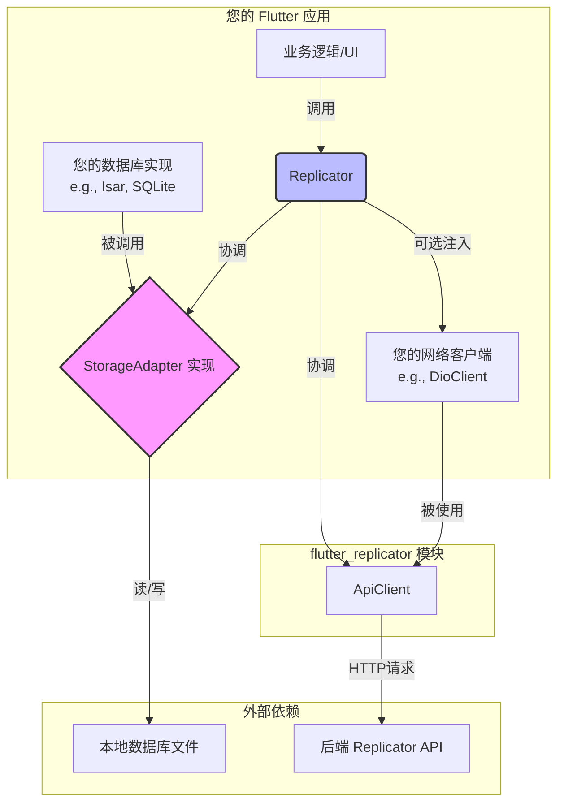
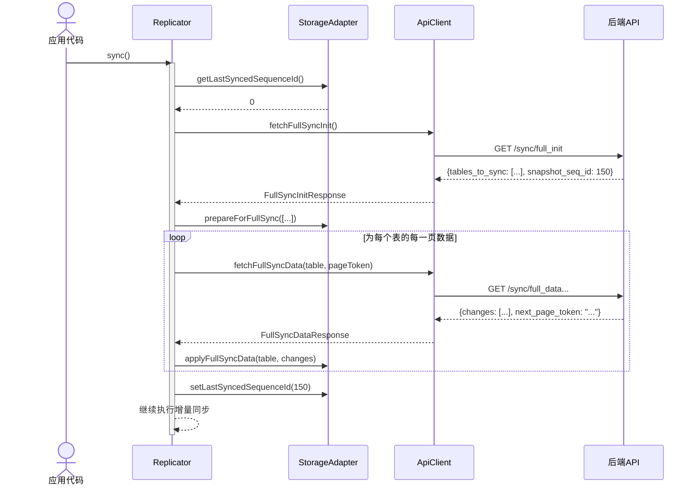
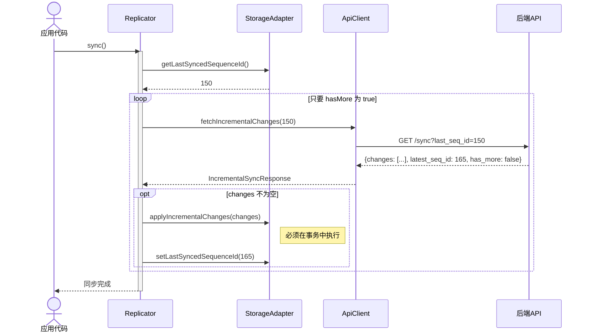

# `flutter_replicator` 模块技术文档

## 1. 概述 (Overview)

`flutter_replicator` 是一个为 Flutter 应用设计的客户端数据同步引擎。它与一个基于变更日志 (Changelog-based) 的后端服务协同工作，旨在高效、可靠地解决移动客户端与服务端之间的数据同步问题，尤其适用于需要离线操作和优化网络流量的场景。

该模块通过提供**增量同步 (Incremental Sync)** 和为新客户端准备的**全量同步 (Full Sync)** 两种机制，确保本地数据与服务端数据的最终一致性，同时显著节省网络带宽和设备电量。

**核心特性:**

*   **变更驱动**: 基于服务端的变更日志进行同步，而非暴力对比全量数据，效率极高。
*   **状态无关**: 同步过程是幂等的，客户端只需记录一个“序列号”即可随时恢复同步。
*   **解耦设计**: 通过 `StorageAdapter` 抽象层，将同步逻辑与具体的本地数据库（如 SQLite, Isar, Hive 等）实现完全分离。
*   **灵活的网络层**: 支持快速启动（内部创建Dio），也支持集成应用已有的复杂网络客户端（注入自定义Dio）。
*   **自动化流程**: 自动判断应执行全量同步还是增量同步。

## 2. 核心原理与架构 (Core Principles & Architecture)

`flutter_replicator` 的工作原理是作为服务端 `replicator` 模块的客户端实现，它通过拉取（pull）服务端的变更日志来更新本地数据。

### 2.1. 核心概念

*   **变更日志 (Changelog)**: 服务端记录了每一次数据变更（创建、更新、删除）的流水账。`flutter_replicator` 的任务就是获取这些变更记录并在本地重放。
*   **序列ID (Sequence ID)**: 每一条变更记录都有一个全局唯一且自增的 `sequenceId`。这相当于一个“同步游标”，客户端只需保存最后一次成功同步的 `sequenceId`，下次即可从该点继续，拉取所有新的变更。
*   **存储适配器 (StorageAdapter)**: 这是一个由您（模块使用者）实现的抽象类。它充当了 `replicator` 模块与您应用中具体数据库之间的桥梁，告诉 `replicator` 如何查询同步状态和如何将变更写入本地存储。

### 2.2. 架构图 (Architecture)

模块的核心组件及其相互关系如下图所示：



*   **Replicator (协调器)**: 是模块的入口和总指挥。它根据本地存储的 `lastSyncedSequenceId` 决定是执行全量同步还是增量同步，并协调 `ApiClient` 和 `StorageAdapter` 完成整个流程。
*   **ApiClient (网络客户端)**: 负责与后端 `replicator` API 进行所有网络通信。它可以**使用您注入的Dio实例**，也可以在您未提供时**内部创建一个默认实例**。
*   **StorageAdapter 实现**: 您需要编写的具体实现。它封装了所有本地数据库操作，使得 `Replicator` 无需关心底层数据库技术。

## 3. 快速集成指南 (Simple Setup)

此方法适用于快速原型开发或没有复杂网络需求的项目。模块将为您自动处理网络请求。

### **第一步: 添加依赖**

将 `flutter_replicator` 添加到您项目的 `pubspec.yaml` 文件中。

### **第二步: 实现 `StorageAdapter`**

这是集成的核心步骤。您需要创建一个类并继承 `StorageAdapter`，然后实现其所有抽象方法。

```dart
import 'package:flutter_replicator/flutter_replicator.dart';
import 'package:my_app/services/database_service.dart'; // 假设这是您的数据库服务

class MyStorageAdapter extends StorageAdapter {
  final DatabaseService dbService;
  MyStorageAdapter(this.dbService);

  @override
  Future<int> getLastSyncedSequenceId() async {
    // 从一个固定的地方读取上次同步的序列ID, 如果从未同步过，必须返回 0
    return await dbService.getKeyValue('last_seq_id') ?? 0;
  }

  @override
  Future<void> setLastSyncedSequenceId(int seqId) async {
    // 将最新的序列ID持久化存储
    await dbService.setKeyValue('last_seq_id', seqId);
  }

  @override
  Future<void> prepareForFullSync(List<String> tables) async {
    // 在一个事务中清空指定的表
    await dbService.transaction(() async {
      for (final tableName in tables) {
        await dbService.clearTable(tableName);
      }
    });
  }

  @override
  Future<void> applyFullSyncData(String tableName, List<Changelog> data) async {
    // 将全量同步的一页数据批量插入到本地数据库
    final models = data.map((log) => MyModel.fromJson(log.payload!)).toList();
    await dbService.bulkInsert(tableName, models);
  }

  @override
  Future<void> applyIncrementalChanges(List<Changelog> changes) async {
    // 必须保证其操作的原子性！使用数据库事务来应用所有增量变更。
    await dbService.transaction(() async {
      for (final change in changes) {
        switch (change.operationType) {
          case OperationType.created:
            await dbService.insert(change.tableName, MyModel.fromJson(change.payload!));
            break;
          case OperationType.updated:
            await dbService.update(change.tableName, change.recordId, MyModel.fromJson(change.payload!));
            break;
          case OperationType.deleted:
            await dbService.delete(change.tableName, change.recordId);
            break;
        }
      }
    });
  }
}
```

### **第三步: 配置并初始化 `Replicator`**

在此模式下，您**必须**在 `ReplicatorConfig` 中提供 `baseUrl`。

```dart
// 1. 创建 Replicator 配置
final replicatorConfig = ReplicatorConfig(
  // 在不提供自定义Dio时，baseUrl是必需的
  baseUrl: 'https://api.example.com/api/v1', 
  deviceId: 'unique-device-id-123',
  userId: 'current-user-id-456',
);

// 2. 实例化您的 StorageAdapter
final storageAdapter = MyStorageAdapter(myDatabaseService);

// 3. 实例化 Replicator (不传入Dio实例)
final replicator = Replicator(
  config: replicatorConfig,
  storage: storageAdapter,
);
```

### **第四步: 触发同步**

在您认为合适的时机调用 `sync()` 方法。

```dart
await replicator.sync();
```

## 4. 推荐实践: 集成自定义 `Dio` 客户端

对于生产级应用，强烈推荐此方法。通过注入您应用中已有的全局 `Dio` 实例，`flutter_replicator` 的所有网络请求将能复用您统一的**认证、Token刷新、重试、日志和错误处理**逻辑。

### **步骤 1: 准备您的全局 `Dio` 实例**

通常您的应用会有一个类似 `DioClient` 的服务来管理 `Dio`，它已经配置了各种拦截器。

```dart
// 假设您已有一个全局可访问的 Dio 实例
// 例如，通过 get_it 或其他依赖注入方式获取
final Dio myAppDio = myDioClient.dio; 
```

### **步骤 2: 配置 `Replicator` (无需 `baseUrl`)**

当注入自定义 `Dio` 时，`ReplicatorConfig` 中的 `baseUrl` 会被忽略，您可以不提供。

```dart
// 创建 Replicator 配置时，不再需要 baseUrl
final replicatorConfig = ReplicatorConfig(
  deviceId: 'a-unique-device-identifier', // 从设备信息获取
  userId: 'current-user-id',             // 从用户会话获取
);
```

### **步骤 3: 实例化 `Replicator` 并注入 `Dio`**

在构造函数中传入您自己的 `Dio` 实例。

```dart
// 实例化您的 StorageAdapter
final storageAdapter = MyStorageAdapter(myDatabaseService);

// 实例化 Replicator，并注入您的 Dio 实例
final replicator = Replicator(
  config: replicatorConfig,
  storage: storageAdapter,
  dio: myAppDio, // <== 核心：注入您自己的Dio实例
);
```

### **步骤 4: 触发同步**

正常调用 `sync()`。现在所有网络请求都将通过您功能完备的 `myAppDio` 实例发出。

```dart
await replicator.sync();
```

### **此模式的优势**

*   **单一来源 (Single Source of Truth)**：网络配置（`baseUrl`、超时等）由您的全局客户端统一管理。
*   **功能复用**：自动利用复杂的**认证Token自动刷新**、智能重试、统一日志等拦截器功能。
*   **高内聚，低耦合**：`Replicator` 模块专注于同步逻辑，您的 `DioClient` 专注于网络通信，职责清晰。
*   **易于维护和测试**：可以轻松地为 `Replicator` 注入一个 mock 的 `Dio` 实例来进行单元测试。

## 5. 同步流程时序图 (Sequence Diagrams)

### 5.1. 全量同步流程 (Full Sync Flow)



### 5.2. 增量同步流程 (Incremental Sync Flow)



## 6. 公共 API 参考 (Public API Reference)

### `Replicator`
*   **`Replicator({required config, required storage, Dio? dio})`**: 构造函数。
    *   `config`: `ReplicatorConfig` - 模块配置。
    *   `storage`: `StorageAdapter` - 数据库适配器实现。
    *   `dio`: `Dio?` - (可选) 自定义的Dio网络客户端。
*   **`Future<void> sync()`**: 启动同步过程的主方法。

### `ReplicatorConfig`
*   **`ReplicatorConfig({baseUrl, required deviceId, required userId, ...})`**: 构造函数。
    *   `baseUrl`: `String?` - 后端API基地址。仅在不提供自定义 `Dio` 实例时**必需**。
    *   `deviceId`: `String` - 客户端唯一ID。
    *   `userId`: `String` - 用户唯一ID。
    *   `defaultPageLimit`: `int` - 分页拉取数据的默认大小。

### `StorageAdapter`
*   **`Future<int> getLastSyncedSequenceId()`**: 获取上次同步的序列ID。
*   **`Future<void> setLastSyncedSequenceId(int seqId)`**: 保存最新的序列ID。
*   **`Future<void> prepareForFullSync(List<String> tables)`**: 全量同步前清空表。
*   **`Future<void> applyFullSyncData(String tableName, List<Changelog> data)`**: 应用全量同步数据。
*   **`Future<void> applyIncrementalChanges(List<Changelog> changes)`**: 原子性地应用增量变更。

---
