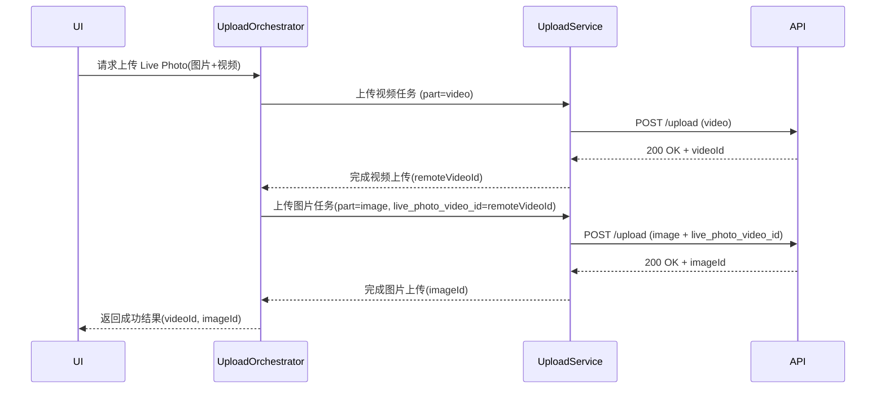
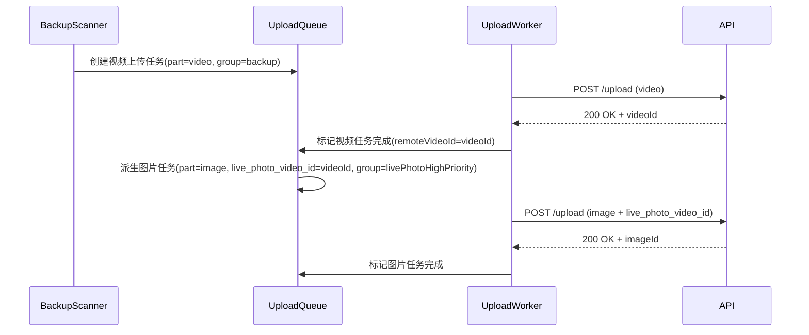

## Context

PrismBox 已经通过 `add-livephoto-upload-support` 变更，为 Live Photo 上传引入了基础能力：

- 数据模型层已统一使用「主资产为图片，图片资产上保存 `livePhotoVideoId` 指向视频资产」的模型；
- 上传表单已经支持在图片上传时携带 `live_photo_video_id` 字段；
- 远程同步层可以从服务器响应中读取 `live_photo_video_id` / `livePhotoVideoId` 并写入本地。

但目前上传队列和编排层仍然将 Live Photo 当作单一资产处理：

- 没有在队列级别显式建模「Live Photo = 视频任务 + 图片任务」；
- 没有保证队列中一定先完成视频上传，再开始对应图片上传；
- 失败与重试路径没有「成对语义」，容易出现图片/视频一部分长期缺失。

Immich 在移动端通过前后台两个服务给出了一套已经验证的实现：

- `ForegroundUploadService._uploadSingleAsset`：
  - 能够在一次调用中处理 Live Photo：先上传视频文件，成功后记录返回的视频资产 ID，再上传图片并携带 `livePhotoVideoId` 字段；
- `BackgroundUploadService`：
  - 对 Live Photo 在任务队列中显式拆分为两条任务：
    - 第一条任务上传 Live Photo 视频；
    - 当第一条任务完成时，通过响应体中的 `id` 构造第二条任务，上传 Live Photo 图片，并在字段中携带 `livePhotoVideoId`，第二条任务放在高优先级组。

本提案目标是在 PrismBox 的上传队列与编排层引入与 Immich 同级的成对上传能力。

## Goals / Non-Goals

### Goals

- G1: **在上传任务层显式建模 Live Photo**  
  将 Live Photo 拆解为「视频任务 + 图片任务」两个子任务，二者通过本地资产 ID 与远程视频资产 ID 建立逻辑关联。

- G2: **实现「先视频后图片」的队列编排**  
  确保无论前台还是后台上传，Live Photo 都遵循：
  - 先上传视频；
  - 成功后再上传图片，并携带上一请求返回的视频资产 ID。

- G3: **提供可恢复的失败与重试路径**  
  能在视频/图片任一上传失败的情况下，单独重试失败部分，最终仍能补齐「图片 + 视频」的完整 Live Photo。

- G4: **与现有 `asset-upload` 行为兼容**  
  保证新的成对编排不会破坏现有的：
  - `isUploaded` 控制；
  - 去重策略；
  - `UploadResult.mediaUuids` 行为。

### Non-Goals

- N1: 不在本提案中定义新的 UI 行为（例如上传状态显示、Live Photo 专属图标），仅约束后台行为。
- N2: 不改变服务端 API 的基本路径与协议，仅约定在现有上传接口中加入/解析 `live_photo_video_id` 等字段。
- N3: 不在此变更中实现下载与保存逻辑，仅保证上传层为后续下载提供完整数据前提。

## Decisions

### Decision 1: Live Photo 的任务拆分与元数据结构

- 为上传任务引入一个专门的 Live Photo 元数据结构（概念上对应 Immich `UploadTaskMetadata`），内容至少包括：
  - `localAssetId`：本地资产 ID；
  - `isLivePhoto`：是否为 Live Photo；
  - `remoteVideoId`：已上传的视频资产远程 ID（初始为空，仅在视频任务完成后填充）；
  - `part`：任务子类型（`video` / `image`）。
- 元数据存储方案：
  - 优先选择在现有 `upload_task_entity` 上增加 JSON 字段（如 `metadataJson`），以便后续按需扩展；
  - 保持对非 Live Photo 资产的兼容（元数据为空或 `isLivePhoto = false`）。

### Decision 2: 前台上传的成对处理模式

- 前台上传（例如用户手动选择资产立即上传）不依赖长期队列，而是直接在调用栈内串联两步：
  1. 步骤一：上传 Live Photo 视频  
     - 根据本地资产从存储中拿到视频文件；
     - 调用上传接口，记录远程视频资产 ID（如响应字段 `id` / `uuid`）；
  2. 步骤二：上传 Live Photo 图片  
     - 使用同一本地资产的图片文件；
     - 在上传表单字段中携带 `live_photo_video_id = <步骤一的远程视频资产 ID>`。
- 异常处理：
  - 若步骤一（视频）失败：不执行步骤二，调用方收到失败结果；允许用户或系统稍后重试整套流程；
  - 若步骤一成功、步骤二失败：系统需要保存 `remoteVideoId` 信息，允许随后只重试图片上传，并继续携带原来的 `remoteVideoId`。

### Decision 3: 后台上传的任务编排模式

- 后台上传（自动备份）采用任务队列模式，整体行为对齐 Immich：
  - 备份候选筛选时，只为 Live Photo 生成**首个「视频任务」**；
  - 当视频任务完成时，统一的上传完成回调负责：
    - 解析响应，提取远程视频资产 ID；
    - 根据元数据中的 `localAssetId` 找到对应的 Live Photo；
    - 生成第二个「图片任务」，将 `remoteVideoId` 写入元数据和上传表单字段 `live_photo_video_id`。
- 任务分组与优先级：
  - 视频任务归入普通备份组；
  - 图片任务归入单独的 Live Photo 最高优先级组（类似 Immich 的 `kBackupLivePhotoGroup`），优先确保已成功上传的视频能尽快配上对应图片。
- 取消与重试策略：
  - 取消操作（针对备份组）可以只影响视频任务组，不触及已经排队或正在执行的图片任务组，避免打断已成功上传的视频补图流程；
  - 重试仅对失败任务生效：失败的视频任务重试不会重复推送新的图片任务，失败的图片任务重试不会重新上传视频。

### Decision 4: Live Photo 专用上传状态枚举

- 为了在上层和 API 层清晰表达「视频 / 图片」两部分的组合状态，系统 SHALL 为 Live Photo 上传状态定义一套**专用状态枚举**，示例包括但不限于：
  - `livePhotoUploadState.none`：尚未开始上传；
  - `livePhotoUploadState.uploadingVideo`：仅视频正在上传；
  - `livePhotoUploadState.uploadingPhoto`：仅图片正在上传（视频已完成）；
  - `livePhotoUploadState.videoOnlyUploaded`：仅视频成功，图片尚未成功；
  - `livePhotoUploadState.photoOnlyUploaded`：仅图片成功（理论上少见，保留以兼容异常场景）；
  - `livePhotoUploadState.bothUploaded`：视频与图片均已成功上传；
  - `livePhotoUploadState.failedVideo` / `failedPhoto` / `failedBoth`：对应失败组合。
- 该状态枚举应作为对现有上传任务状态的**聚合视图**：
  - 底层仍使用通用的任务状态（pending / uploading / completed / failed 等）驱动；
  - Live Photo 状态枚举通过「图片任务 + 视频任务」的组合计算得到，而不是取代底层任务状态；
  - 服务端在相关 API（如上传结果查询 / 任务状态查询）中 SHALL 使用相同枚举值或兼容映射对外暴露该状态，以便多端统一解析。

### Decision 5: 与 `asset-upload` 能力的契约

- `asset-upload` spec 中已经约定：
  - 上传完成后更新 `isUploaded`；
  - 通过 `UploadResult.mediaUuids` 返回成功任务对应的远程 UUID；
  - 失败不更新 `isUploaded`。
- 在 Live Photo 成对上传场景：
  - 视频任务完成时，可以更新对应「视频本地资产」的 `isUploaded`，并记录其 UUID；
  - 图片任务完成时，更新图片本地资产的 `isUploaded`，并记录其 UUID；
  - 上层如需构建「逻辑上的一张 Live Photo」视图，可以依赖「图片本地资产 + `livePhotoVideoId`（远程视频 ID）」来整合信息。

## Risks / Trade-offs

- Risk 1: 队列逻辑复杂度上升  
  两阶段任务 + 任务分组 + 元数据处理会增加上传编排层的复杂度。

  - Mitigation:
    - 严格限制 Live Photo 成对上传的逻辑在少量集中模块中（例如 `UploadTaskMetadata` 解析 / 序列化、派生任务生成回调）；
    - 对非 Live Photo 路径保持最小改动，复用现有单任务上传流程。

- Risk 2: 失败场景下的数据不一致  
  例如服务端已记录视频资产，但客户端长期未成功上传图片或同步关联。

  - Mitigation:
    - 客户端端保持清晰的「待补图片 / 待补视频」状态，通过重试策略尽量补齐；
    - 后续可以在服务端增加孤立 Live Photo 片段的审计和清理机制（不在本提案范围内）。

- Risk 3: 与现有去重与 `isUploaded` 逻辑的交互  
  如果处理不当，重试时可能因为 `isUploaded` 已经为 true 而跳过必要任务。

  - Mitigation:
    - 在设计中明确：去重逻辑与成对逻辑的优先级与边界（例如，在成对上传场景下，`isUploaded` 判定要细分到「图片」与「视频」各自的本地资产）。

## Migration Plan

1. **建模与边界梳理**
   - 定义 Live Photo 元数据结构与任务分组方案；
   - 梳理当前上传编排的调用链与状态机，标出成对上传需要介入的挂钩点。

2. **前台上传成对逻辑设计**
   - 先在设计层面确定「前台成对上传」的调用顺序、异常处理和返回值语义；
   - 不直接在此阶段修改实现，只在设计中对照 Immich 源码说明映射关系。

3. **后台上传成对编排设计**
   - 对照 Immich `BackgroundUploadService` 的时序，设计 PrismBox 版本的两阶段任务逻辑；
   - 将「视频完成 → 派生图片任务」的行为以时序图形式固化到设计文档。

4. **Spec 对齐与扩展**
   - 在 `asset-upload` 的变更 spec 中新增「Live Photo 成对上传编排」要求（ADDED Requirements），确保未来实现必须满足这些行为；
   - 如有必要，为任务分组和优先级引入新的 spec 能力，或扩展现有能力描述。

5. **实现阶段准备**
   - 基于本设计拆分具体实现任务（在 `tasks.md` 中列出）；
   - 在进入实现阶段前，通过 `openspec validate add-livephoto-paired-upload-orchestration --strict` 确认 proposal 完整一致。

## Sequence diagrams

### 前台上传 Live Photo 成功路径

### 后台上传 Live Photo 成功路径

### 关键失败与重试路径（摘要）

- 视频失败：视频任务失败或被取消时，不派生图片任务；队列保留失败视频任务，后续仅重试该任务。
- 图片失败：视频任务已成功并记录 `remoteVideoId`，图片任务失败时仅重试图片任务，重试时继续携带原有 `remoteVideoId`。
- 取消：备份组取消仅影响视频任务；已生成的 Live Photo 高优先级图片任务继续执行，避免长期「仅视频」状态。

## Verification scenarios

为后续实现阶段准备最小验证用例（不在本变更中实现测试代码）：

- 单个 Live Photo 前台上传成功：依次完成视频→图片上传，最终两端状态为 `bothUploaded`。
- 单个 Live Photo 后台上传成功：备份扫描生成视频任务，完成后派生图片任务并完成，两端状态为 `bothUploaded`。
- 批量 Live Photo 后台上传：确认视频任务按普通备份组顺序执行，图片任务进入最高优先级组并在视频完成后尽快执行。
- 视频失败场景：视频任务失败/取消且未派生图片任务，后续重试仅重试视频任务，不重复生成图片任务。
- 图片失败场景：视频任务成功、图片任务失败时，状态为 `videoOnlyUploaded`，重试仅针对图片任务，重试成功后状态变为 `bothUploaded`。

## Open Questions

（无）  
Live Photo 状态枚举在 API 层的承载方式对齐 Immich 设计：作为上传任务 / 资产状态响应中的独立字段（例如 `livePhotoUploadState`），客户端按该字段解析并映射到本地的 Live Photo 状态枚举。

