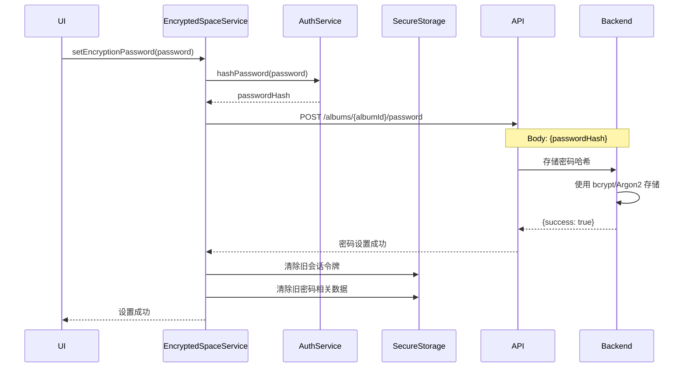
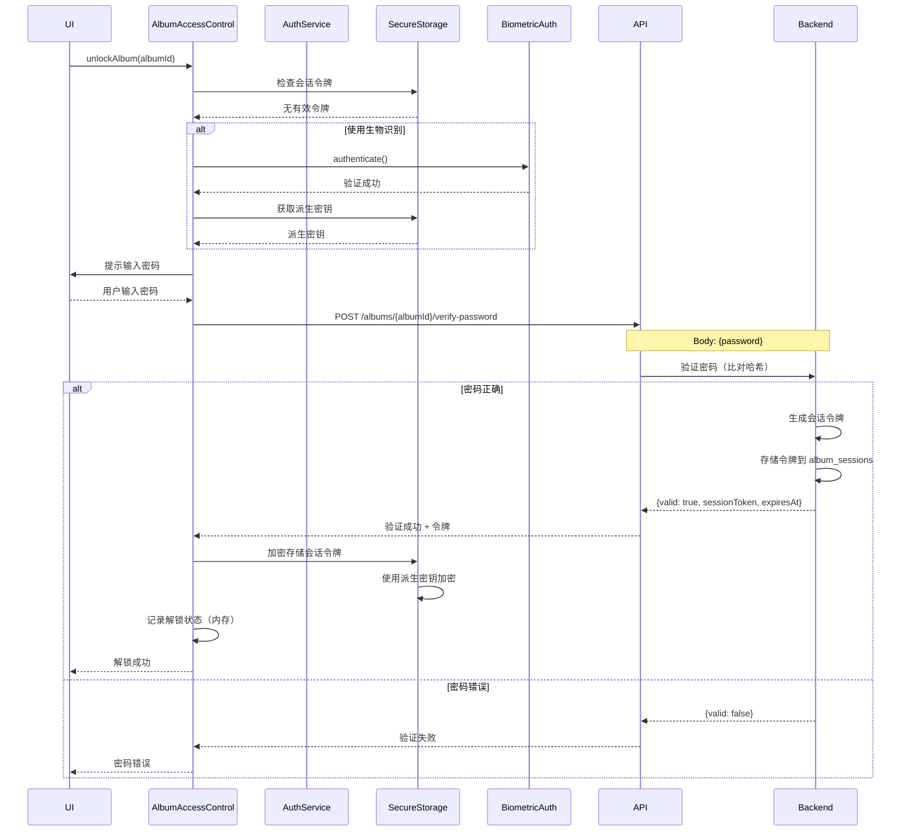
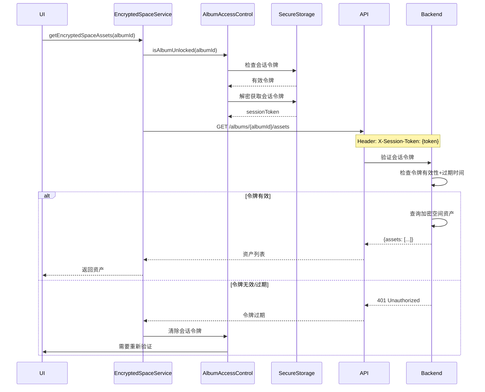
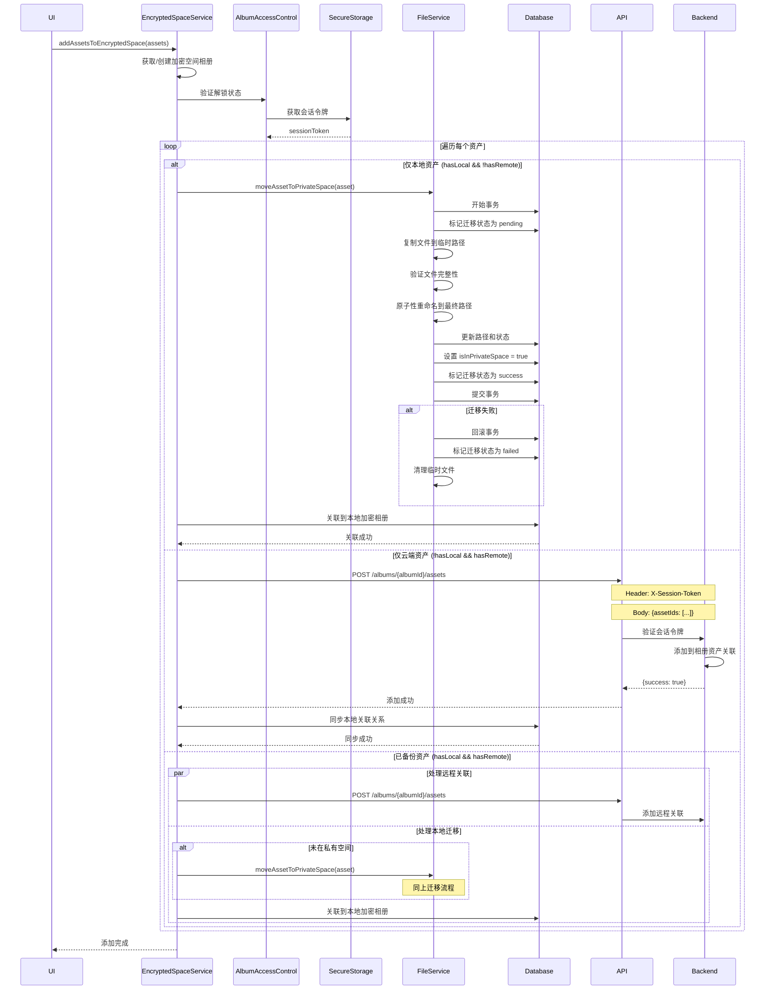
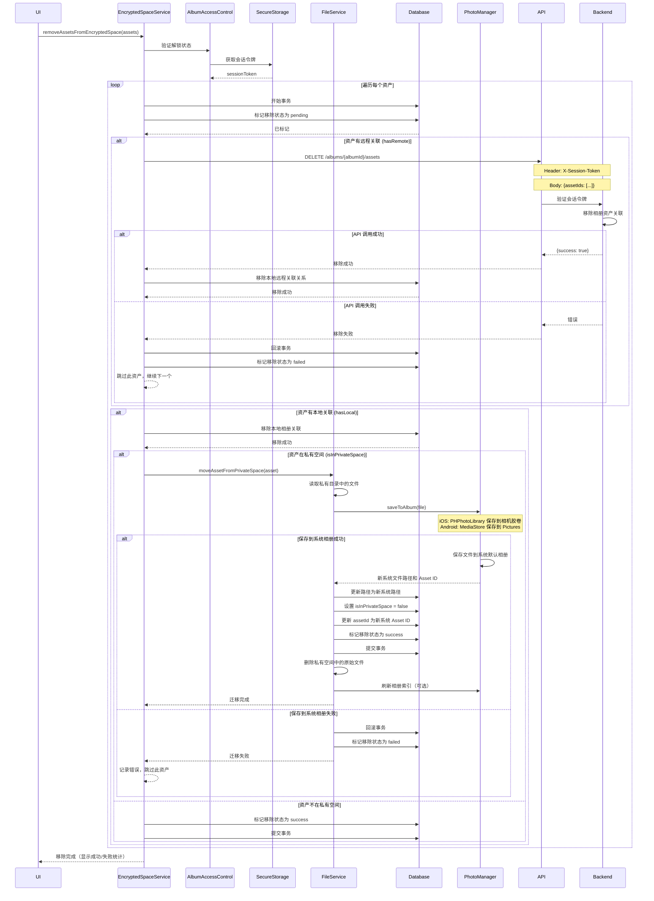
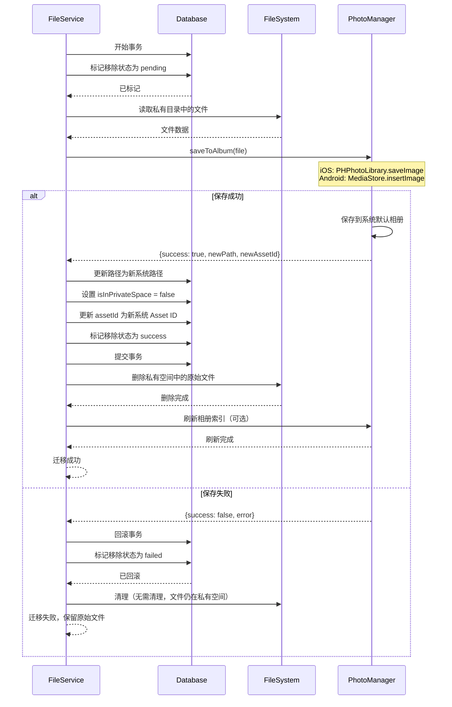
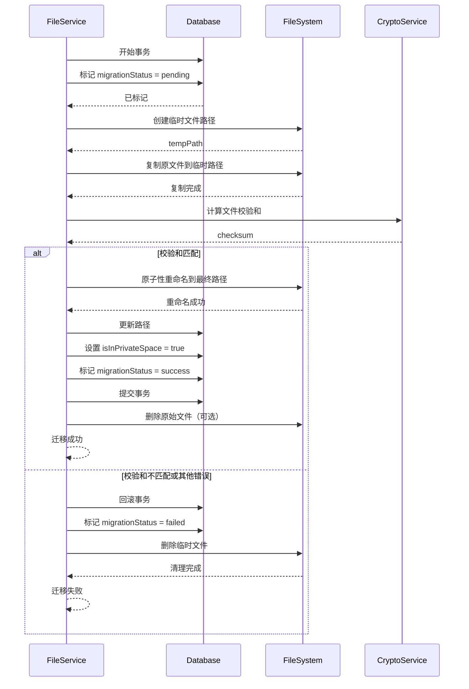
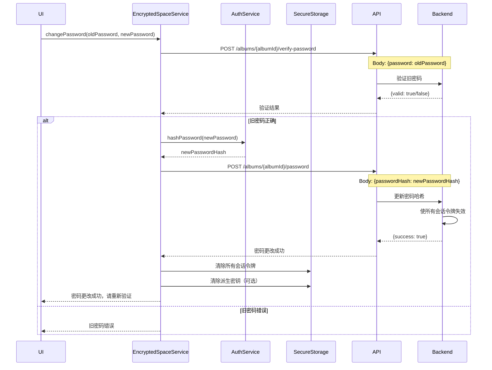

## 加密空间功能完整方案

## 目录

- [一、核心设计理念](#一核心设计理念)
- [二、数据模型设计](#二数据模型设计)
  - [2.1 移动端数据库表扩展](#21-移动端数据库表扩展)
  - [2.2 后端数据库表扩展](#22-后端数据库表扩展)
- [三、安全认证机制](#三安全认证机制)
  - [3.1 密码存储策略](#31-密码存储策略)
  - [3.2 会话令牌机制](#32-会话令牌机制)
- [四、加密空间管理逻辑](#四加密空间管理逻辑)
  - [4.1 加密空间相册创建](#41-加密空间相册创建)
- [五、核心业务流程](#五核心业务流程)
  - [5.1 设置加密空间密码](#51-设置加密空间密码)
  - [5.2 解锁加密空间（首次验证）](#52-解锁加密空间首次验证)
  - [5.3 使用会话令牌访问加密空间](#53-使用会话令牌访问加密空间)
  - [5.4 添加资产到加密空间](#54-添加资产到加密空间)
  - [5.5 从加密空间移除资产](#55-从加密空间移除资产)
  - [5.5.1 从私有空间移回系统相册（事务保护）](#551-从私有空间移回系统相册事务保护)
  - [5.6 文件迁移到私有空间（事务保护）](#56-文件迁移到私有空间事务保护)
- [六、访问控制机制](#六访问控制机制)
  - [6.1 解锁状态管理](#61-解锁状态管理)
  - [6.2 自动锁定机制](#62-自动锁定机制)
  - [6.3 密码更改流程](#63-密码更改流程)
- [七、后端 API 设计](#七后端-api-设计)
  - [7.1 API 端点设计](#71-api-端点设计)
  - [7.2 API 认证流程](#72-api-认证流程)
- [八、数据同步策略](#八数据同步策略)
  - [8.1 远程同步](#81-远程同步)
  - [8.2 本地到云端同步](#82-本地到云端同步)
- [九、错误处理与恢复](#九错误处理与恢复)
  - [9.1 文件迁移失败处理](#91-文件迁移失败处理)
  - [9.2 从加密空间移除资产失败处理](#92-从加密空间移除资产失败处理)
  - [9.3 会话令牌失效处理](#93-会话令牌失效处理)
  - [9.4 网络异常处理](#94-网络异常处理)
- [十、安全考虑总结](#十安全考虑总结)
  - [10.1 访问控制安全](#101-访问控制安全)
  - [10.2 数据安全](#102-数据安全)
  - [10.3 审计与追踪](#103-审计与追踪)
- [十一、实施建议](#十一实施建议)
  - [阶段一：数据模型与基础设施](#阶段一数据模型与基础设施)
  - [阶段二：核心服务层](#阶段二核心服务层)
  - [阶段三：访问控制层](#阶段三访问控制层)
  - [阶段四：API 层](#阶段四api-层)
  - [阶段五：UI 层集成](#阶段五ui-层集成)
- [十二、关键改进点总结](#十二关键改进点总结)

---

### 一、核心设计理念

1. 加密空间是特殊相册：`isEncrypted=true` 的相册（远程和本地）
2. 基于相册组织资产：复用现有相册-资产关联结构
3. 访问控制：相册级验证，未验证不可查看内容
4. 安全存储：本地资产迁移到应用私有目录
5. 安全认证：使用会话令牌机制，避免明文密码传输
6. 原子性操作：文件迁移和数据库操作使用事务保护
7. 可扩展性：支持多个加密相册，使用 UUID 而非固定 ID

### 二、数据模型设计

#### 2.1 移动端数据库表扩展

**RemoteAlbumEntity 扩展**
- `isEncrypted`: Boolean（默认 false）
- `albumType`: Enum（normal/encryptedSpace/custom，用于区分相册类型）

**LocalAlbumEntity 扩展**
- `isEncrypted`: Boolean（默认 false）
- `albumType`: Enum（与远程一致）

**LocalAssetEntity 扩展**
- `isInPrivateSpace`: Boolean（默认 false，标识文件是否在私有目录）
- `migrationStatus`: Enum（none/pending/success/failed，用于跟踪迁移和移除操作状态）
  - `none`: 初始状态，无操作进行
  - `pending`: 操作进行中（迁移到私有空间或移回系统相册）
  - `success`: 操作成功完成
  - `failed`: 操作失败，需要重试或清理

**LocalAlbumAssetEntity**
- 复用现有表结构，支持本地相册-资产关联

**新增：AlbumSessionEntity（会话令牌表）**
- `albumId`: String（相册 ID）
- `sessionToken`: String（会话令牌，加密存储）
- `expiresAt`: DateTime（过期时间）
- `createdAt`: DateTime

#### 2.2 后端数据库表扩展

**albums 表扩展**
- `is_encrypted`: BOOLEAN（默认 FALSE）
- `album_type`: ENUM（normal/encrypted_space/custom）
- `password_hash`: VARCHAR(255) NULL（bcrypt/Argon2 哈希）

**新增：album_sessions 表（会话令牌）**
- `id`: UUID（主键）
- `album_id`: UUID（外键 → albums.id）
- `user_id`: UUID（外键 → users.id）
- `session_token`: VARCHAR(255)（令牌哈希）
- `expires_at`: TIMESTAMP
- `created_at`: TIMESTAMP

**使用现有关联表**
- `album_assets`：远程相册-资产关联
- 无需新建表

### 三、安全认证机制

#### 3.1 密码存储策略

原则：
- 后端仅存储密码哈希（bcrypt/Argon2）
- 移动端不存储明文密码
- 使用密钥派生函数（KDF）加密会话令牌

存储方案：
- 后端：`albums.password_hash` 存储密码哈希
- 移动端：使用 Keychain/KeyStore 存储派生密钥（用于加密会话令牌）
- 移动端：会话令牌存储在加密的本地存储中，并设置过期时间

#### 3.2 会话令牌机制

流程：
1. 用户输入密码 → 后端验证 → 返回短期会话令牌（如 1 小时）
2. 移动端使用密钥加密会话令牌后存储
3. 后续 API 请求使用会话令牌替代密码
4. 令牌过期后需要重新验证

优势：
- 避免每次请求传输密码
- 支持撤销单个会话
- 可审计和追踪

### 四、加密空间管理逻辑

#### 4.1 加密空间相册创建

策略：
- 不再使用固定 ID（如 `__encrypted_space__`）
- 使用 UUID 作为相册 ID
- 通过 `albumType = encryptedSpace` 标识系统加密空间相册
- 支持用户创建多个加密相册

创建时机：
- 远程加密空间：首次使用加密功能时自动创建
- 本地加密空间：首次添加仅本地资产到加密空间时自动创建

查询方式：
- 通过 `albumType = encryptedSpace` + `ownerId` 查询用户的加密空间相册
- 系统自动创建的加密空间相册使用固定名称（如"加密空间"）

### 五、核心业务流程

#### 5.1 设置加密空间密码

流程说明：
1. 用户首次设置密码或修改密码
2. 前端生成密码哈希（可选，或直接传输到后端）
3. 后端验证并存储密码哈希
4. 前端清除本地存储的旧会话令牌
5. 提示用户已设置/修改成功

时序图：

#### 5.2 解锁加密空间（首次验证）

流程说明：
1. 用户选择加密空间相册
2. 检查是否已有有效会话令牌
3. 如无，提示输入密码（或使用生物识别）
4. 生物识别成功后，从 Keychain 获取派生密钥
5. 向后端验证密码，获取会话令牌
6. 加密存储会话令牌
7. 更新本地解锁状态

时序图：

#### 5.3 使用会话令牌访问加密空间

流程说明：
1. 检查本地是否有有效会话令牌
2. 如有，使用令牌访问 API
3. 如令牌过期或无效，重新验证

时序图：

#### 5.4 添加资产到加密空间

流程说明：
- 仅本地资产：迁移文件到私有空间（事务保护）
- 仅云端资产：关联到远程加密相册
- 已备份资产：同时处理远程关联和本地迁移

时序图：

#### 5.5 从加密空间移除资产

流程说明：
1. 验证相册解锁状态
2. 使用数据库事务保护整个移除过程
3. 标记移除状态为 pending（防止重复操作）
4. 移除远程相册关联（如有）
5. 移除本地相册关联
6. 处理本地文件：**自动移回系统相册**（如果资产在私有空间）
   - 使用事务保护文件迁移过程
   - 先保存到系统相册，成功后更新数据库，最后删除私有文件
   - 如有失败，回滚所有操作
7. 标记移除状态为 success
8. 提交事务

**数据一致性保障**：
- 所有数据库操作在事务中执行
- 文件操作失败时，数据库状态回滚
- 使用状态标记（pending/success/failed）防止重复操作和部分成功
- 删除私有文件仅在数据库提交成功后执行
- 如果删除失败，记录错误但不影响已提交的数据库状态

**移回系统相册的详细流程（事务保护）**：
1. 在事务中标记移除状态为 pending
2. 从应用私有目录读取文件
3. 通过 photo_manager API 将文件保存到系统默认相册
4. 获取系统相册返回的新文件路径和 Asset ID
5. 在事务中更新数据库：
   - 更新文件路径为新系统路径
   - 设置 `isInPrivateSpace = false`
   - 更新 `LocalAssetEntity.id` 为新系统 Asset ID（如需要）
   - 标记移除状态为 success
6. 提交事务
7. 事务成功后，删除应用私有目录中的原始文件
8. 如有错误，回滚事务并清理临时数据

时序图：

#### 5.5.1 从私有空间移回系统相册（事务保护）

流程说明：
1. 使用数据库事务保护整个迁移过程
2. 先标记移除状态为 pending
3. 读取私有目录中的文件
4. 保存到系统相册（通过 photo_manager API）
5. 验证保存成功
6. 在事务中更新数据库（路径、状态、Asset ID）
7. 提交事务
8. 事务成功后删除私有文件
9. 如有失败，回滚并清理

时序图：

**错误处理场景**：

1. **文件读取失败**：回滚事务，标记状态为 failed
2. **保存到系统相册失败**：回滚事务，文件保留在私有空间
3. **数据库更新失败**：回滚事务，系统相册中的文件需要手动清理（或通过后台任务）
4. **删除私有文件失败**：记录错误但不影响已提交的事务，可通过后台任务清理

#### 5.6 文件迁移到私有空间（事务保护）

流程说明：
1. 使用数据库事务保护
2. 先标记迁移状态为 pending
3. 复制到临时路径
4. 验证完整性
5. 原子性重命名
6. 更新数据库
7. 如有失败，回滚并清理

时序图：

### 六、访问控制机制

#### 6.1 解锁状态管理

设计原则：
- 内存中维护已解锁相册集合（应用级状态）
- 持久化会话令牌（支持跨应用重启）
- 按相册独立管理解锁时间和过期策略

状态存储：
- 内存：`Map<albumId, UnlockState>`（包含解锁时间、过期时间）
- 持久化：加密的会话令牌存储在本地（Keychain/KeyStore）

#### 6.2 自动锁定机制

策略：
1. 时间锁定：解锁后启动计时器，可配置超时时间（默认 30 分钟，用户可调整）
2. 后台锁定：应用进入后台时，可选择立即锁定或延迟锁定
3. 令牌过期：会话令牌过期时自动锁定
4. 手动锁定：用户主动锁定

实现：
- 每个相册独立的锁定计时器
- 应用生命周期监听（进入后台/前台）
- 定期检查会话令牌有效性

#### 6.3 密码更改流程

时序图：

### 七、后端 API 设计

#### 7.1 API 端点设计

**相册管理**
- `GET /api/v1/albums/encrypted-space` - 获取或创建加密空间相册
- `POST /api/v1/albums/{albumId}/password` - 设置/更新相册密码
- `POST /api/v1/albums/{albumId}/verify-password` - 验证密码并获取会话令牌
- `DELETE /api/v1/albums/{albumId}/sessions` - 撤销所有会话令牌

**资产管理（需要会话令牌）**
- `GET /api/v1/albums/{albumId}/assets` - 获取加密空间资产列表
- `POST /api/v1/albums/{albumId}/assets` - 添加资产到加密空间
- `DELETE /api/v1/albums/{albumId}/assets` - 从加密空间移除资产

**会话令牌管理**
- `GET /api/v1/albums/{albumId}/sessions` - 获取有效会话列表
- `DELETE /api/v1/albums/{albumId}/sessions/{sessionId}` - 撤销特定会话

#### 7.2 API 认证流程

请求格式：
- Header: `Authorization: Bearer {userToken}`（用户身份认证）
- Header: `X-Session-Token: {albumSessionToken}`（加密空间访问令牌）

验证顺序：
1. 验证用户 Token（JWT）
2. 检查相册是否为加密相册
3. 验证会话令牌（有效性、过期时间、权限）
4. 继续处理请求

### 八、数据同步策略

#### 8.1 远程同步

同步内容：
- 相册信息：`isEncrypted`、`albumType`
- 不同步：`password_hash`（仅后端存储）
- 相册资产关联关系

同步策略：
- 相册信息变化时触发同步
- 资产关联变化时触发同步
- 同步冲突解决：以后端为准

#### 8.2 本地到云端同步

同步时机：
- 创建/更新加密相册时
- 添加/移除资产时
- 设置/更改密码时（仅同步标志，不同步哈希）

同步流程：
1. 检查本地加密相册是否存在远程对应
2. 如无，创建远程加密相册
3. 同步相册属性和资产关联
4. 密码设置需要单独调用密码设置 API

### 九、错误处理与恢复

#### 9.1 文件迁移失败处理

场景：
- 磁盘空间不足
- 文件权限问题
- 文件已损坏
- 数据库操作失败

处理策略：
1. 回滚数据库事务
2. 清理临时文件
3. 标记迁移状态为 failed
4. 记录错误日志
5. 通知用户并提供重试机制

#### 9.2 从加密空间移除资产失败处理

场景：
- API 调用失败（网络异常、会话令牌失效）
- 保存到系统相册失败（权限问题、磁盘空间不足）
- 数据库操作失败
- 删除私有文件失败

处理策略：
1. **API 调用失败**：
   - 回滚本地数据库事务
   - 标记移除状态为 failed
   - 保留资产在加密空间中
   - 记录错误并提示用户重试

2. **保存到系统相册失败**：
   - 回滚数据库事务
   - 文件保留在私有空间
   - 标记移除状态为 failed
   - 记录错误日志
   - 通知用户并提供重试机制

3. **数据库更新失败**：
   - 回滚事务
   - 系统相册中已保存的文件需要通过后台任务清理
   - 或保留在系统相册中（用户可手动处理）
   - 标记移除状态为 failed

4. **删除私有文件失败**：
   - 记录错误但不影响已提交的数据库状态
   - 通过后台清理任务定期删除遗留文件
   - 不影响用户体验，资产已成功移回系统相册

5. **部分资产移除失败**：
   - 继续处理其他资产
   - 最终返回成功/失败的统计信息
   - 允许用户对失败的资产进行重试

#### 9.3 会话令牌失效处理

场景：
- 令牌过期
- 令牌被撤销（密码更改）
- 令牌验证失败

处理策略：
1. 清除本地存储的令牌
2. 更新解锁状态为锁定
3. 提示用户重新验证
4. 自动触发重新验证流程（可选）

#### 9.4 网络异常处理

场景：
- API 请求失败
- 网络超时
- 服务器错误

处理策略：
1. 本地操作立即完成（乐观更新）
2. API 操作加入重试队列
3. 网络恢复后自动同步
4. 显示同步状态给用户

### 十、安全考虑总结

#### 10.1 访问控制安全
- 双重验证：本地状态检查 + 后端会话令牌验证
- 密码存储：后端仅存储哈希，移动端不存储明文
- 会话令牌：短期有效，支持撤销
- 自动锁定：多种触发机制

#### 10.2 数据安全
- 文件安全：本地资产迁移到私有目录，不在系统相册暴露
- 私有目录：使用系统推荐的私有目录，防止云同步
- 传输加密：所有 API 调用使用 HTTPS
- 令牌加密：会话令牌使用派生密钥加密存储

#### 10.3 审计与追踪
- 会话记录：后端记录所有会话创建和撤销
- 操作日志：记录关键操作（添加/移除资产、密码更改）
- 异常检测：检测异常访问模式

### 十一、实施建议

#### 阶段一：数据模型与基础设施
1. 数据库迁移：添加新字段和表
2. 会话令牌基础设施：后端 API 和移动端存储
3. 密钥管理：实现派生密钥生成和加密存储

#### 阶段二：核心服务层
1. 认证服务：密码验证、会话令牌管理
2. 加密空间服务：相册创建、资产管理
3. 文件服务：文件迁移（事务保护）

#### 阶段三：访问控制层
1. 访问控制服务：解锁状态管理、自动锁定
2. 会话管理：令牌刷新、撤销机制

#### 阶段四：API 层
1. 后端 API：加密相册管理、会话令牌管理
2. API 中间件：会话令牌验证

#### 阶段五：UI 层集成
1. 密码设置界面
2. 加密空间入口和验证界面
3. 资产添加/移除界面
4. 错误处理和状态展示

### 十二、关键改进点总结

相比原方案的主要改进：
1. 密码安全：移除明文密码存储，使用会话令牌机制
2. API 安全：使用会话令牌替代每次传输密码
3. 原子性：文件迁移使用事务保护，支持回滚
4. 灵活性：移除固定 ID，支持多个加密相册
5. 完整性：补充资产移除场景的完整流程
6. 可维护性：清晰的分层架构和错误处理机制

该方案在安全、可靠性和可扩展性方面进行了改进，为后续扩展奠定了基础。
