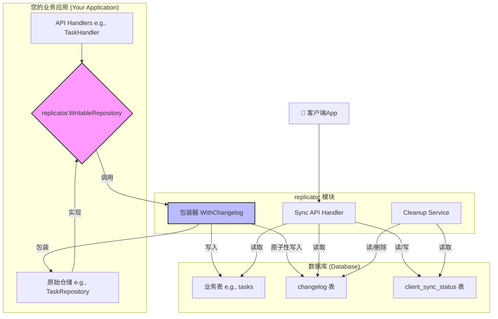
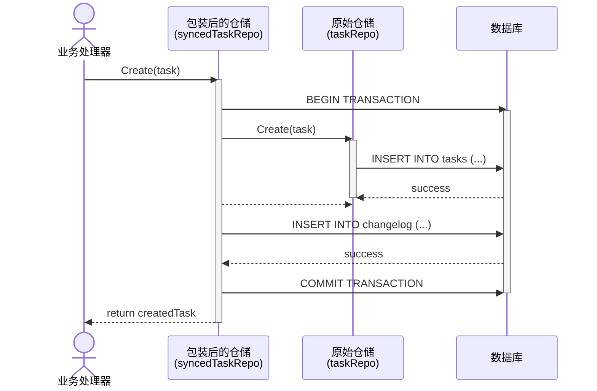
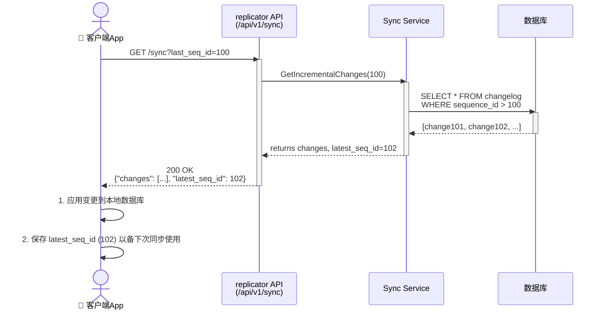

// replicator/README.md

# `replicator` 模块技术文档

## 1. 概述 (Overview)

`replicator` 是一个为现代移动应用设计的、**无侵入的**、**基于变更日志 (Changelog-based)** 的服务端数据同步引擎。

它的核心目标是解决移动客户端（App）与服务端之间的数据同步问题，尤其是在弱网络和需要离线操作的场景下。它通过提供高效的**增量同步**和为新设备准备的**全量同步**机制，极大地节省了客户端的网络流量和电量消耗，同时保证了数据的最终一致性。

**“无侵入”** 是其设计的核心哲学。业务开发者在编写数据操作逻辑时，几乎不需要感知`replicator`的存在，只需遵循简单的接口规范，即可让业务数据自动具备被同步的能力。

## 2. 核心原理与概念 (Core Principles & Concepts)

`replicator` 的工作原理基于**变更数据捕获 (Change Data Capture, CDC)** 的思想。它不直接对比客户端与服务端的数据差异，而是通过一个中央“账本”来记录每一次数据的变更。

### 2.1. 变更日志 (The Changelog)

这是整个模块的心脏。我们引入一张`Changelog`表，它像一个只增不减的流水账，忠实地记录了每一次对业务数据的**创建 (CREATED)**、**更新 (UPDATED)** 或 **删除 (DELETED)** 操作。

*   **`SequenceID`**: 每个变更记录都有一个全局唯一且自增的ID。这个ID成为了数据同步的“时间戳”或“游标”，客户端只需告诉服务端“我上次同步到了哪个ID”，服务端就能准确地返回此ID之后的所有新变更。

### 2.2. 仓储包装器 (The Repository Wrapper)

这是实现“无侵入”设计的关键。我们提供了一个`replicator.WithChangelog()`函数，它采用了**装饰器模式 (Decorator Pattern)**。

*   **工作方式**：您像往常一样编写纯粹的业务仓储（Repository），它只负责GORM的增删改查。然后，将这个仓储实例传入`WithChangelog()`，它会返回一个功能完全相同的新仓储实例。
*   **神奇之处**：当您使用这个“包装后”的实例去执行创建、更新或删除操作时，它会在同一个数据库事务内，**原子性地**完成两件事：
    1.  执行您原始的业务数据操作（例如，在`tasks`表中插入一条记录）。
    2.  向`Changelog`表中写入一条对应的变更记录。
*   **好处**：业务代码完全与`Changelog`解耦，并且杜绝了业务数据写入成功但变更日志写入失败的数据不一致问题。

### 2.3. 客户端状态追踪 (Client State Tracking)

模块通过`ClientSyncStatus`表来记住每一个设备（`DeviceID`）的同步进度，即它最后一次成功同步到的`SequenceID`。这使得同步过程是**幂等且可恢复的**。

## 3. 架构图 (Architecture)

`replicator` 模块与您的业务代码协同工作，其整体架构如下：


*   **业务代码** 只需面向`WritableRepository`接口编程。
*   **`WithChangelog`包装器** 是业务写操作的入口，它协调对**业务表**和**changelog表**的原子性写入。
*   **Sync API Handler** 是客户端读操作的入口，负责提供增量和全量数据。
*   **Cleanup Service** 是一个独立的后台任务，用于维护数据库健康。

## 4. 快速集成指南 (Getting Started Guide)

集成 `replicator` 到您的项目中非常简单，只需遵循以下三步。

### **第一步：实现业务逻辑接口**

您需要让您的业务模型和仓储实现 `replicator` 定义的接口。

1.  **适配 `SyncedModel` 接口**：
    为您的GORM模型（如`Task`）添加两个方法。

    ```go
    // a. 您的业务模型
    type Task struct {
        ID        string `gorm:"primaryKey..." json:"id"`
        Title     string `json:"title"`
        Completed bool   `json:"completed"`
    }

    // b. 实现接口
    func (t *Task) GetRecordID() string  { return t.ID }
    func (t *Task) GetTableName() string { return "tasks" }
    ```

2.  **适配 `WritableRepository` 接口**：
    编写您的仓储层，确保其方法签名符合接口定义。

    ```go
    // a. 您的仓储实现
    type TaskRepository struct {
        db *gorm.DB
    }

    // b. 实现接口方法 (注意：方法内是纯粹的业务逻辑)
    func (r *TaskRepository) Create(ctx context.Context, task *Task) (*Task, error) {
        return task, r.db.WithContext(ctx).Create(task).Error
    }

    func (r *TaskRepository) Update(ctx context.Context, task *Task) (*Task, error) {
        // ...
    }

    func (r *TaskRepository) Delete(ctx context.Context, task *Task) error {
        // ...
    }
    ```

### **第二步：初始化并包装**

在您的程序入口（如`main.go`）中，初始化`replicator`模块，并使用`WithChangelog`包装您的业务仓储。

```go
// main.go
func main() {
    // ... 数据库和Gin的初始化 ...

    // 1. 创建您原始的业务仓储实例
    taskRepo := NewTaskRepository(db)

    // 2. 初始化 replicator
    replConfig := replicator.DefaultConfig()
    replConfig.FullSyncTables["tasks"] = replicator.FullSyncTableConfig{
        PrimaryKeyColumn: "id",
    }
    repl := replicator.New(db, replConfig)

    // ✨ 3. [核心] 将您的仓储进行包装 ✨
    // syncedTaskRepo 拥有了自动记录变更的能力
    syncedTaskRepo := replicator.WithChangelog(db, taskRepo)

    // ... 后续步骤 ...
}
```

### **第三步：注入并使用**

将“包装后”的`syncedTaskRepo`注入到您的业务处理器 (Handler) 中，并像使用普通仓储一样使用它。

```go
// main.go
func main() {
    // ...
    syncedTaskRepo := replicator.WithChangelog(db, taskRepo)

    // 1. 创建业务处理器，注入“增强版”仓储
    taskHandler := NewTaskHandler(syncedTaskRepo)

    // 2. 注册业务 API 路由
    businessAPI := router.Group("/api/v1/business")
    {
        businessAPI.POST("/tasks", taskHandler.CreateTask)
        businessAPI.PUT("/tasks/:id", taskHandler.UpdateTask)
        businessAPI.DELETE("/tasks/:id", taskHandler.DeleteTask)
    }

    // 3. 注册 replicator 自身的 API 路由
    apiV1 := router.Group("/api/v1")
    repl.RegisterRoutesAndJobs(apiV1)

    // ...
}
```

完成！现在，您对`task`的所有增删改操作都将被`replicator`自动记录并可供客户端同步。

## 5. 核心流程时序图 (Sequence Diagrams)

### 5.1. 数据写入流程 (Create/Update/Delete)

此图展示了当您的业务API被调用时，`WithChangelog`包装器如何确保数据写入和日志记录的原子性。



### 5.2. 客户端同步流程 (Client Sync Flow)

此图展示了客户端App与`replicator` API交互，以完成一次典型的增量同步过程。



## 6. API 接口参考 (API Reference)

`replicator` 模块会注册以下HTTP API端点：

| 方法 | 路径                 | 描述                                                                                              |
| :--- | :------------------- | :------------------------------------------------------------------------------------------------ |
| GET  | `/sync`              | **增量同步**。提供`last_seq_id`参数，获取此ID之后的所有数据变更。                                   |
| GET  | `/full_init`         | **全量同步初始化**。新设备首次同步时调用，获取需要同步的表名列表和当前数据库的快照点 (`snapshot_seq_id`)。 |
| GET  | `/full_data`         | **全量同步数据拉取**。根据`full_init`返回的表名，分页拉取该表的全量数据。                           |

## 7. 配置项说明 (Configuration)

您可以通过`replicator.Config`结构体对模块进行配置：

| 字段                  | 类型                           | 描述                                                                 | 默认值          |
| :-------------------- | :----------------------------- | :------------------------------------------------------------------- | :-------------- |
| `CleanupInterval`       | `time.Duration`                | 后台清理任务的运行周期。                                               | 24小时          |
| `DeviceActiveThreshold` | `time.Duration`                | 判断设备是否活跃的阈值。超过此时间未同步的设备的同步记录可能被清理。   | 180天           |
| `DefaultSyncPageLimit`  | `int`                          | 同步API默认的分页大小。                                              | 500             |
| `FullSyncTables`        | `map[string]FullSyncTableConfig` | 配置哪些表参与全量同步，并指定用于排序和分页的主键列名。           | 空map           |

---
